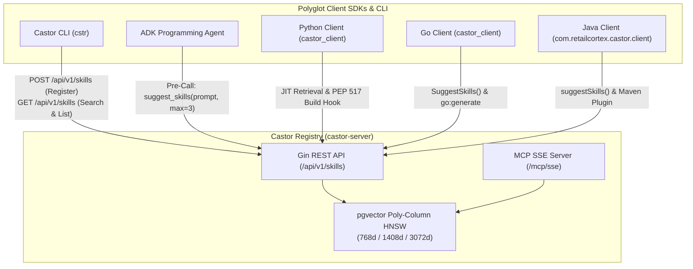

# Castor: Enterprise Project Pattern Registry

[](https://github.com/retail-cortex/castor)

**Castor** is an enterprise-grade AI Agent Skills registry and lifecycle tooling platform built for the **Google Agent Development Kit (ADK)** and autonomous multi-agent ecosystems. While extending the foundational [agentskills.io](https://agentskills.io/specification) standard, Castor implements strict enterprise governance, multi-modal vector search, and dynamic JIT tool retrieval.

---

## Enterprise Extensions

* **Multi-Modal Vector Search & Poly-Column Schema**: Dual-tier search powered by PostgreSQL/AlloyDB `pgvector` with dedicated HNSW indexes (`embedding_768`, `embedding_1408`, `embedding_3072`). Indexes textual instructions, Markdown references, and binary media (PNG, JPEG, WebP, PDF, WASM, Protobuf).
* **Pluggable Soft-Switch Embedding Providers**: Switch dynamically via `.env.toml` (`embedding_provider`) between Vertex AI (`multimodalembedding`, 1408d / `text-embedding-004`, 768d) and in-database AlloyDB AI (`alloydb-ai`, 768d).
* **JIT Dynamic Pre-Call Retrieval**: Client SDKs and ADK agents query the semantic index on incoming prompts, constraining injected tools to the top $\le 3$ ranked skills to eliminate tool bleed and conserve context window tokens.
* **Bounded REST Pagination & Protection**: Central `/api/v1/skills` endpoint enforces strict page size bounding ($1 \le \text{page\_size} \le 25$, default $5$) with standard `X-Total-Count`, `X-Page`, `X-Page-Size`, `X-Total-Pages` response headers.
* **Cryptographic Manifest Locking (`.manifest.lock`)**: Enforces deterministic SHA-256 integrity verification across installed skills.
* **Human-in-the-Loop (HITL) Policy Gates**: Tiered intervention gates and static compliance validation ensuring safe Agent-Human Interaction (AHI).



---

## Quickstart Commands

### 1. Run Castor CLI (`cstr`)
The `cstr` CLI manages local and remote skill lifecycles:

```bash
# Build & run cstr CLI via Bazel
bazel run //cmd/cstr -- --help

# Remote Vector Search against Castor Registry with pagination
bazel run //cmd/cstr -- search "canvas image rendering raster" --remote --page 1 --max 5

# Remote Server Listing
bazel run //cmd/cstr -- list --remote --page 1 --max 5

# Add skill dependencies from polyglot URIs (creates .manifest.lock)
bazel run //cmd/cstr -- add castor://skills/example.com/retail/cart-service/1.0.0
bazel run //cmd/cstr -- add github://retail-cortex/castor@main/packages/skills-python
bazel run //cmd/cstr -- add mod://github.com/retail-cortex/castor@v1.0.0/packages/skills-go
bazel run //cmd/cstr -- add maven://com.retailcortex.castor:skills-java:1.0.0

# 5-Point SDLC Quality Audit
bazel run //cmd/cstr -- validate -r ./skills --json

# Verify cryptographic lockfile integrity
bazel run //cmd/cstr -- verify -d .skills
```

### 2. Start Central Backend Server (`Castor Registry`)
```bash
# Start dual REST & MCP server on port 8000
bazel run //:castor-server
```

### 3. Run Native Python ADK Agent
```bash
# Run ADK agent with JIT pre-call skill suggestion
uv run python examples/python/client/main.py
```

### 4. Run Polyglot Developer CLI
```bash
# Run polyglot Bazel scaffolding agent
uv run python examples/python/polyglot/main.py --target-dir ./scratch/my-app
```

### 5. Execute Full Test Suite
```bash
# All 26 Bazel test targets across Go, Python, Java, and MCP
bazel test //...
```

---

## Castor CLI (`cstr`) Command Reference

| Command | Syntax | Description |
| :--- | :--- | :--- |
| **`search`** | `cstr search <query> [-r] [-p <page>] [-n <max>] [--json]` | Searches skills locally or against remote `Castor Registry` vector index ($1 \le \text{max} \le 25$). |
| **`list`** | `cstr list [-r] [-p <page>] [-n <max>] [--json]` | Lists skills from local filesystem or central server with pagination metadata. |
| **`add`** | `cstr add <uri> [-d <dir>] [--force] [--manifest-only]` | Resolves and installs skills from `castor://`, `cstr://`, `github://`, `mod://`, `maven://`, `pkg://`, or `file://` URIs. |
| **`register`**| `cstr register <source_uri>` | Registers source skill with central `Castor Registry`, computing multi-modal vector embeddings. |
| **`login`** | `cstr login <email> [app_name]` | Requests developer application registration and sends verification challenge. |
| **`config`** | `cstr config set <server\|api_key\|domain\|org> <val>` | Configures local CLI connection settings in `~/.castor/.env.toml`. |
| **`config`** | `cstr config show` | Displays active CLI configuration and masked credentials. |
| **`validate`**| `cstr validate <path> [-r] [--json]` | Executes 5-point SDLC compliance audit (Frontmatter, Structure, CWE rules, 429 retries, File links). |
| **`verify`** | `cstr verify [-d <dir>] [--json]` | Audits installed skill directory checksums against `.manifest.lock`. |
| **`compile`** | `cstr compile [-d <dir>] [-o <manifest.json>]` | Generates pre-compiled JSON manifest for zero-I/O cold starts. |
| **`init`** | `cstr init <name> [-d <dir>]` | Scaffolds a new skill directory conforming to all SDLC requirements. |

---

## Polyglot Client SDKs

### Python SDK (`castor-client`)
* **JIT Pre-Call Retrieval**:
  ```python
  from castor_client import SkillRegistry

  registry = SkillRegistry()
  # Queries central Castor Registry vector index, falls back to local discovery
  suggested_skills = registry.suggest_skills(prompt="render canvas image", max_skills=3)
  ```
* **PEP 517 Build Backend**: Declare `build-backend = "castor_client.build_meta"` in `pyproject.toml` to automatically download and validate skills during `uv build` or `pip install`.

### Go SDK (`castor_client`)
* **JIT Dynamic Suggestions**:
  ```go
  import "github.com/retail-cortex/castor/clients/go/pkg/castor_client"

  registry, _ := castor_client.NewSkillRegistry("", nil, nil, "")
  suggested := registry.SuggestSkills("render canvas image", 3, "http://localhost:8000")
  ```
* **Build Directives**: Use `//go:generate cstr compile -d ./skills` and `//go:embed skills_manifest.json` for zero-I/O static binary embeds.

### Java SDK (`com.retailcortex.castor`)
* **JIT Suggestions & Client**:
  ```java
  import com.retailcortex.castor.client.CastorClient;
  import com.retailcortex.castor.loader.SkillRegistry;

  CastorClient client = new CastorClient();
  var suggested = client.suggestSkills("render canvas image", 3);
  ```
* **Maven Plugin**: Include `castor-client` in `pom.xml` during `generate-resources` to package `skills_manifest.json` into executable JARs.

---

## Documentation Site (Hugo)

Full architectural and API documentation is maintained in the [`docs/`](docs) directory:

```bash
# Build documentation static assets
bazel build //docs:site

# Run documentation site integrity test
bazel test //docs:site_test
```

---

## License & Legal Notices

Licensed under the Apache License, Version 2.0. See [LICENSE](LICENSE) and [NOTICE](NOTICE) for attribution and details.

