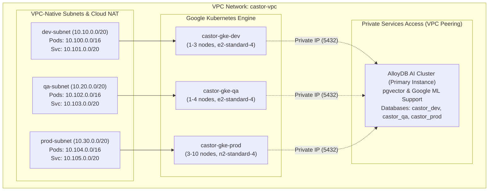

# Enterprise Infrastructure & Kubernetes Deployments

This directory contains production-ready **Terraform** modules, **Google Kubernetes Engine (GKE)** cluster definitions, **AlloyDB AI** provisioning scripts, and **Kustomize** deployment manifests for the `castor-registry` across `dev`, `qa`, and `prod` environments.

---

## 1. Directory Structure

```text
deployments/
├── terraform/                      # Modular Infrastructure as Code (Terraform)
│   ├── versions.tf                 # Google/Google-Beta provider & GCS remote state backend
│   ├── main.tf                     # Root orchestrator wiring network, alloydb, and gke
│   ├── variables.tf                # Input variables (project_id, region, node pools)
│   ├── outputs.tf                  # Connection strings, cluster endpoints, and secret IDs
│   ├── terraform.tfvars.example    # Configuration template
│   └── modules/
│       ├── network/                # VPC Network, VPC-native subnets, PSA Peering, Cloud NAT
│       ├── alloydb/                # AlloyDB AI Cluster, Primary Instance, dev/qa/prod DBs & users
│       └── gke/                    # 3 VPC-Native Private GKE clusters (dev, qa, prod)
├── kubernetes/                     # Kubernetes Kustomize deployment manifests
│   ├── base/                       # Core service, deployment, configmap, serviceaccount
│   │   ├── deployment.yaml         # Container specs, health probes (/health), resource bounds
│   │   ├── service.yaml            # ClusterIP service (ports 8000 REST/MCP, 9090 gRPC)
│   │   ├── serviceaccount.yaml     # Workload Identity annotated ServiceAccount
│   │   ├── configmap.yaml          # Shared environment baseline
│   │   └── kustomization.yaml
│   └── overlays/                   # Environment-specific overlays
│       ├── dev/                    # 2 replicas, vertex-gemini, dev database
│       ├── qa/                     # 3 replicas, alloydb-ai, qa database
│       └── prod/                   # 5-30 replicas (HPA), topology spread, production database
├── scripts/                        # Automated deployment runners
│   ├── deploy-infra.sh             # Terraform formatting, validation, planning & applying
│   ├── deploy-k8s.sh               # GKE credential sync, Secret Manager injection & rollout
│   └── setup-workload-identity.sh  # IAM policy binding for Vertex AI & Secret Manager
└── README.md
```

---

## 2. Infrastructure Architecture (GCP)



---

## 3. Provisioned Components

### 3.1 Network (`modules/network`)
- **VPC Network**: Custom regional VPC (`castor-vpc`).
- **Subnets**: Dedicated subnets for `dev`, `qa`, and `prod` with primary CIDRs and secondary alias IP ranges for GKE pods and services.
- **Private Services Access (PSA)**: Allocates a `/16` internal IP range peered via `servicenetworking.googleapis.com` for AlloyDB private connectivity.
- **Cloud Router & NAT**: Enables private GKE nodes to reach external Google APIs without public IPs.

### 3.2 AlloyDB AI Database (`modules/alloydb`)
- **Cluster & Primary Instance**: HA AlloyDB instance with `google_ml.enable_model_support=on` and `alloydb.enable_pgvector=on`.
- **Environment Partitions**:
  - `dev_user` accessing database `castor_dev`
  - `qa_user` accessing database `castor_qa`
  - `prod_user` accessing database `castor_prod`
- **Secret Manager Integration**: Passwords and full DSN connection strings are stored in Google Cloud Secret Manager (`castor-alloydb-<env>-dsn`).

### 3.3 GKE Clusters (`modules/gke`)
- **3 Isolated Clusters**: `castor-gke-dev`, `castor-gke-qa`, and `castor-gke-prod`.
- **Workload Identity**: Configured to allow Kubernetes ServiceAccounts to authenticate directly to Google Cloud APIs (Vertex AI, Cloud Trace, Secret Manager) without static keyfiles.
- **Private Nodes**: Node pools execute on private IPs with Calico network policies and Shielded VM security.

---

## 4. Deployment Instructions

### Step 1: Provision Cloud Infrastructure (Terraform)

```bash
# 1. Set environment variables
export GCP_PROJECT_ID="your-project-id"
export GCP_REGION="us-central1"
export GCS_TF_STATE_BUCKET="your-tf-state-bucket" # Optional for remote GCS state

# 2. Run infrastructure provisioning script
./deployments/scripts/deploy-infra.sh
```

### Step 2: Deploy `castor-registry` to GKE (Kustomize)

```bash
# Deploy to Development Cluster
./deployments/scripts/deploy-k8s.sh dev

# Deploy to QA Cluster
./deployments/scripts/deploy-k8s.sh qa

# Deploy to Production Cluster
./deployments/scripts/deploy-k8s.sh prod
```

### Step 3: Verify Workload Identity & Pod Logs

```bash
# Verify pods are running in the target cluster
kubectl get pods -n castor

# Stream logs to confirm AlloyDB connection and embedding provider initialization
kubectl logs -n castor -l app.kubernetes.io/name=castor-registry -f
```
