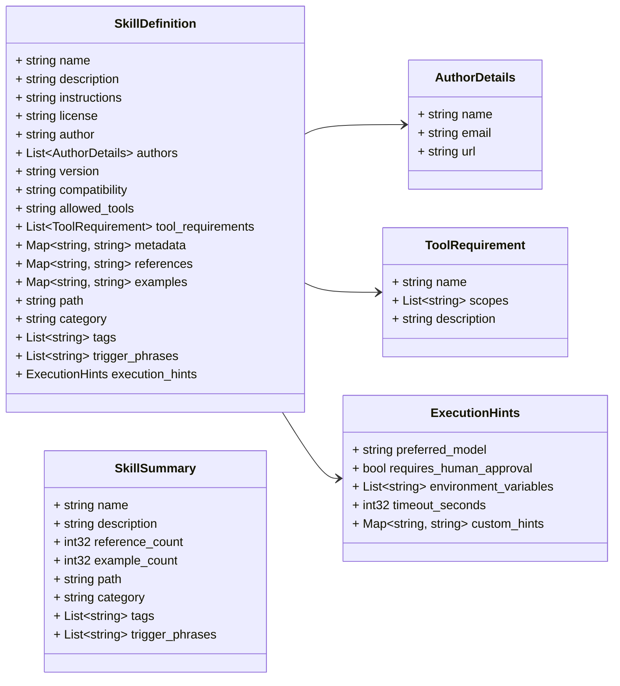
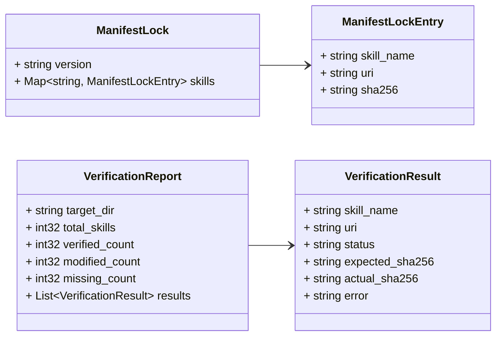

# Engineering Standards & Architecture

Every skill in this registry enforces a complete, production-grade Software Development Lifecycle (SDLC) with zero-tolerance security, Google OAuth2 authentication, and HTTP 429 rate limit resilience.

---

## 1. Google OAuth2 Identity Provider (UI & APIs)

- **Frontend UI (React 19 / Next.js)**: Standardized on Google Identity Services (GIS) and Authorization Code Flow with PKCE (`@react-oauth/google`). Access tokens stored in secure, encrypted, `HttpOnly`, `SameSite=Lax` cookies; unencrypted tokens in `localStorage` are prohibited (CWE-79).
- **Backend APIs (Python, Go, Java 25)**: Validate Google Bearer ID tokens against Google JWKS (`google-auth`, `google.golang.org/api/idtoken`, `GoogleIdTokenVerifier`).
- **User Token Delegation**: Backend agents delegate authenticated user OAuth2 tokens into `ToolContext.state["user_token"]` to execute BigQuery CAPI and storage tools under the end user's IAM permissions (CWE-269).

---

## 2. HTTP 429 Rate Limit & Quota Resilience

All AI-driven API calls (Gemini, BigQuery CAPI, Vertex AI) MUST implement **Exponential Backoff with Full Randomized Jitter**:

- **Python 3.13**: `tenacity` library for async retry and backoff algorithms.
- **Go 1.26+**: `hashicorp/go-retryablehttp` wrapper.
- **Java 25**: `Resilience4j` retry and rate limiter modules.

Inbound endpoints protect against quota exhaustion via token bucket rate limiters (`slowapi`, `golang.org/x/time/rate`, `Bucket4j`). Frontend clients catch 429 responses, parse `Retry-After` headers, and render live countdown timers on disabled action triggers.

---

## 3. Paired Positive, Negative & Boundary TDD

Every feature and service component MUST be tested against paired scenarios:

- **Positive / Happy Path**: Valid inputs, expected schemas, 200/201 HTTP status codes.
- **Negative / Error State**: Missing/expired OAuth tokens, 400/401/404/422/429/500 HTTP responses, database connection timeouts, and exception propagation.
- **Empty Value Boundaries**: Empty strings `""`, whitespace `"   "`, empty lists `[]`, zero numeric counts `0`, and missing dictionary keys.

---

## 4. Defensive Error Handling & Null/Nil Safety

- **Go**: Strict `nil` checks on pointers/slices/maps; defensive error wrapping (`fmt.Errorf("...: %w", err)`).
- **Java 25 (LTS)**: Enforce `java.util.Optional<T>` return types, `@NonNull` parameter annotations, SpotBugs `NP_NULL_ON_SOME_PATH` analysis, and SLF4J 2.x structured logging (zero `printStackTrace()`).
- **Python 3.13**: Strict type annotations (`T | None`), prohibition of `Any`, defensive `.get()` dictionary defaults, and Pydantic v2 input bounds.
- **TypeScript / React 19**: Enforce `strictNullChecks: true`, optional chaining (`?.`), and nullish coalescing (`??`).

---

## 5. Java 25 (LTS) Standard

- Standardized strictly on **Java 25 (LTS)** (`<maven.compiler.release>25</maven.compiler.release>`) leveraging virtual threads and modern records.
- Dependencies managed via the latest Google Cloud `libraries-bom`, Javalin 6+, SLF4J 2.x, Jackson 2.18+, and wrapped in Bazel `rules_java`.

---

## 6. Build System Interoperability (Bazel 9.2 Overarching Standard)

Every language standardizes on **Bazel 9.2** for hermetic CI/CD and monorepo execution:

- **Python (3.13+)**: Managed locally via **uv** (`pyproject.toml`), wrapped in Bazel `rules_python` (`1.7.0`).
- **Node.js (22+) / React (19+)**: Managed locally via **pnpm** (`pnpm-lock.yaml`), wrapped in Bazel `aspect_rules_js` / `npm.npm_translate_lock`.
- **Java (25 LTS)**: Managed locally via **Maven** (`pom.xml`), wrapped in Bazel `rules_java`.
- **Go (1.26+)**: Managed locally via **Go modules** (`go.mod`), wrapped in Bazel `rules_go` and `gazelle`.

---

## 7. ADK Superior Deployment Pattern

Google ADK agents standardly wrap agent execution runners inside **FastAPI** web services served asynchronously via **Uvicorn** for streaming SSE and high concurrency.

---

## 8. Hierarchical TOML Configuration & Security

Standardized multi-tier cascading TOML configurations (`.env.toml`, `.env.local.toml`, `.env.${RUNTIME}.toml`) using `modenv` and in-memory XOR secret encryption (`xor:...`).

---

## 9. Protocol Buffer Architecture Diagrams (`api/v1/`)

The core domain model (`SkillDefinition`, `AuthorDetails`, `ToolRequirement`, `ExecutionHints`, `SkillSummary`, `ManifestLock`) is formally defined in Protocol Buffers (`api/v1/*.proto`) and visualized via auto-generated Mermaid class diagrams ([`GoogleCloudPlatform/proto-gen-md-diagrams`](https://github.com/GoogleCloudPlatform/proto-gen-md-diagrams)):

### SkillDefinition & Execution Model Class Diagram

### Cryptographic Manifest Lock Diagram (`manifest.proto`)

