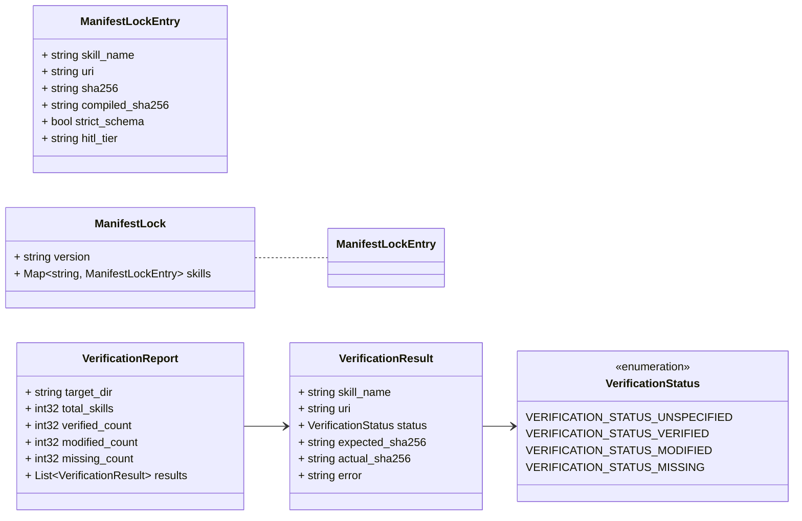
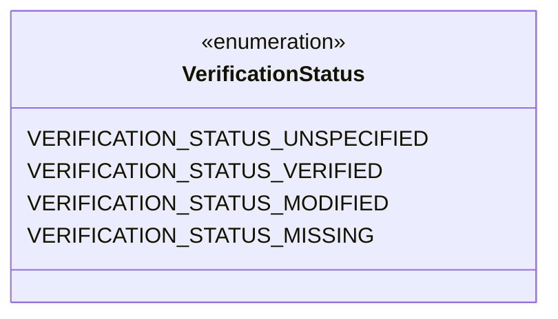
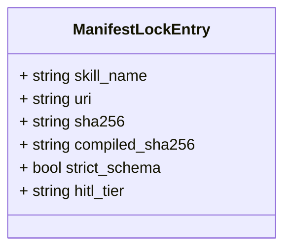
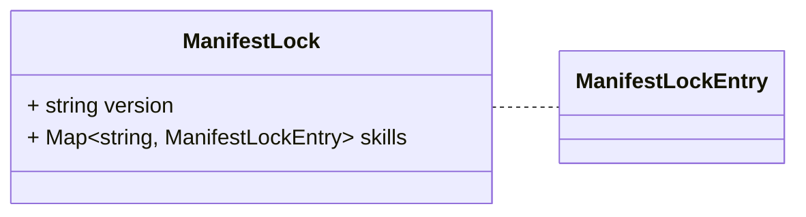
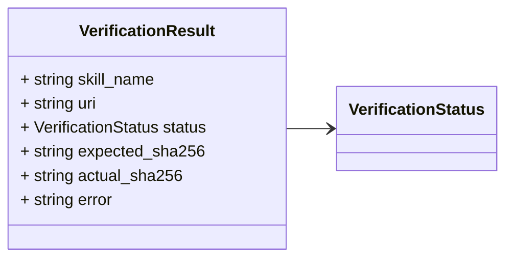
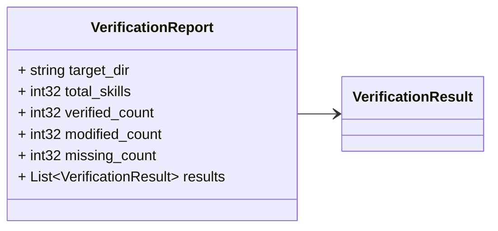

# Package: retailcortex.castor.v1

## Imports

| Import | Description |
|--------|-------------|

## Options

| Name                | Value                                                        | Description |
|---------------------|--------------------------------------------------------------|-------------|
| go_package          | github.com/retail-cortex/castor/proto/retailcortex/castor/v1 |             |
| java_package        | com.retailcortex.castor.proto.retailcortex.castor.v1         |             |
| java_multiple_files | true                                                         |             |

### retailcortex.castor.v1 Diagram

## Enum: VerificationStatus

**FQN**: retailcortex.castor.v1.VerificationStatus

VerificationStatus indicates the integrity audit result for a skill.

| Name                              | Ordinal | Description |
|-----------------------------------|---------|-------------|
| `VERIFICATION_STATUS_UNSPECIFIED` | 0       |             |
| `VERIFICATION_STATUS_VERIFIED`    | 1       |             |
| `VERIFICATION_STATUS_MODIFIED`    | 2       |             |
| `VERIFICATION_STATUS_MISSING`     | 3       |             |

### VerificationStatus Diagram

### ManifestLockEntry Diagram

### ManifestLock Diagram

### VerificationResult Diagram

### VerificationReport Diagram

## Message: ManifestLockEntry

**FQN**: retailcortex.castor.v1.ManifestLockEntry

ManifestLockEntry records the skill identity, download URI, and calculated SHA-256 hash.

| Field             | Ordinal | Type     | Label | Description |
|-------------------|---------|----------|-------|-------------|
| `skill_name`      | 1       | `string` |       |             |
| `uri`             | 2       | `string` |       |             |
| `sha256`          | 3       | `string` |       |             |
| `compiled_sha256` | 4       | `string` |       |             |
| `strict_schema`   | 5       | `bool`   |       |             |
| `hitl_tier`       | 6       | `string` |       |             |

## Message: ManifestLock

**FQN**: retailcortex.castor.v1.ManifestLock

ManifestLock represents the .manifest.lock file schema in skill target directories.

| Field     | Ordinal | Type                        | Label | Description |
|-----------|---------|-----------------------------|-------|-------------|
| `version` | 1       | `string`                    |       |             |
| `skills`  | 2       | `string, ManifestLockEntry` | Map   |             |

## Message: VerificationResult

**FQN**: retailcortex.castor.v1.VerificationResult

VerificationResult details the verification audit for a single skill.

| Field             | Ordinal | Type                 | Label | Description |
|-------------------|---------|----------------------|-------|-------------|
| `skill_name`      | 1       | `string`             |       |             |
| `uri`             | 2       | `string`             |       |             |
| `status`          | 3       | `VerificationStatus` |       |             |
| `expected_sha256` | 4       | `string`             |       |             |
| `actual_sha256`   | 5       | `string`             |       |             |
| `error`           | 6       | `string`             |       |             |

## Message: VerificationReport

**FQN**: retailcortex.castor.v1.VerificationReport

VerificationReport captures the full audit summary for a target directory.

| Field            | Ordinal | Type                 | Label    | Description |
|------------------|---------|----------------------|----------|-------------|
| `target_dir`     | 1       | `string`             |          |             |
| `total_skills`   | 2       | `int32`              |          |             |
| `verified_count` | 3       | `int32`              |          |             |
| `modified_count` | 4       | `int32`              |          |             |
| `missing_count`  | 5       | `int32`              |          |             |
| `results`        | 6       | `VerificationResult` | Repeated |             |

<!-- Created by: Proto Diagram Tool -->
<!-- https://github.com/GoogleCloudPlatform/proto-gen-md-diagrams -->
