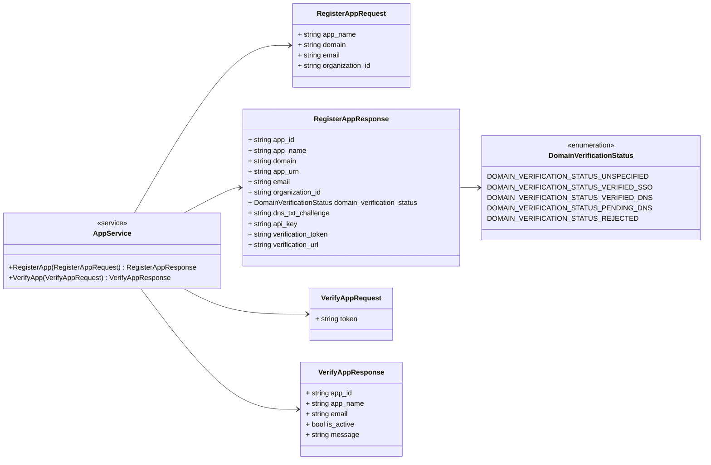
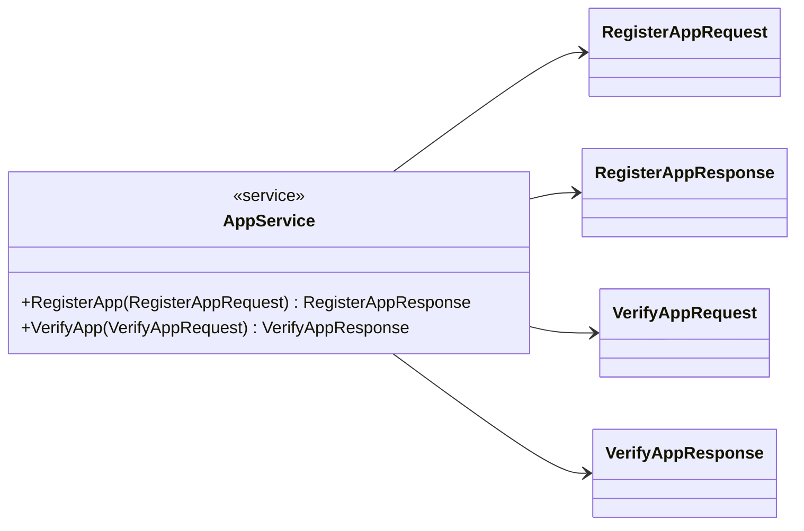
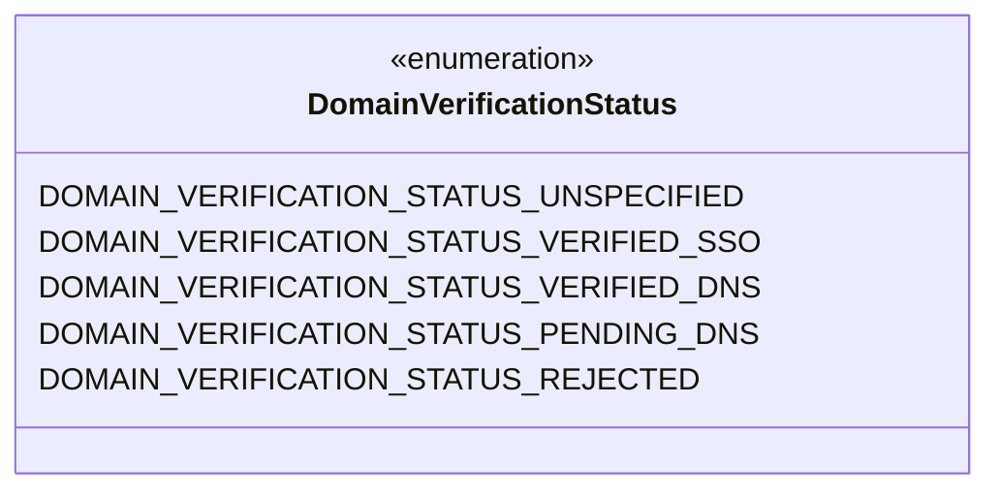
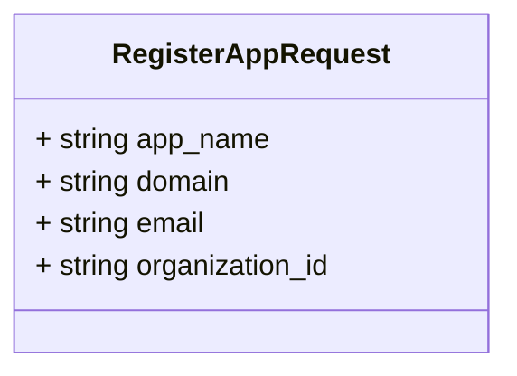
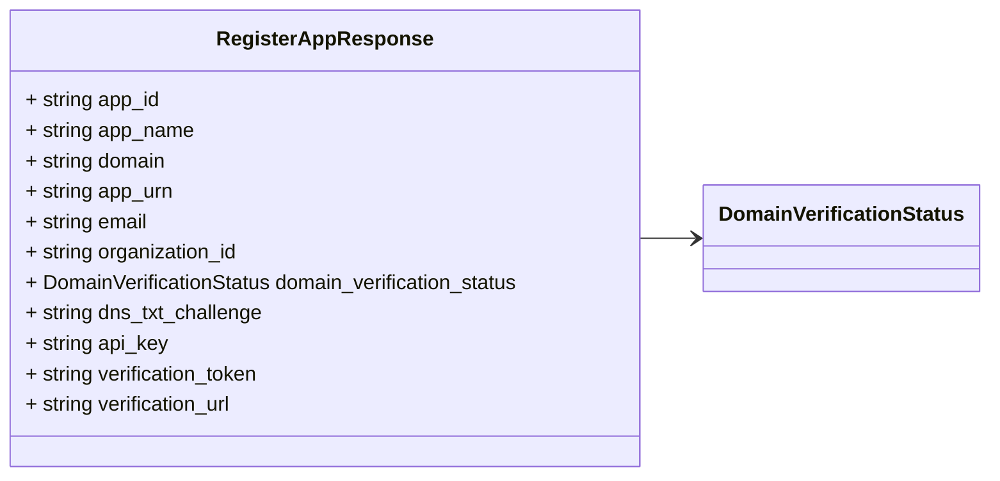
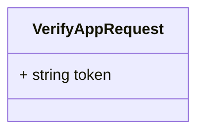
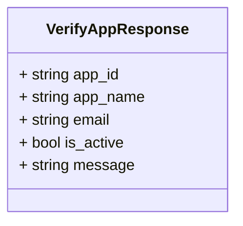

# Package: retailcortex.registration.v1

## Imports

| Import | Description |
|--------|-------------|

## Options

| Name                | Value                                                              | Description |
|---------------------|--------------------------------------------------------------------|-------------|
| go_package          | github.com/retail-cortex/skills/proto/retailcortex/registration/v1 |             |
| java_package        | com.retailcortex.skills.proto.retailcortex.registration.v1         |             |
| java_multiple_files | true                                                               |             |

### retailcortex.registration.v1 Diagram

## Service: AppService

**FQN**: retailcortex.registration.v1

AppService provides gRPC and REST methods for application registration and verification. HTTP Endpoints: - POST /api/v1/apps/register -> RegisterApp - GET /api/v1/apps/verify -> VerifyApp

### AppService Diagram

| Method         | Parameter (In)       | Parameter (Out)       | Description                                                                                                     |
|----------------|----------------------|-----------------------|-----------------------------------------------------------------------------------------------------------------|
| `RegisterApp ` | `RegisterAppRequest` | `RegisterAppResponse` | Register a new application to acquire API credentials. HTTP: POST /api/v1/apps/register                         |
| `VerifyApp `   | `VerifyAppRequest`   | `VerifyAppResponse`   | Verify an application using email verification token. HTTP: GET /api/v1/apps/verify?token={verification_token}  |

## Enum: DomainVerificationStatus

**FQN**: retailcortex.registration.v1.DomainVerificationStatus

DomainVerificationStatus classifies domain ownership validation state.

| Name                                      | Ordinal | Description                            |
|-------------------------------------------|---------|----------------------------------------|
| `DOMAIN_VERIFICATION_STATUS_UNSPECIFIED`  | 0       |                                        |
| `DOMAIN_VERIFICATION_STATUS_VERIFIED_SSO` | 1       | Verified via SSO/email domain match    |
| `DOMAIN_VERIFICATION_STATUS_VERIFIED_DNS` | 2       | Verified via DNS TXT record challenge  |
| `DOMAIN_VERIFICATION_STATUS_PENDING_DNS`  | 3       | Awaiting DNS TXT record challenge      |
| `DOMAIN_VERIFICATION_STATUS_REJECTED`     | 4       | Domain claim rejected                  |

### DomainVerificationStatus Diagram

### RegisterAppRequest Diagram

### RegisterAppResponse Diagram

### VerifyAppRequest Diagram

### VerifyAppResponse Diagram

## Message: RegisterAppRequest

**FQN**: retailcortex.registration.v1.RegisterAppRequest

RegisterAppRequest specifies parameters for application registration.

| Field             | Ordinal | Type     | Label | Description |
|-------------------|---------|----------|-------|-------------|
| `app_name`        | 1       | `string` |       |             |
| `domain`          | 2       | `string` |       |             |
| `email`           | 3       | `string` |       |             |
| `organization_id` | 4       | `string` |       |             |

## Message: RegisterAppResponse

**FQN**: retailcortex.registration.v1.RegisterAppResponse

RegisterAppResponse contains credentials and verification details.

| Field                        | Ordinal | Type                       | Label | Description |
|------------------------------|---------|----------------------------|-------|-------------|
| `app_id`                     | 1       | `string`                   |       |             |
| `app_name`                   | 2       | `string`                   |       |             |
| `domain`                     | 3       | `string`                   |       |             |
| `app_urn`                    | 4       | `string`                   |       |             |
| `email`                      | 5       | `string`                   |       |             |
| `organization_id`            | 6       | `string`                   |       |             |
| `domain_verification_status` | 7       | `DomainVerificationStatus` |       |             |
| `dns_txt_challenge`          | 8       | `string`                   |       |             |
| `api_key`                    | 9       | `string`                   |       |             |
| `verification_token`         | 10      | `string`                   |       |             |
| `verification_url`           | 11      | `string`                   |       |             |

## Message: VerifyAppRequest

**FQN**: retailcortex.registration.v1.VerifyAppRequest

VerifyAppRequest specifies the email verification token.

| Field   | Ordinal | Type     | Label | Description |
|---------|---------|----------|-------|-------------|
| `token` | 1       | `string` |       |             |

## Message: VerifyAppResponse

**FQN**: retailcortex.registration.v1.VerifyAppResponse

VerifyAppResponse contains activation status.

| Field       | Ordinal | Type     | Label | Description |
|-------------|---------|----------|-------|-------------|
| `app_id`    | 1       | `string` |       |             |
| `app_name`  | 2       | `string` |       |             |
| `email`     | 3       | `string` |       |             |
| `is_active` | 4       | `bool`   |       |             |
| `message`   | 5       | `string` |       |             |

<!-- Created by: Proto Diagram Tool -->
<!-- https://github.com/GoogleCloudPlatform/proto-gen-md-diagrams -->
