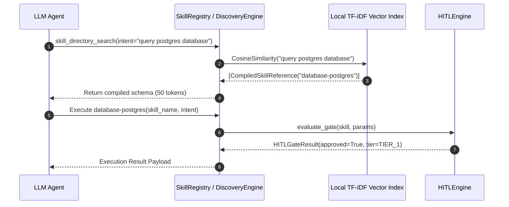

# Architectural Specification: Semantic Discovery, Skill Compiler, and HITL Execution Safety

This document defines the technical architecture for dynamic Just-in-Time (JIT) skill discovery, compiled schema optimization, cryptographic manifest integrity, and Human-in-the-Loop (HITL) execution safety in the Enterprise AI Agent Skill Registry (`retail-cortex/skills`).

---

## 1. Two-Step Directory Protocol (Semantic Discovery)

To prevent LLM prompt bloat and context degradation caused by feeding dozens of raw tool schemas into the initial prompt, the architecture enforces a **Two-Step Directory Protocol**:

1. **Meta-Tool Injection**: The LLM context is initialized with only a single meta-tool: `skill_directory_search(intent: string)`.
2. **Intent Retrieval**: When an agent requires a capability, it queries `skill_directory_search` with its natural language intent.
3. **Local Vector Search**: The orchestrator executes a TF-IDF / BM25 + Cosine Similarity search over the pre-indexed skill catalog and returns only the matching `CompiledSkillReference` pointers (reducing initial prompt overhead from ~500 tokens down to ~50 tokens).



---

## 2. Skill Compiler Specification

The `SkillCompiler` module processes raw `SkillDefinition` objects and `SKILL.md` documents to produce immutable, compact reference objects.

### Compilation Pipeline
1. **Comment & Formatting Stripping**: Removes HTML comments (`<!-- ... -->`), developer annotations, and redundant whitespace.
2. **Schema Generation**: Converts tool requirements into JSON Schemas:
   - **Strict Mode** (`strict_schemas=True`): Sets `additionalProperties: false` to force Poka-yoke execution and eliminate parameter hallucinations.
   - **Permissive Mode** (`strict_schemas=False`): Allows additional properties or explicitly extended property lists via `--allow-additional-properties`.
3. **Cryptographic Hashing**: Generates an immutable SHA-256 digest of the instructions, tool requirements, and metadata.

---

## 3. Human-in-the-Loop (HITL) Execution Architecture

Execution safety is enforced via a 4-tier security policy classification engine:

| Tier | Policy Name | Risk Profile | Execution Directive | Bypass Allowed |
| :--- | :--- | :--- | :--- | :--- |
| **Tier 0** | `TIER_0_BYPASS_ALL` | Automated CI / Headless | Immediate execution without intervention | Yes (`--skip-hitl`) |
| **Tier 1** | `TIER_1_AUTO_READ` | Informative / Read-only | Autonomous execution with structured audit log | N/A |
| **Tier 2** | `TIER_2_AUDITED_WRITE` | Low-risk state mutation | Autonomous execution with state snapshot & audit trail | N/A |
| **Tier 3** | `TIER_3_MANDATORY_APPROVAL` | High-risk / Destructive | Mandatory interactive user authorization gate | Yes (`--skip-hitl` or `SKILL_SKIP_HITL=1`) |

---

## 4. Manifest Locking Integrity (`.manifest.lock`)

Every target skill directory includes a `.manifest.lock` file storing the cryptographic checksums of all file contents:

```json
{
  "version": "1.0.0",
  "skills": {
    "python-core": {
      "skill_name": "python-core",
      "uri": "pkg://skills-python/python-core",
      "sha256": "e3b0c44298fc1c149afbf4c8996fb92427ae41e4649b934ca495991b7852b855",
      "compiled_sha256": "7f83b1657ff1fc53b92dc18148a1d65dfc2d4b1fa3d677284addd200126d9069",
      "strict_schema": true,
      "hitl_tier": "TIER_1_AUTO_READ"
    }
  }
}
```

Prior to dispatching any tool payload, the orchestrator computes the live directory checksum against `.manifest.lock`. If a mismatch or illegal payload tampering is detected, execution is immediately halted.
