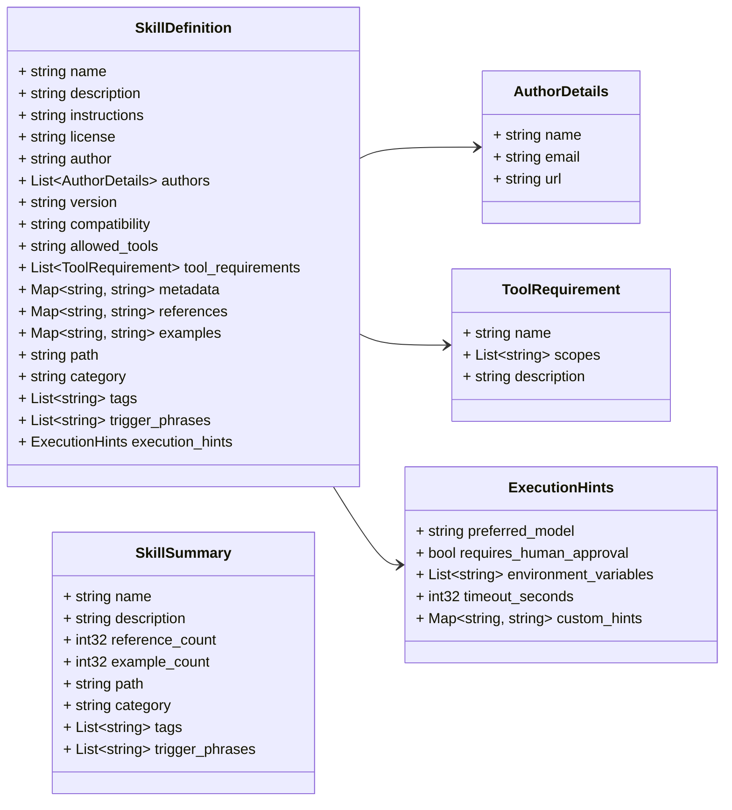
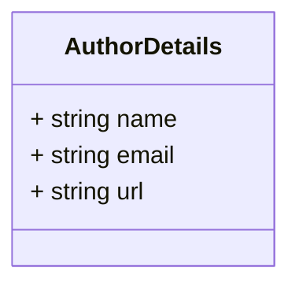
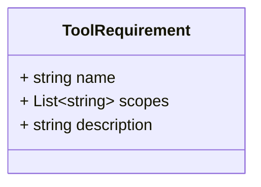
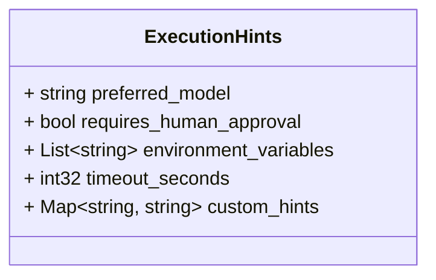
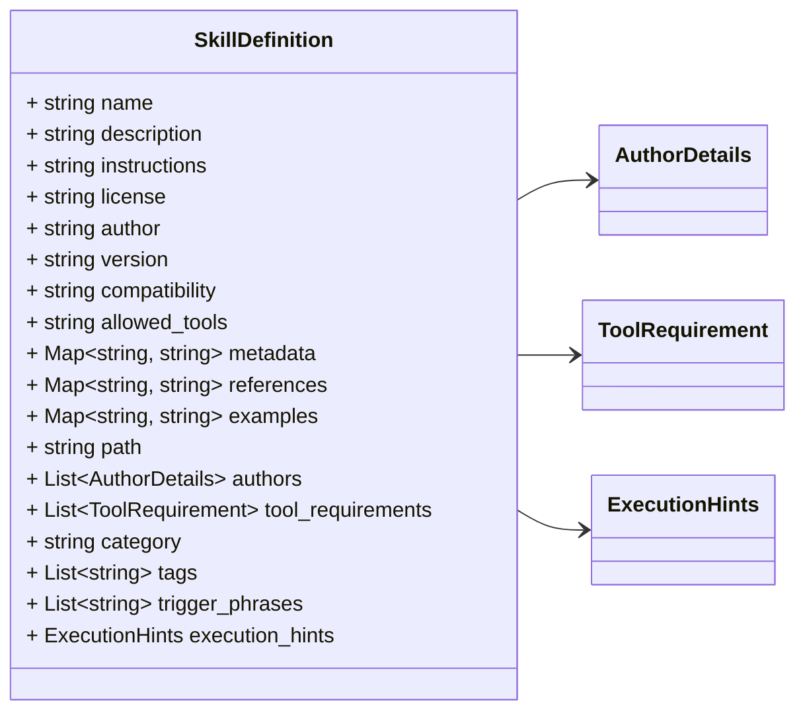
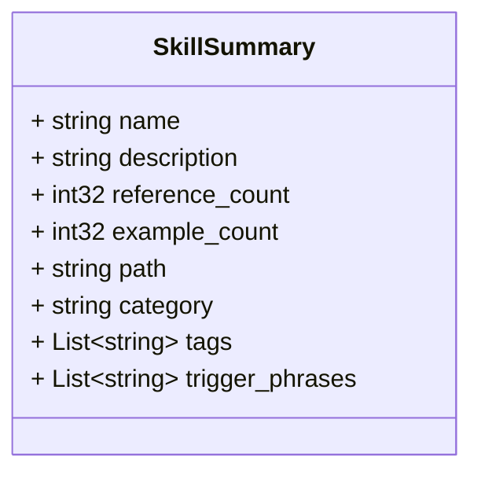

# Package: retailcortex.skills.v1

## Imports

| Import | Description |
|--------|-------------|

## Options

| Name                | Value                                  | Description |
|---------------------|----------------------------------------|-------------|
| go_package          | github.com/retail-cortex/skills/api/v1 |             |
| java_package        | com.retailcortex.skills.api.v1         |             |
| java_multiple_files | true                                   |             |

### retailcortex.skills.v1 Diagram

### AuthorDetails Diagram

### ToolRequirement Diagram

### ExecutionHints Diagram

### SkillDefinition Diagram

### SkillSummary Diagram

## Message: AuthorDetails

**FQN**: retailcortex.skills.v1.AuthorDetails

AuthorDetails represents structured attribution for a skill contributor.

| Field   | Ordinal | Type     | Label | Description |
|---------|---------|----------|-------|-------------|
| `name`  | 1       | `string` |       |             |
| `email` | 2       | `string` |       |             |
| `url`   | 3       | `string` |       |             |

## Message: ToolRequirement

**FQN**: retailcortex.skills.v1.ToolRequirement

ToolRequirement represents a structured permission contract for agent tool execution.

| Field         | Ordinal | Type     | Label    | Description                              |
|---------------|---------|----------|----------|------------------------------------------|
| `name`        | 1       | `string` |          | e.g. "Bash", "Read", "WebSearch"         |
| `scopes`      | 2       | `string` | Repeated | e.g. ["git:*", "uv:*"]                   |
| `description` | 3       | `string` |          | Rationale for requesting tool execution  |

## Message: ExecutionHints

**FQN**: retailcortex.skills.v1.ExecutionHints

ExecutionHints provides operational parameters for LLM agents, routers, and orchestrators.

| Field                     | Ordinal | Type             | Label    | Description                                                  |
|---------------------------|---------|------------------|----------|--------------------------------------------------------------|
| `preferred_model`         | 1       | `string`         |          | e.g. "gemini-3.1-pro", "gemini-2.0-flash"                    |
| `requires_human_approval` | 2       | `bool`           |          | True if the skill performs high-risk or destructive actions  |
| `environment_variables`   | 3       | `string`         | Repeated | Required env vars (e.g. ["GITHUB_TOKEN", "GOPATH"])          |
| `timeout_seconds`         | 4       | `int32`          |          | Max recommended execution duration in seconds                |
| `custom_hints`            | 5       | `string, string` | Map      | Arbitrary key-value execution directives                     |

## Message: SkillDefinition

**FQN**: retailcortex.skills.v1.SkillDefinition

SkillDefinition defines the core structural model for an enterprise AI agent skill.

| Field               | Ordinal | Type              | Label    | Description                                                                             |
|---------------------|---------|-------------------|----------|-----------------------------------------------------------------------------------------|
| `name`              | 1       | `string`          |          |                                                                                         |
| `description`       | 2       | `string`          |          |                                                                                         |
| `instructions`      | 3       | `string`          |          |                                                                                         |
| `license`           | 4       | `string`          |          |                                                                                         |
| `author`            | 5       | `string`          |          | Attribution Legacy single-string author for backward compatibility                      |
| `version`           | 6       | `string`          |          |                                                                                         |
| `compatibility`     | 7       | `string`          |          |                                                                                         |
| `allowed_tools`     | 8       | `string`          |          | Tool Permissions & Security Contracts Legacy flat string for backward compatibility     |
| `metadata`          | 9       | `string, string`  | Map      |                                                                                         |
| `references`        | 10      | `string, string`  | Map      |                                                                                         |
| `examples`          | 11      | `string, string`  | Map      |                                                                                         |
| `path`              | 12      | `string`          |          |                                                                                         |
| `authors`           | 13      | `AuthorDetails`   | Repeated | Strongly-typed list of contributors                                                     |
| `tool_requirements` | 14      | `ToolRequirement` | Repeated | Strongly-typed tool permissions                                                         |
| `category`          | 15      | `string`          |          | Categorization & Intent Triggers Domain category (e.g. "devops", "database", "python")  |
| `tags`              | 16      | `string`          | Repeated | Search tags for fast registry discovery                                                 |
| `trigger_phrases`   | 17      | `string`          | Repeated | Explicit phrases or intent triggers (e.g. "scaffold Go microservice")                   |
| `execution_hints`   | 18      | `ExecutionHints`  |          | Agent Execution Guidelines Operational hints for LLM orchestrators                      |

## Message: SkillSummary

**FQN**: retailcortex.skills.v1.SkillSummary

SkillSummary provides a lightweight summary of a skill definition for listing and discovery.

| Field             | Ordinal | Type     | Label    | Description |
|-------------------|---------|----------|----------|-------------|
| `name`            | 1       | `string` |          |             |
| `description`     | 2       | `string` |          |             |
| `reference_count` | 3       | `int32`  |          |             |
| `example_count`   | 4       | `int32`  |          |             |
| `path`            | 5       | `string` |          |             |
| `category`        | 6       | `string` |          |             |
| `tags`            | 7       | `string` | Repeated |             |
| `trigger_phrases` | 8       | `string` | Repeated |             |

<!-- Created by: Proto Diagram Tool -->
<!-- https://github.com/GoogleCloudPlatform/proto-gen-md-diagrams -->
