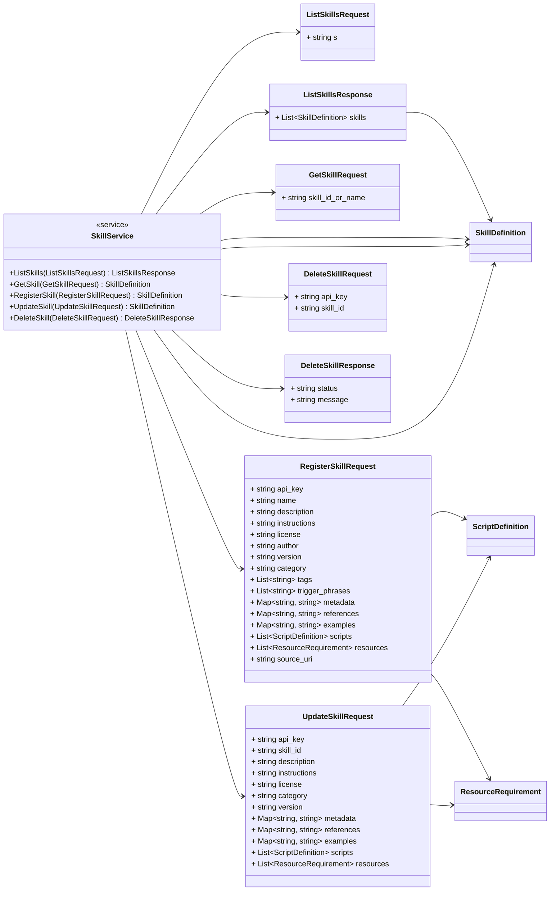
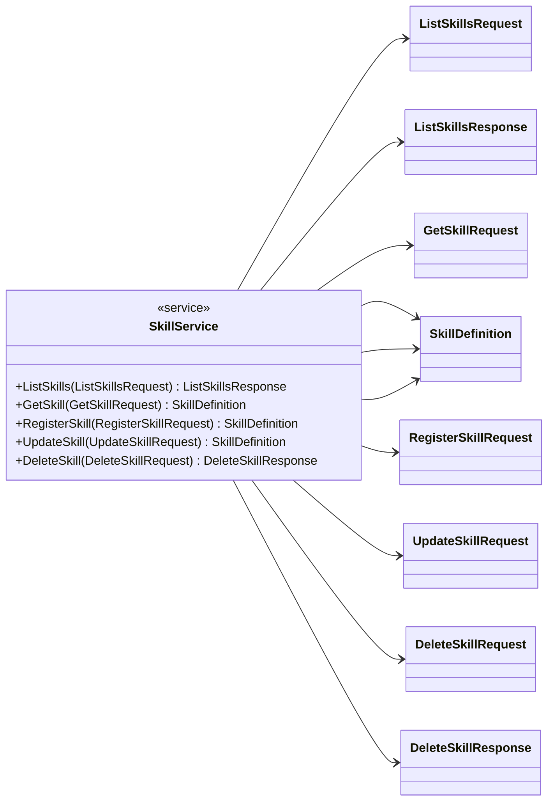
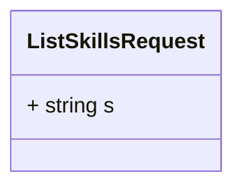
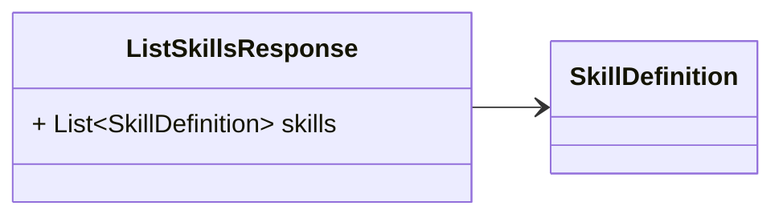
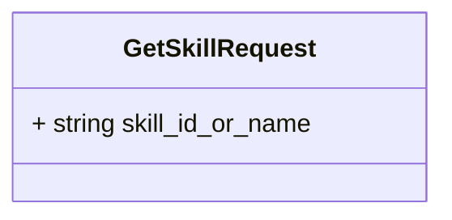
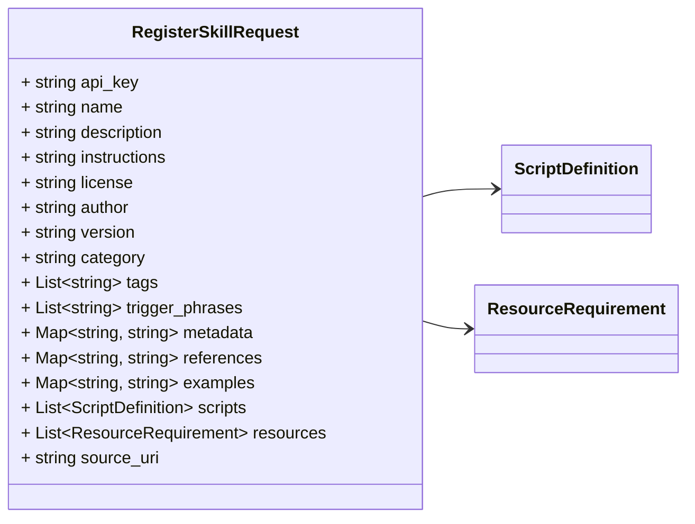
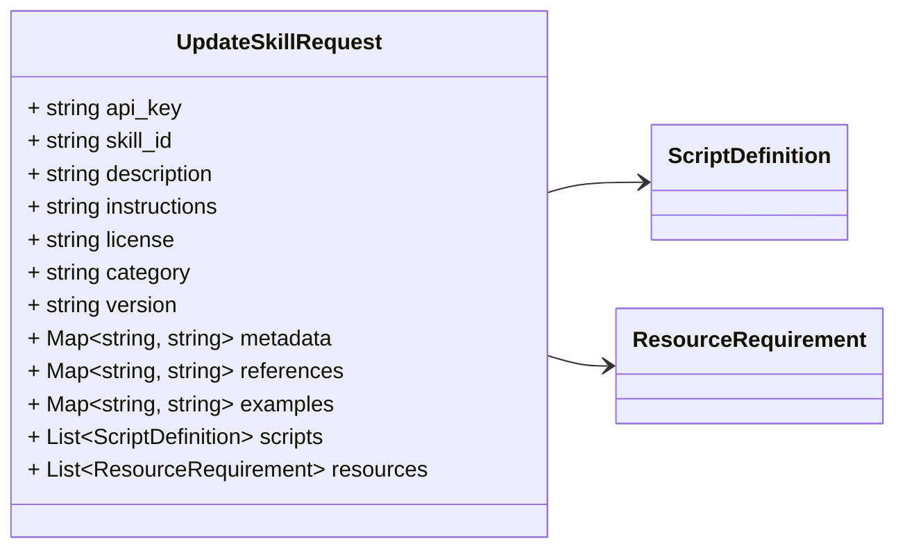
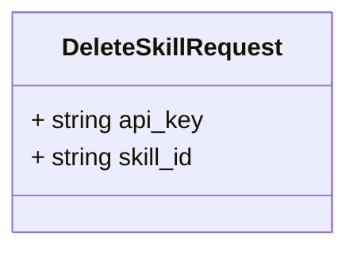
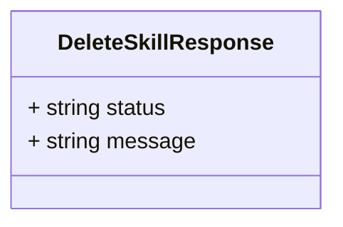

# Package: retailcortex.skills.v1

## Imports

| Import                             | Description |
|------------------------------------|-------------|
| retailcortex/skills/v1/skill.proto |             |

## Options

| Name                | Value                                                        | Description |
|---------------------|--------------------------------------------------------------|-------------|
| go_package          | github.com/retail-cortex/skills/proto/retailcortex/skills/v1 |             |
| java_package        | com.retailcortex.skills.proto.retailcortex.skills.v1         |             |
| java_multiple_files | true                                                         |             |

### retailcortex.skills.v1 Diagram

## Service: SkillService

**FQN**: retailcortex.skills.v1

SkillService provides gRPC and REST methods for skill discovery and lifecycle management. HTTP Endpoints: - GET /api/v1/skills -> ListSkills - GET /api/v1/skills/{skill_id_or_name} -> GetSkill - POST /api/v1/skills -> RegisterSkill (Header: X-API-Key) - PUT /api/v1/skills/{skill_id} -> ReplaceSkill (Header: X-API-Key) - PATCH /api/v1/skills/{skill_id} -> UpdateSkill (Header: X-API-Key) - DELETE /api/v1/skills/{skill_id} -> DeleteSkill (Header: X-API-Key)

### SkillService Diagram

| Method           | Parameter (In)         | Parameter (Out)       | Description                                                                                                     |
|------------------|------------------------|-----------------------|-----------------------------------------------------------------------------------------------------------------|
| `ListSkills `    | `ListSkillsRequest`    | `ListSkillsResponse`  | Query matching skill definitions. HTTP: GET /api/v1/skills?s={query}                                            |
| `GetSkill `      | `GetSkillRequest`      | `SkillDefinition`     | Retrieve a single skill by ID or unique name. HTTP: GET /api/v1/skills/{skill_id_or_name}                       |
| `RegisterSkill ` | `RegisterSkillRequest` | `SkillDefinition`     | Register a new skill. Requires verified X-API-Key header. HTTP: POST /api/v1/skills                             |
| `UpdateSkill `   | `UpdateSkillRequest`   | `SkillDefinition`     | Update an existing skill definition. Requires verified X-API-Key header. HTTP: PATCH /api/v1/skills/{skill_id}  |
| `DeleteSkill `   | `DeleteSkillRequest`   | `DeleteSkillResponse` | Delete a skill by ID. Requires verified X-API-Key header. HTTP: DELETE /api/v1/skills/{skill_id}                |

### ListSkillsRequest Diagram

### ListSkillsResponse Diagram

### GetSkillRequest Diagram

### RegisterSkillRequest Diagram

### UpdateSkillRequest Diagram

### DeleteSkillRequest Diagram

### DeleteSkillResponse Diagram

## Message: ListSkillsRequest

**FQN**: retailcortex.skills.v1.ListSkillsRequest

ListSkillsRequest specifies criteria for querying skills.

| Field | Ordinal | Type     | Label | Description                                   |
|-------|---------|----------|-------|-----------------------------------------------|
| `s`   | 1       | `string` |       | Optional semantic vector search query string  |

## Message: ListSkillsResponse

**FQN**: retailcortex.skills.v1.ListSkillsResponse

ListSkillsResponse contains a list of matching skill definitions.

| Field    | Ordinal | Type              | Label    | Description |
|----------|---------|-------------------|----------|-------------|
| `skills` | 1       | `SkillDefinition` | Repeated |             |

## Message: GetSkillRequest

**FQN**: retailcortex.skills.v1.GetSkillRequest

GetSkillRequest specifies the skill ID or unique name to retrieve.

| Field              | Ordinal | Type     | Label | Description |
|--------------------|---------|----------|-------|-------------|
| `skill_id_or_name` | 1       | `string` |       |             |

## Message: RegisterSkillRequest

**FQN**: retailcortex.skills.v1.RegisterSkillRequest

RegisterSkillRequest contains parameters for creating a new skill.

| Field             | Ordinal | Type                  | Label    | Description                                                                               |
|-------------------|---------|-----------------------|----------|-------------------------------------------------------------------------------------------|
| `api_key`         | 1       | `string`              |          |                                                                                           |
| `name`            | 2       | `string`              |          |                                                                                           |
| `description`     | 3       | `string`              |          |                                                                                           |
| `instructions`    | 4       | `string`              |          |                                                                                           |
| `license`         | 5       | `string`              |          |                                                                                           |
| `author`          | 6       | `string`              |          |                                                                                           |
| `version`         | 7       | `string`              |          |                                                                                           |
| `category`        | 8       | `string`              |          |                                                                                           |
| `tags`            | 9       | `string`              | Repeated |                                                                                           |
| `trigger_phrases` | 10      | `string`              | Repeated |                                                                                           |
| `metadata`        | 11      | `string, string`      | Map      |                                                                                           |
| `references`      | 12      | `string, string`      | Map      |                                                                                           |
| `examples`        | 13      | `string, string`      | Map      |                                                                                           |
| `scripts`         | 14      | `ScriptDefinition`    | Repeated |                                                                                           |
| `resources`       | 15      | `ResourceRequirement` | Repeated |                                                                                           |
| `source_uri`      | 16      | `string`              |          | Original source URI (e.g. github://google/skills@main/tree/main/skills/cloud/gemini-api)  |

## Message: UpdateSkillRequest

**FQN**: retailcortex.skills.v1.UpdateSkillRequest

UpdateSkillRequest contains parameters for modifying an existing skill.

| Field          | Ordinal | Type                  | Label    | Description |
|----------------|---------|-----------------------|----------|-------------|
| `api_key`      | 1       | `string`              |          |             |
| `skill_id`     | 2       | `string`              |          |             |
| `description`  | 3       | `string`              |          |             |
| `instructions` | 4       | `string`              |          |             |
| `license`      | 5       | `string`              |          |             |
| `category`     | 6       | `string`              |          |             |
| `version`      | 7       | `string`              |          |             |
| `metadata`     | 8       | `string, string`      | Map      |             |
| `references`   | 9       | `string, string`      | Map      |             |
| `examples`     | 10      | `string, string`      | Map      |             |
| `scripts`      | 11      | `ScriptDefinition`    | Repeated |             |
| `resources`    | 12      | `ResourceRequirement` | Repeated |             |

## Message: DeleteSkillRequest

**FQN**: retailcortex.skills.v1.DeleteSkillRequest

DeleteSkillRequest specifies the target skill to delete.

| Field      | Ordinal | Type     | Label | Description |
|------------|---------|----------|-------|-------------|
| `api_key`  | 1       | `string` |       |             |
| `skill_id` | 2       | `string` |       |             |

## Message: DeleteSkillResponse

**FQN**: retailcortex.skills.v1.DeleteSkillResponse

DeleteSkillResponse contains execution status of skill deletion.

| Field     | Ordinal | Type     | Label | Description |
|-----------|---------|----------|-------|-------------|
| `status`  | 1       | `string` |       |             |
| `message` | 2       | `string` |       |             |

<!-- Created by: Proto Diagram Tool -->
<!-- https://github.com/GoogleCloudPlatform/proto-gen-md-diagrams -->
