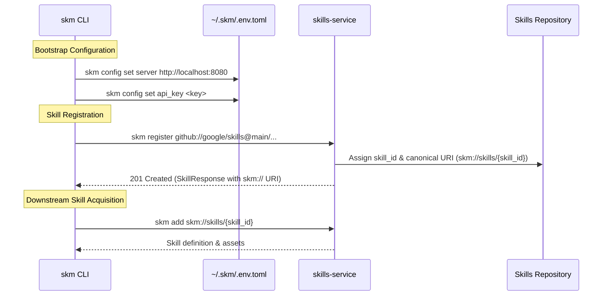

# Engineering Standards & Architecture

Every skill in this registry enforces a complete, production-grade Software Development Lifecycle (SDLC) with zero-tolerance security, Google OAuth2 authentication, and HTTP 429 rate limit resilience.

---

## 1. Enterprise Service Architecture (`skills-service`)

The enterprise skills platform is architected around a high-performance Go backend service (`cmd/skills-service`) exposing dual gRPC and REST HTTP endpoints (`/api/v1/skills`, `/api/v1/apps/verify`), alongside stdio/pipe-based Model Context Protocol (MCP) tool bindings (`pkg/mcp`).

```mermaid
graph TD
    subgraph CLI Client ["skm CLI Client"]
        CLI1[skm config (~/.skm/.env.toml)]
        CLI2[skm register github://...]
        CLI3[skm add skm://skills/{id}]
    end

    subgraph Service Backend ["cmd/skills-service (Go Backend)"]
        S1[Gin REST & gRPC API Handlers]
        S2[pkg/service Skills & Apps Service]
        S3[pkg/data GORM SQLite / AlloyDB Repository]
        S4[pkg/mcp MCP Server Tools]
    end

    CLI2 -- "POST /api/v1/skills (Header: X-API-Key)" --> S1
    CLI3 -- "GET /api/v1/skills/{id}" --> S1
    S1 --> S2
    S2 --> S3
    S2 --> S4
```

---

## 2. Enterprise Skill Lifecycle & Canonical URIs (`skm://`)



---

## 3. Polyglot Client Libraries & Native Build Plugins

1. **Go Client (`clients/go/pkg/skillsloader`)**: Integrated via `//go:generate` directives, `modenv` (`github.com/rrmcguinness/modenv/pkg/modenv`) TOML property loading, and Bazel `rules_go`.
2. **Java Client (`clients/java`)**: Implemented as a native Maven Plugin (`skills-loader-maven-plugin` / `GenerateManifestMojo`) binding to `mvn compile`, Java System properties (`System.getProperty`), and `rules_jvm_external`.
3. **Python Client (`clients/python`)**: Implemented as a PEP 517 build backend wrapper (`loader.build_meta`) binding to `uv build` / `pip install`, `python-dotenv`, and `rules_python`.

---

## 4. Google OAuth2 Identity & Header Authentication

- **Header Authentication (`X-API-Key`)**: Client requests to `skills-service` attach `X-API-Key` headers for tenant isolation and caller verification.
- **Frontend UI (React 19 / Next.js)**: Google Identity Services (GIS) and Authorization Code Flow with PKCE (`@react-oauth/google`). Access tokens stored in secure `HttpOnly`, `SameSite=Lax` cookies; unencrypted tokens in `localStorage` are prohibited (CWE-79).
- **User Token Delegation**: Backend agents delegate authenticated user OAuth2 tokens into `ToolContext.state["user_token"]` to execute BigQuery CAPI and storage tools under the end user's IAM permissions (CWE-269).

---

## 5. HTTP 429 Rate Limit & Quota Resilience

All AI-driven API calls (Gemini, BigQuery CAPI, Vertex AI) MUST implement **Exponential Backoff with Full Randomized Jitter**:

- **Python 3.13**: `tenacity` library for async retry and backoff algorithms.
- **Go 1.26+**: `hashicorp/go-retryablehttp` wrapper.
- **Java 17+**: `Resilience4j` retry and rate limiter modules.

Inbound endpoints protect against quota exhaustion via token bucket rate limiters (`golang.org/x/time/rate`, `slowapi`, `Bucket4j`).

---

## 6. Build System Interoperability (Bazel Overarching Standard)

Every language standardizes on **Bazel** for hermetic CI/CD and monorepo execution:

- **Python (3.13+)**: Managed locally via **uv** (`pyproject.toml`), wrapped in Bazel `rules_python` (`1.7.0`).
- **Java (17+)**: Managed locally via **Maven** (`pom.xml`), wrapped in Bazel `rules_java` and `rules_jvm_external`.
- **Go (1.26+)**: Managed locally via **Go modules** (`go.mod`), wrapped in Bazel `rules_go` and `gazelle`.

---

## 7. Hierarchical Configuration & Security

- **Go**: `modenv` (`github.com/rrmcguinness/modenv/pkg/modenv`) for multi-tier cascading TOML configuration (`.env.toml`, `.env.local.toml`).
- **Python**: `python-dotenv` (`load_dotenv()`) for `.env` property resolution.
- **Java**: Java System Properties (`System.getProperty("skm.server.url")`) with environment fallbacks.

---

## 8. Safe Storage, Cryptographic Integrity & HITL Execution

- **Manifest Locking (`.manifest.lock`)**: Every compiled skill is cryptographically hashed (inputs, outputs, execution logic). The orchestrator rejects payloads attempting to alter execution parameters outside the compiled schema.
- **Human-in-the-Loop (HITL)**: The `HITLEngine` provides tiered intervention gates to isolate read and write workloads, preventing LLM excessive agency (OWASP LLM08).

---

## 9. Protocol Buffer Architecture Contracts (`proto/`)

The core domain model (`SkillDefinition`, `SkillSummary`, `RegisterSkillRequest`, `AppDefinition`) is formally defined in Protocol Buffers (`proto/retailcortex/skills/v1/skill.proto` and `proto/retailcortex/skills/v1/skill_service.proto`).
