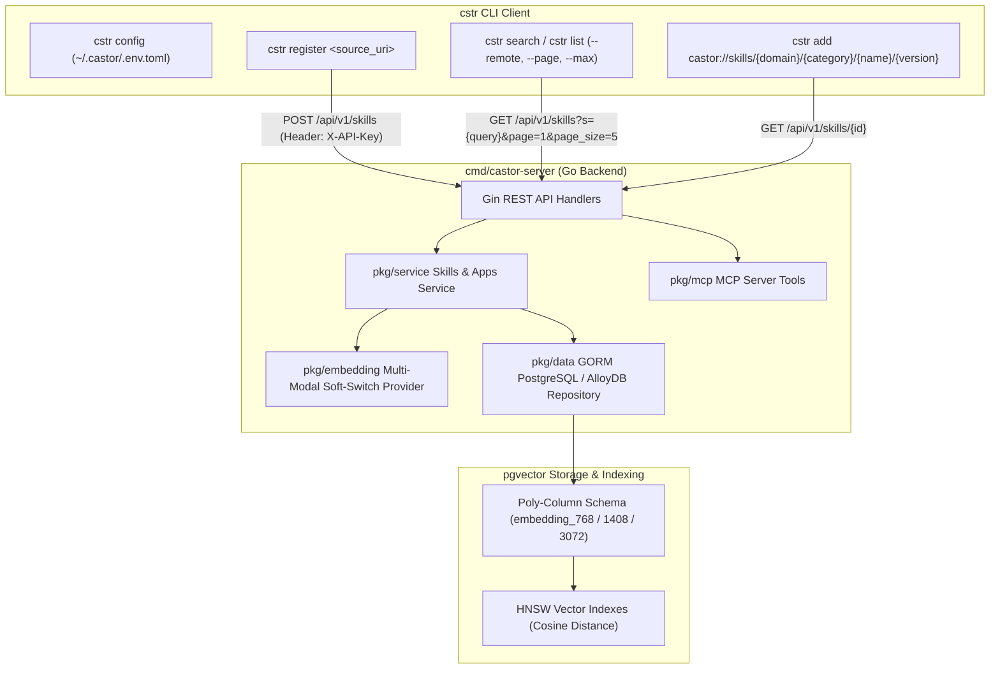
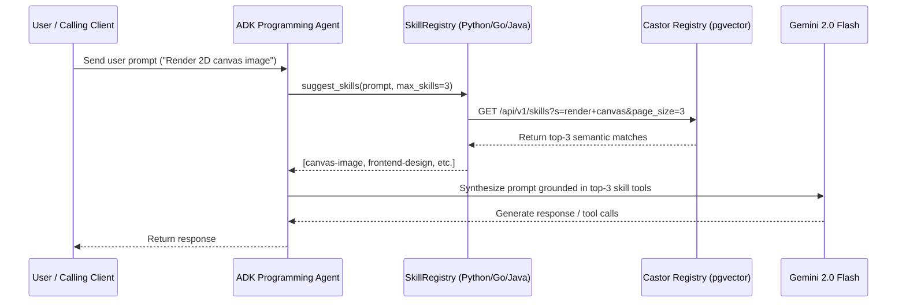

# Engineering Standards & Architecture

Every skill in this registry enforces a complete, production-grade Software Development Lifecycle (SDLC) with zero-tolerance security, Google OAuth2 authentication, multi-modal vector search, and HTTP 429 rate limit resilience.

---

## 1. Enterprise Service Architecture (`Castor Registry`)

The enterprise skills platform is architected around a high-performance Go backend service (`cmd/castor-server`) exposing dual REST HTTP endpoints (`/api/v1/skills`, `/api/v1/apps/register`, `/api/v1/apps/verify`), alongside Model Context Protocol (MCP) tool bindings (`pkg/mcp`).



---

## 2. Multi-Modal Vector Search & Poly-Column Schema

The storage layer standardizes on a **Poly-Column Schema** with PostgreSQL/AlloyDB `pgvector` to seamlessly support multiple embedding models of varying dimensions:

* **`embedding_768` (`vector(768)`)**: Used for `text-embedding-004` and `alloydb-ai` in-database embedding functions.
* **`embedding_1408` (`vector(1408)`)**: Used for Google Vertex AI `multimodalembedding` multi-modal image/text models.
* **`embedding_3072` (`vector(3072)`)**: Reserved for ultra-high-dimensional generative embeddings.

### HNSW Index Partitions
Each active vector column is indexed using Hierarchical Navigable Small World (HNSW) graphs with cosine distance operators (`vector_cosine_ops`):

```sql
CREATE INDEX IF NOT EXISTS skills_embedding_768_hnsw_idx 
ON skills USING hnsw (embedding_768 vector_cosine_ops) 
WITH (m = 16, ef_construction = 64);

CREATE INDEX IF NOT EXISTS skills_embedding_1408_hnsw_idx 
ON skills USING hnsw (embedding_1408 vector_cosine_ops) 
WITH (m = 16, ef_construction = 64);
```

---

## 3. Pluggable Soft-Switch Embedding Providers

The embedding layer standardizes on a decoupled Go provider interface ([`pkg/embedding.Provider`](file:///Users/rmcguinness/Projects/skill-builder/pkg/embedding/provider.go#L26-L50)):

```go
type Provider interface {
    // Name returns the provider identifier (e.g. "vertex-gemini", "alloydb-ai").
    Name() string

    // Dimension returns the vector dimension produced by this provider.
    Dimension() int

    // GenerateEmbedding generates a vector embedding for a single text input.
    GenerateEmbedding(ctx context.Context, text string) ([]float64, error)

    // GenerateImageEmbedding generates a vector embedding for a base64-encoded image input.
    GenerateImageEmbedding(ctx context.Context, base64Image string) ([]float64, error)

    // GenerateSkillEmbeddings decomposes and generates granular multi-chunk embeddings for an entire skill.
    GenerateSkillEmbeddings(
        ctx context.Context,
        name, description, instructions string,
        triggers []string,
        references map[string]string,
        examples map[string]string,
    ) ([]model.SkillEmbeddingChunk, error)

    // CosineSimilarity computes the cosine similarity between two vector embeddings.
    CosineSimilarity(a, b []float64) float64
}
```

### Supported Concrete Providers

Configured dynamically in `cmd/castor-server/.env.toml` via `embedding_provider` or environment variable `EMBEDDING_PROVIDER`:

#### 1. Google Vertex AI & Gemini Provider ([`pkg/embedding/vertex`](file:///Users/rmcguinness/Projects/skill-builder/pkg/embedding/vertex/vertex.go))
- **Provider Identifier**: `"vertex-gemini"` (default)
- **Supported Models**: `multimodalembedding` (1408 dimensions, default) and `text-embedding-004` (768 dimensions).
- **Authentication**: Supports Google Cloud Application Default Credentials (ADC) OAuth2 access token caching (`gcloud auth print-access-token` / GCP metadata server) or Gemini Developer API keys (`GEMINI_API_KEY`).
- **Configuration Variables**:
  - `GCP_PROJECT_ID` / `GOOGLE_CLOUD_PROJECT`: Target Google Cloud Project ID.
  - `GCP_REGION`: Target GCP Region (defaults to `us-central1`).
  - `GEMINI_API_KEY`: API key for Gemini Developer API endpoints.
  - `VERTEX_AI_BASE_URL`: Custom proxy or emulator endpoint.
- **Offline Fallback**: Implements deterministic, normalized vector generation ([`embedding.GenerateDeterministicVector`](file:///Users/rmcguinness/Projects/skill-builder/pkg/embedding/provider.go#L128)) when credentials are not configured, enabling zero-network local development.

#### 2. AlloyDB AI In-Database Provider ([`pkg/embedding/alloydb`](file:///Users/rmcguinness/Projects/skill-builder/pkg/embedding/alloydb/alloydb.go))
- **Provider Identifier**: `"alloydb-ai"` or `"alloydb"`
- **Supported Models**: `text-embedding-004` (768 dimensions, default).
- **Execution Mechanism**: Invokes native in-database PostgreSQL functions directly over the active database connection:
  ```sql
  SELECT embedding('text-embedding-004', $1)::text;
  -- Fallback to Google ML extension:
  SELECT google_ml.embedding('text-embedding-004', $1)::text;
  ```
- **Driver Support**: Interfaces via GORM `*gorm.DB` or standard `database/sql.DB`.

### Asynchronous Ingestion & Multi-Chunk Decomposition

During skill registration, embedding generation is offloaded to non-blocking background workers ([`SkillsService.startBackgroundWorkers`](file:///Users/rmcguinness/Projects/skill-builder/pkg/service/skills_service.go#L106-L129)):

1. **Sliding-Window Chunking**: Long instructions and references are partitioned into $\le 900$-character chunks with an 80-character sliding step overlap ([`embedding.SplitTextIntoChunks`](file:///Users/rmcguinness/Projects/skill-builder/pkg/embedding/provider.go#L70)).
2. **Multi-Asset Embedding**: Generates distinct chunk embeddings across skill metadata, system instructions, trigger phrases, Markdown references, and code examples.
3. **Poly-Column Persistence**: Chunks are stored in the `skill_embeddings` table and indexed using pgvector HNSW cosine graphs.

### Evaluation & Benchmark Test Harness ([`pkg/embedding/harness_test.go`](file:///Users/rmcguinness/Projects/skill-builder/pkg/embedding/harness_test.go))

The embedding evaluation test harness benchmarks candidate embedding providers against ground-truth skill corpora to verify:
- **Mean Reciprocal Rank (MRR)**: Average reciprocal rank of expected skill matches across natural language queries.
- **Top-1 & Top-3 Recall Accuracy**: Fraction of queries where the relevant skill appears in the top $1$ or $3$ recommendations.
- **P95 Latency & Throughput**: Text embedding generation latency and batch skill decomposition performance.

---

## 4. Bounded REST Pagination & Abuse Prevention

The central `/api/v1/skills` endpoint enforces strict bounding:
- **`page`**: 1-based page index (minimum `1`).
- **`page_size` / `max`**: Clamped between `1` and `25` (default: `5`).
- **Response Headers**:
  - `X-Total-Count`: Total number of matching items in the database.
  - `X-Page`: Current page number.
  - `X-Page-Size`: Effective page size.
  - `X-Total-Pages`: Total available pages.
- **Envelope Mode**: Querying `?envelope=true` returns a wrapped `PaginatedSkillResponse` JSON structure.

---

## 5. JIT Dynamic Pre-Call Retrieval Pattern for ADK Agents

Rather than injecting dozens of tools into the LLM system prompt statically, autonomous agents implement **JIT Pre-Call Retrieval**:



---

## 6. Build System Interoperability (Bazel Overarching Standard)

Every language standardizes on **Bazel** for hermetic CI/CD and monorepo execution:

- **Python (3.13+)**: Managed locally via **uv** (`pyproject.toml`), wrapped in Bazel `rules_python`.
- **Java (17+)**: Managed locally via **Maven** (`pom.xml`), wrapped in Bazel `rules_java` and `rules_jvm_external`.
- **Go (1.26+)**: Managed locally via **Go modules** (`go.mod`), wrapped in Bazel `rules_go` and `gazelle`.

---

## 7. Hierarchical Configuration & Security

- **Go**: `modenv` (`github.com/rrmcguinness/modenv/pkg/modenv`) for multi-tier cascading TOML configuration (`.env.toml`, `.env.local.toml`).
- **Python**: `python-dotenv` (`load_dotenv()`) for `.env` property resolution.
- **Java**: Java System Properties (`System.getProperty("castor.server.url")`) with environment fallbacks.

---

## 8. Safe Storage, Cryptographic Integrity & HITL Execution

- **Manifest Locking (`.manifest.lock`)**: Every installed skill is cryptographically hashed (inputs, outputs, execution logic). The orchestrator rejects payloads attempting to alter execution parameters outside the compiled schema.
- **Human-in-the-Loop (HITL)**: The `HITLEngine` provides tiered intervention gates to isolate read and write workloads, preventing LLM excessive agency (OWASP LLM08).

---

## 9. Role-Based Access Control (RBAC) & Collaborator Model

The enterprise registry enforces multi-tenant Role-Based Access Control at the application level via [`pkg/model/app.go`](file:///Users/rmcguinness/Projects/skill-builder/pkg/model/app.go) and [`pkg/data/apps_repository.go`](file:///Users/rmcguinness/Projects/skill-builder/pkg/data/apps_repository.go).

### Permission Hierarchy

| Role | Scope | Permitted Operations |
|---|---|---|
| **`OWNER`** | Full Administrative | Invite/remove collaborators, assign roles, provision/revoke API keys, transfer app ownership, create/update/delete skills, read skills. |
| **`EDITOR`** | Engineering / CI-CD | Create, update, replace, and delete skills owned by the application. Provision developer scoped keys. Read skills. |
| **`VIEWER`** | Read-Only / Analytics | List and retrieve skills, read metadata, execute semantic search queries. Prohibited from mutating skills. |

### REST Management Endpoints

- **`GET /api/v1/apps/members`**: List registered collaborators and their statuses (`ACTIVE`, `PENDING_INVITE`).
- **`POST /api/v1/apps/members/invite`**: Issue an email invitation with a specific role (`OWNER`, `EDITOR`, `VIEWER`).
- **`GET /api/v1/apps/members/accept?token=...`**: Token-based invitation verification and activation.
- **`PATCH /api/v1/apps/members/:member_id`**: Update collaborator role (requires `OWNER`).
- **`DELETE /api/v1/apps/members/:member_id`**: Revoke and delete a collaborator (requires `OWNER`).
- **`GET /api/v1/apps/keys`**: List active and revoked scoped API keys.
- **`POST /api/v1/apps/keys`**: Provision a dedicated, expiration-bounded API key for developers or CI/CD pipelines.
- **`DELETE /api/v1/apps/keys/:key_id`**: Instantly revoke an API key.

---

## 10. Protocol Buffer Architecture Contracts (`proto/`)

The core domain model (`SkillDefinition`, `SkillSummary`, `RegisterSkillRequest`, `AppDefinition`) is formally defined in Protocol Buffers (`proto/retailcortex/skills/v1/skill.proto` and `proto/retailcortex/skills/v1/skill_service.proto`).

