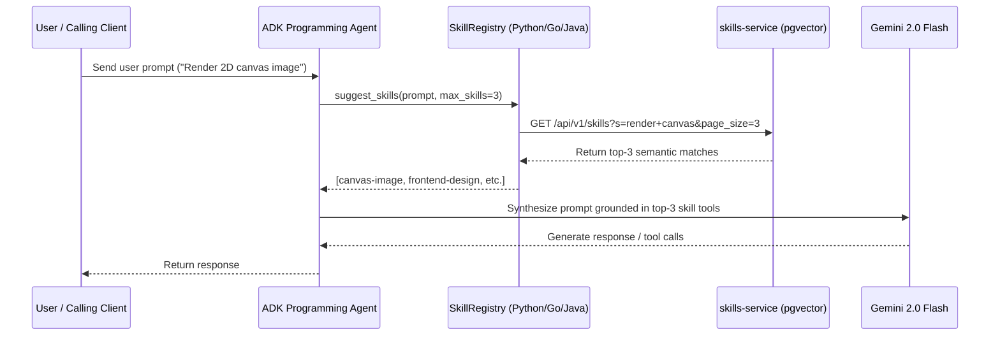

# Engineering Standards & Architecture

Every skill in this registry enforces a complete, production-grade Software Development Lifecycle (SDLC) with zero-tolerance security, Google OAuth2 authentication, multi-modal vector search, and HTTP 429 rate limit resilience.

---

## 1. Enterprise Service Architecture (`skills-service`)

The enterprise skills platform is architected around a high-performance Go backend service (`cmd/skills-service`) exposing dual REST HTTP endpoints (`/api/v1/skills`, `/api/v1/apps/register`, `/api/v1/apps/verify`), alongside Model Context Protocol (MCP) tool bindings (`pkg/mcp`).

```mermaid
graph TD
    subgraph CLI Client ["skm CLI Client"]
        CLI1[skm config (~/.skm/.env.toml)]
        CLI2[skm register <source_uri>]
        CLI3[skm search / skm list (--remote, --page, --max)]
        CLI4[skm add skm://skills/{id}]
    end

    subgraph Service Backend ["cmd/skills-service (Go Backend)"]
        S1[Gin REST API Handlers]
        S2[pkg/service Skills & Apps Service]
        S3[pkg/embedding Multi-Modal Soft-Switch Provider]
        S4[pkg/data GORM PostgreSQL / AlloyDB Repository]
        S5[pkg/mcp MCP Server Tools]
    end

    subgraph Database ["pgvector Storage & Indexing"]
        DB1["Poly-Column Schema (embedding_768 / 1408 / 3072)"]
        DB2["HNSW Vector Indexes (Cosine Distance)"]
    end

    CLI2 -- "POST /api/v1/skills (Header: X-API-Key)" --> S1
    CLI3 -- "GET /api/v1/skills?s={query}&page=1&page_size=5" --> S1
    CLI4 -- "GET /api/v1/skills/{id}" --> S1
    S1 --> S2
    S2 --> S3
    S2 --> S4
    S4 --> DB1
    DB1 --> DB2
    S1 --> S5
```

---

## 2. Multi-Modal Vector Search & Poly-Column Schema

The storage layer standardizes on a **Poly-Column Schema** with PostgreSQL/AlloyDB `pgvector` to seamlessly support multiple embedding models of varying dimensions:

* **`embedding_768` (`vector(768)`)**: Used for `text-embedding-004` and `alloydb-ai` in-database embedding functions.
* **`embedding_1408` (`vector(1408)`)**: Used for Google Vertex AI `multimodalembedding` multi-modal image/text models.
* **`embedding_3072` (`vector(3072)`)**: Reserved for ultra-high-dimensional generative embeddings.

### HNSW Index Partitions
Each active vector column is indexed using Hierarchical Navigable Small World (HNSW) graphs with cosine distance operators (`vector_cosine_ops`):

```sql
CREATE INDEX IF NOT EXISTS skills_embedding_768_hnsw_idx 
ON skills USING hnsw (embedding_768 vector_cosine_ops) 
WITH (m = 16, ef_construction = 64);

CREATE INDEX IF NOT EXISTS skills_embedding_1408_hnsw_idx 
ON skills USING hnsw (embedding_1408 vector_cosine_ops) 
WITH (m = 16, ef_construction = 64);
```

---

## 3. Pluggable Soft-Switch Embedding Providers

The embedding layer defines a decoupled Go interface (`pkg/embedding.EmbeddingProvider`):

```go
type EmbeddingProvider interface {
    Dimension() int
    EmbedText(ctx context.Context, text string) ([]float32, error)
    EmbedAsset(ctx context.Context, data []byte, mimeType string) ([]float32, error)
    BatchEmbedText(ctx context.Context, texts []string) ([][]float32, error)
}
```

Configured dynamically in `cmd/skills-service/.env.toml` via `embedding_provider`:
- **`vertex-gemini`**: Google Vertex AI `multimodalembedding` (1408d) and `text-embedding-004` (768d).
- **`alloydb-ai`**: Native in-database Google AlloyDB AI embedding functions (`embedding(model_id, text)`).

---

## 4. Bounded REST Pagination & Abuse Prevention

The central `/api/v1/skills` endpoint enforces strict bounding:
- **`page`**: 1-based page index (minimum `1`).
- **`page_size` / `max`**: Clamped between `1` and `25` (default: `5`).
- **Response Headers**:
  - `X-Total-Count`: Total number of matching items in the database.
  - `X-Page`: Current page number.
  - `X-Page-Size`: Effective page size.
  - `X-Total-Pages`: Total available pages.
- **Envelope Mode**: Querying `?envelope=true` returns a wrapped `PaginatedSkillResponse` JSON structure.

---

## 5. JIT Dynamic Pre-Call Retrieval Pattern for ADK Agents

Rather than injecting dozens of tools into the LLM system prompt statically, autonomous agents implement **JIT Pre-Call Retrieval**:



---

## 6. Build System Interoperability (Bazel Overarching Standard)

Every language standardizes on **Bazel** for hermetic CI/CD and monorepo execution:

- **Python (3.13+)**: Managed locally via **uv** (`pyproject.toml`), wrapped in Bazel `rules_python`.
- **Java (17+)**: Managed locally via **Maven** (`pom.xml`), wrapped in Bazel `rules_java` and `rules_jvm_external`.
- **Go (1.26+)**: Managed locally via **Go modules** (`go.mod`), wrapped in Bazel `rules_go` and `gazelle`.

---

## 7. Hierarchical Configuration & Security

- **Go**: `modenv` (`github.com/rrmcguinness/modenv/pkg/modenv`) for multi-tier cascading TOML configuration (`.env.toml`, `.env.local.toml`).
- **Python**: `python-dotenv` (`load_dotenv()`) for `.env` property resolution.
- **Java**: Java System Properties (`System.getProperty("skm.server.url")`) with environment fallbacks.

---

## 8. Safe Storage, Cryptographic Integrity & HITL Execution

- **Manifest Locking (`.manifest.lock`)**: Every installed skill is cryptographically hashed (inputs, outputs, execution logic). The orchestrator rejects payloads attempting to alter execution parameters outside the compiled schema.
- **Human-in-the-Loop (HITL)**: The `HITLEngine` provides tiered intervention gates to isolate read and write workloads, preventing LLM excessive agency (OWASP LLM08).

---

## 9. Protocol Buffer Architecture Contracts (`proto/`)

The core domain model (`SkillDefinition`, `SkillSummary`, `RegisterSkillRequest`, `AppDefinition`) is formally defined in Protocol Buffers (`proto/retailcortex/skills/v1/skill.proto` and `proto/retailcortex/skills/v1/skill_service.proto`).
