# Package: castor.registration.v1


## Imports

| Import | Description |
|--------|-------------|


## Options

| Name                | Value                                                        | Description |
|---------------------|--------------------------------------------------------------|-------------|
| go_package          | github.com/retail-cortex/castor/proto/castor/registration/v1 |             |
| java_package        | com.retailcortex.castor.proto.registration.v1                |             |
| java_multiple_files | true                                                         |             |


### castor.registration.v1 Diagram

```mermaid
classDiagram
direction LR
%% Mermaid Diagram for package: castor.registration.v1

%% RegisterAppRequest specifies parameters for application registration.

class RegisterAppRequest {
  + string app_name
  + string domain
  + string email
  + string organization_id
}

%% RegisterAppResponse contains credentials and verification details.

class RegisterAppResponse {
  + string app_id
  + string app_name
  + string domain
  + string app_urn
  + string email
  + string organization_id
  + DomainVerificationStatus domain_verification_status
  + string dns_txt_challenge
  + string api_key
  + string verification_token
  + string verification_url
}
RegisterAppResponse --> `DomainVerificationStatus`

%% VerifyAppRequest specifies the email verification token.

class VerifyAppRequest {
  + string token
}

%% VerifyAppResponse contains activation status.

class VerifyAppResponse {
  + string app_id
  + string app_name
  + string domain
  + string app_urn
  + string email
  + DomainVerificationStatus domain_verification_status
  + bool is_active
  + string message
}
VerifyAppResponse --> `DomainVerificationStatus`

%% AppMember represents an individual collaborator assigned an RBAC role.

class AppMember {
  + string id
  + string app_id
  + string email
  + AppRole role
  + string invited_by
  + MemberStatus status
  + string created_at
  + string accepted_at
}
AppMember --> `AppRole`
AppMember --> `MemberStatus`

%% AppApiKeySummary represents metadata for a provisioned scoped API key.

class AppApiKeySummary {
  + string id
  + string app_id
  + string member_email
  + string name
  + AppRole role
  + string created_at
  + string last_used_at
  + string expires_at
  + bool is_active
}
AppApiKeySummary --> `AppRole`

%% ListMembersRequest queries team members for an application.

class ListMembersRequest {
  + string app_id
}

%% ListMembersResponse contains the list of active/pending team members.

class ListMembersResponse {
  + List~AppMember~ members
}
ListMembersResponse --> `AppMember`

%% InviteMemberRequest initiates a new team invitation.

class InviteMemberRequest {
  + string email
  + AppRole role
}
InviteMemberRequest --> `AppRole`

%% InviteMemberResponse contains invitation details.

class InviteMemberResponse {
  + AppMember member
  + string invitation_token
  + string invitation_url
}
InviteMemberResponse --> `AppMember`

%% AcceptInvitationRequest accepts a pending invitation.

class AcceptInvitationRequest {
  + string token
}

%% AcceptInvitationResponse confirms invitation acceptance.

class AcceptInvitationResponse {
  + string message
  + AppMember member
}
AcceptInvitationResponse --> `AppMember`

%% UpdateMemberRoleRequest modifies an existing collaborator's role.

class UpdateMemberRoleRequest {
  + string member_id
  + AppRole role
}
UpdateMemberRoleRequest --> `AppRole`

%% UpdateMemberRoleResponse returns the updated collaborator.

class UpdateMemberRoleResponse {
  + AppMember member
}
UpdateMemberRoleResponse --> `AppMember`

%% RemoveMemberRequest removes a collaborator from the application.

class RemoveMemberRequest {
  + string member_id
}

%% RemoveMemberResponse confirms collaborator removal.

class RemoveMemberResponse {
  + string message
}

%% ListApiKeysRequest queries scoped API keys for an application.

class ListApiKeysRequest {
  + string app_id
}

%% ListApiKeysResponse returns all scoped API keys.

class ListApiKeysResponse {
  + List~AppApiKeySummary~ keys
}
ListApiKeysResponse --> `AppApiKeySummary`

%% CreateApiKeyRequest creates a new scoped API key.

class CreateApiKeyRequest {
  + string name
  + AppRole role
  + int32 expires_in_days
}
CreateApiKeyRequest --> `AppRole`

%% CreateApiKeyResponse returns the newly provisioned raw API key.

class CreateApiKeyResponse {
  + string id
  + string app_id
  + string member_email
  + string name
  + string api_key
  + AppRole role
  + string created_at
  + string expires_at
}
CreateApiKeyResponse --> `AppRole`

%% RevokeApiKeyRequest revokes an API key immediately.

class RevokeApiKeyRequest {
  + string key_id
}

%% RevokeApiKeyResponse confirms API key revocation.

class RevokeApiKeyResponse {
  + string message
}
%% DomainVerificationStatus classifies domain ownership validation state.

class DomainVerificationStatus{
  <<enumeration>>
  DOMAIN_VERIFICATION_STATUS_UNSPECIFIED
  DOMAIN_VERIFICATION_STATUS_VERIFIED_SSO
  DOMAIN_VERIFICATION_STATUS_VERIFIED_DNS
  DOMAIN_VERIFICATION_STATUS_PENDING_DNS
  DOMAIN_VERIFICATION_STATUS_REJECTED
}
%% AppRole defines Role-Based Access Control (RBAC) authorization tiers.

class AppRole{
  <<enumeration>>
  APP_ROLE_UNSPECIFIED
  APP_ROLE_OWNER
  APP_ROLE_EDITOR
  APP_ROLE_VIEWER
}
%% MemberStatus classifies collaborator account lifecycle state.

class MemberStatus{
  <<enumeration>>
  MEMBER_STATUS_UNSPECIFIED
  MEMBER_STATUS_ACTIVE
  MEMBER_STATUS_PENDING_INVITE
  MEMBER_STATUS_REVOKED
}
class AppService {
  <<service>>
  +RegisterApp (RegisterAppRequest) RegisterAppResponse
  +VerifyApp (VerifyAppRequest) VerifyAppResponse
  +ListMembers (ListMembersRequest) ListMembersResponse
  +InviteMember (InviteMemberRequest) InviteMemberResponse
  +AcceptInvitation (AcceptInvitationRequest) AcceptInvitationResponse
  +UpdateMemberRole (UpdateMemberRoleRequest) UpdateMemberRoleResponse
  +RemoveMember (RemoveMemberRequest) RemoveMemberResponse
  +ListApiKeys (ListApiKeysRequest) ListApiKeysResponse
  +CreateApiKey (CreateApiKeyRequest) CreateApiKeyResponse
  +RevokeApiKey (RevokeApiKeyRequest) RevokeApiKeyResponse
}
AppService --> `RegisterAppRequest`
AppService --> `RegisterAppResponse`
AppService --> `VerifyAppRequest`
AppService --> `VerifyAppResponse`
AppService --> `ListMembersRequest`
AppService --> `ListMembersResponse`
AppService --> `InviteMemberRequest`
AppService --> `InviteMemberResponse`
AppService --> `AcceptInvitationRequest`
AppService --> `AcceptInvitationResponse`
AppService --> `UpdateMemberRoleRequest`
AppService --> `UpdateMemberRoleResponse`
AppService --> `RemoveMemberRequest`
AppService --> `RemoveMemberResponse`
AppService --> `ListApiKeysRequest`
AppService --> `ListApiKeysResponse`
AppService --> `CreateApiKeyRequest`
AppService --> `CreateApiKeyResponse`
AppService --> `RevokeApiKeyRequest`
AppService --> `RevokeApiKeyResponse`

```

## Service: AppService

**FQN**: castor.registration.v1

AppService provides gRPC and REST methods for application registration, verification, and multi-user RBAC.


### AppService Diagram

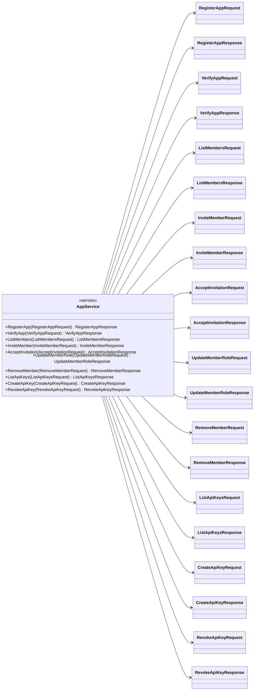

| Method              | Parameter (In)            | Parameter (Out)            | Description                                                                                                                                             |
|---------------------|---------------------------|----------------------------|---------------------------------------------------------------------------------------------------------------------------------------------------------|
| `RegisterApp `      | `RegisterAppRequest`      | `RegisterAppResponse`      | Register a new application to acquire initial owner credentials. HTTP: POST /api/v1/apps/register                                                       |
| `VerifyApp `        | `VerifyAppRequest`        | `VerifyAppResponse`        | Verify an application using email verification token. HTTP: GET /api/v1/apps/verify?token={verification_token}                                          |
| `ListMembers `      | `ListMembersRequest`      | `ListMembersResponse`      | List all registered collaborators for the application. HTTP: GET /api/v1/apps/members                                                                   |
| `InviteMember `     | `InviteMemberRequest`     | `InviteMemberResponse`     | Invite a new collaborator with an assigned RBAC role. HTTP: POST /api/v1/apps/members/invite                                                            |
| `AcceptInvitation ` | `AcceptInvitationRequest` | `AcceptInvitationResponse` | Accept a collaborator invitation using an invitation token. HTTP: GET /api/v1/apps/members/accept?token={token} HTTP: POST /api/v1/apps/members/accept  |
| `UpdateMemberRole ` | `UpdateMemberRoleRequest` | `UpdateMemberRoleResponse` | Update an existing collaborator's RBAC role. HTTP: PATCH /api/v1/apps/members/{member_id}                                                               |
| `RemoveMember `     | `RemoveMemberRequest`     | `RemoveMemberResponse`     | Remove a collaborator from the application. HTTP: DELETE /api/v1/apps/members/{member_id}                                                               |
| `ListApiKeys `      | `ListApiKeysRequest`      | `ListApiKeysResponse`      | List all scoped API keys for the application. HTTP: GET /api/v1/apps/keys                                                                               |
| `CreateApiKey `     | `CreateApiKeyRequest`     | `CreateApiKeyResponse`     | Create a new scoped API key with assigned role and expiration. HTTP: POST /api/v1/apps/keys                                                             |
| `RevokeApiKey `     | `RevokeApiKeyRequest`     | `RevokeApiKeyResponse`     | Revoke a scoped API key immediately. HTTP: DELETE /api/v1/apps/keys/{key_id}                                                                            |


## Enum: DomainVerificationStatus

**FQN**: castor.registration.v1.DomainVerificationStatus

DomainVerificationStatus classifies domain ownership validation state.


| Name                                      | Ordinal | Description                            |
|-------------------------------------------|---------|----------------------------------------|
| `DOMAIN_VERIFICATION_STATUS_UNSPECIFIED`  | 0       |                                        |
| `DOMAIN_VERIFICATION_STATUS_VERIFIED_SSO` | 1       | Verified via SSO/email domain match    |
| `DOMAIN_VERIFICATION_STATUS_VERIFIED_DNS` | 2       | Verified via DNS TXT record challenge  |
| `DOMAIN_VERIFICATION_STATUS_PENDING_DNS`  | 3       | Awaiting DNS TXT record challenge      |
| `DOMAIN_VERIFICATION_STATUS_REJECTED`     | 4       | Domain claim rejected                  |


## Enum: AppRole

**FQN**: castor.registration.v1.AppRole

AppRole defines Role-Based Access Control (RBAC) authorization tiers.


| Name                   | Ordinal | Description                                                |
|------------------------|---------|------------------------------------------------------------|
| `APP_ROLE_UNSPECIFIED` | 0       |                                                            |
| `APP_ROLE_OWNER`       | 1       | Full administrative access (collaborators, keys, skills)   |
| `APP_ROLE_EDITOR`      | 2       | Skill create/update/delete and developer key provisioning  |
| `APP_ROLE_VIEWER`      | 3       | Read-only inspection and semantic search                   |


## Enum: MemberStatus

**FQN**: castor.registration.v1.MemberStatus

MemberStatus classifies collaborator account lifecycle state.


| Name                           | Ordinal | Description |
|--------------------------------|---------|-------------|
| `MEMBER_STATUS_UNSPECIFIED`    | 0       |             |
| `MEMBER_STATUS_ACTIVE`         | 1       |             |
| `MEMBER_STATUS_PENDING_INVITE` | 2       |             |
| `MEMBER_STATUS_REVOKED`        | 3       |             |


### DomainVerificationStatus Diagram

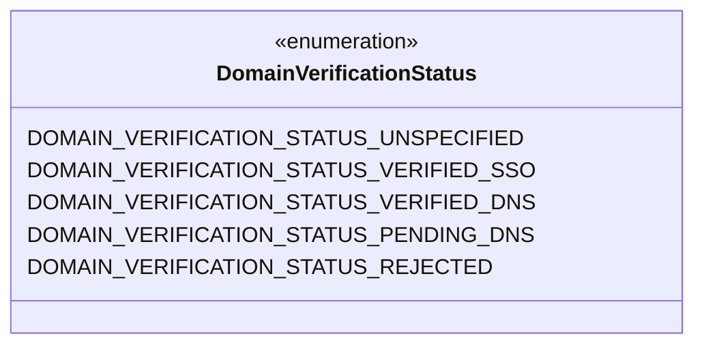
### AppRole Diagram

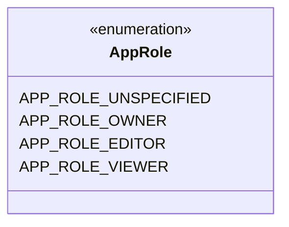
### MemberStatus Diagram

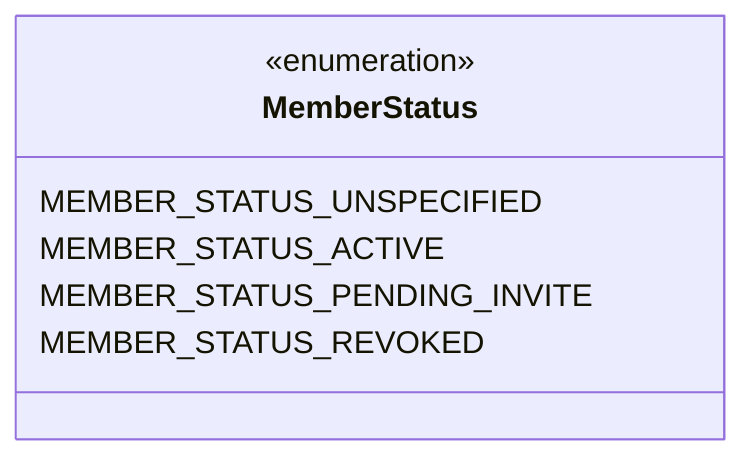
### RegisterAppRequest Diagram

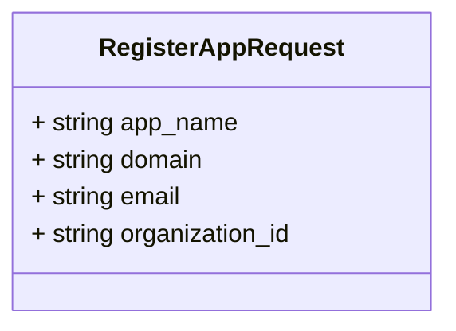
### RegisterAppResponse Diagram

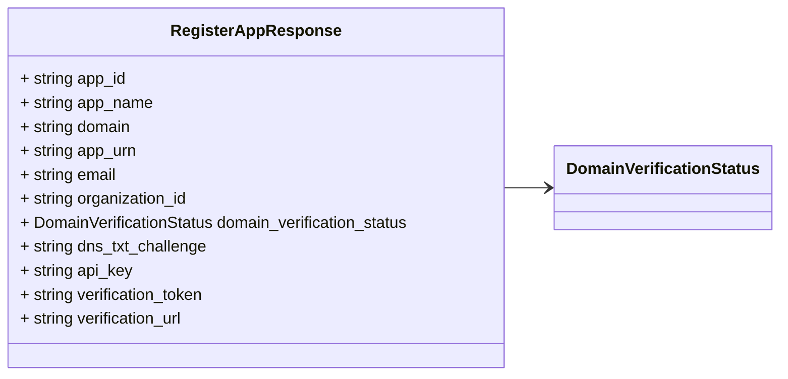
### VerifyAppRequest Diagram

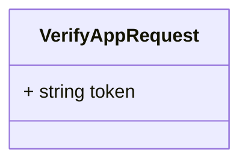
### VerifyAppResponse Diagram

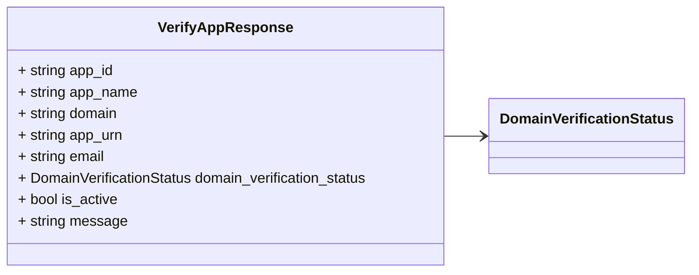
### AppMember Diagram

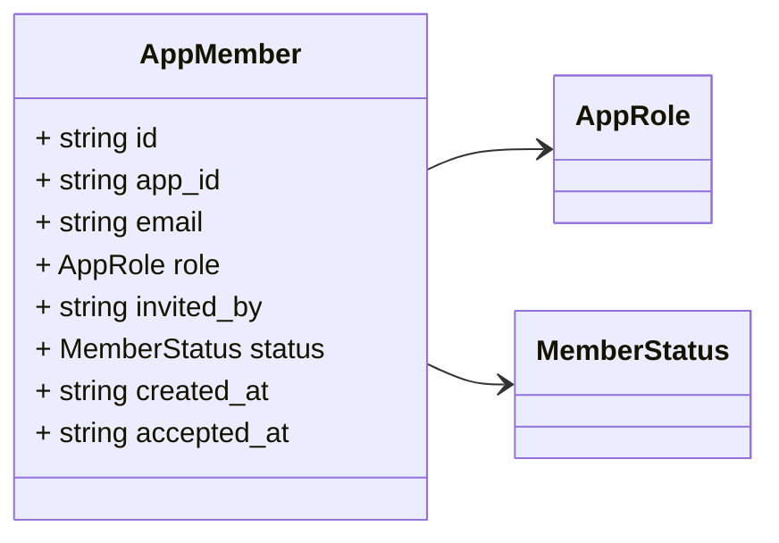
### AppApiKeySummary Diagram

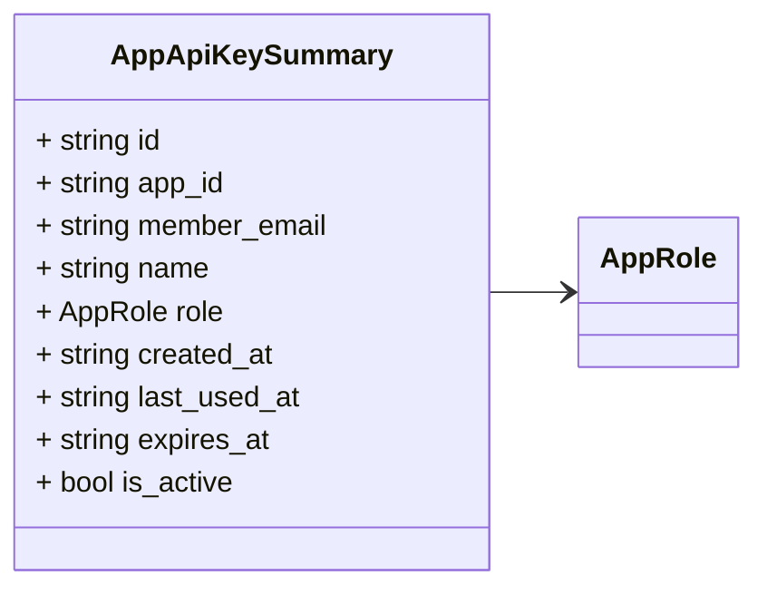
### ListMembersRequest Diagram

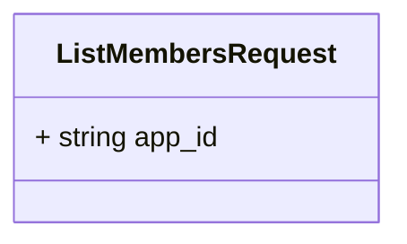
### ListMembersResponse Diagram

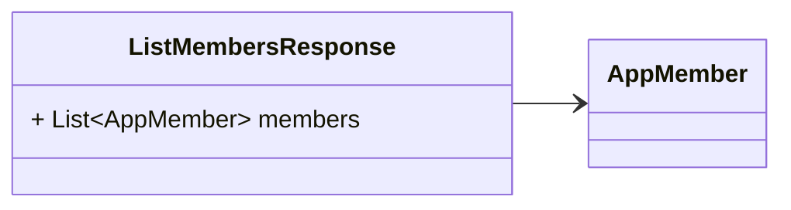
### InviteMemberRequest Diagram

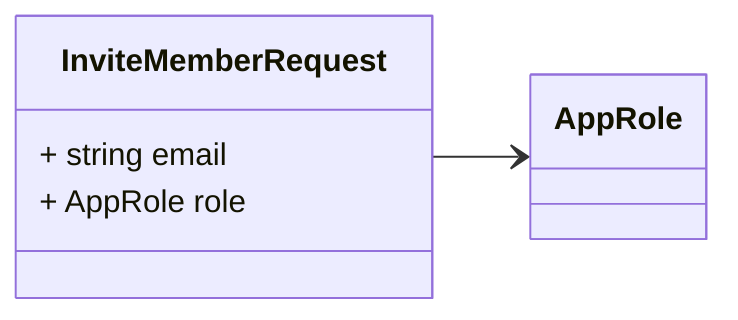
### InviteMemberResponse Diagram

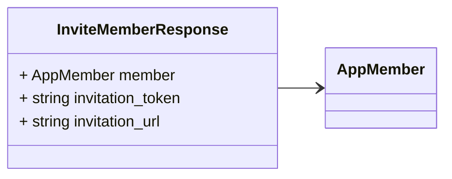
### AcceptInvitationRequest Diagram

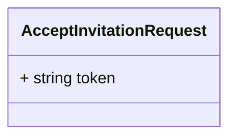
### AcceptInvitationResponse Diagram

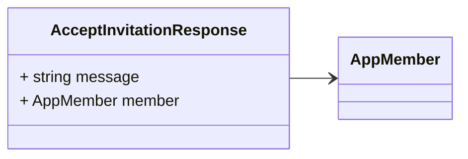
### UpdateMemberRoleRequest Diagram

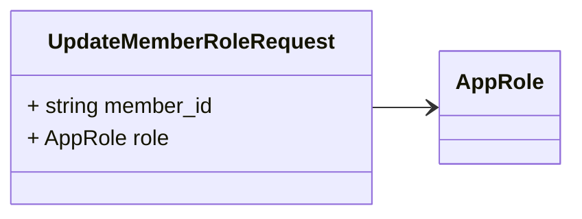
### UpdateMemberRoleResponse Diagram

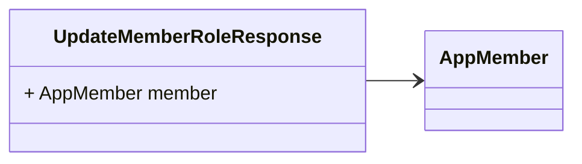
### RemoveMemberRequest Diagram

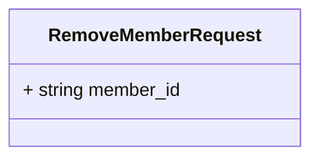
### RemoveMemberResponse Diagram

```mermaid
classDiagram
direction LR

%% RemoveMemberResponse confirms collaborator removal.

class RemoveMemberResponse {
  + string message
}

```
### ListApiKeysRequest Diagram

```mermaid
classDiagram
direction LR

%% ListApiKeysRequest queries scoped API keys for an application.

class ListApiKeysRequest {
  + string app_id
}

```
### ListApiKeysResponse Diagram

```mermaid
classDiagram
direction LR

%% ListApiKeysResponse returns all scoped API keys.

class ListApiKeysResponse {
  + List~AppApiKeySummary~ keys
}
ListApiKeysResponse --> `AppApiKeySummary`

```
### CreateApiKeyRequest Diagram

```mermaid
classDiagram
direction LR

%% CreateApiKeyRequest creates a new scoped API key.

class CreateApiKeyRequest {
  + string name
  + AppRole role
  + int32 expires_in_days
}
CreateApiKeyRequest --> `AppRole`

```
### CreateApiKeyResponse Diagram

```mermaid
classDiagram
direction LR

%% CreateApiKeyResponse returns the newly provisioned raw API key.

class CreateApiKeyResponse {
  + string id
  + string app_id
  + string member_email
  + string name
  + string api_key
  + AppRole role
  + string created_at
  + string expires_at
}
CreateApiKeyResponse --> `AppRole`

```
### RevokeApiKeyRequest Diagram

```mermaid
classDiagram
direction LR

%% RevokeApiKeyRequest revokes an API key immediately.

class RevokeApiKeyRequest {
  + string key_id
}

```
### RevokeApiKeyResponse Diagram

```mermaid
classDiagram
direction LR

%% RevokeApiKeyResponse confirms API key revocation.

class RevokeApiKeyResponse {
  + string message
}

```

## Message: RegisterAppRequest

**FQN**: castor.registration.v1.RegisterAppRequest

RegisterAppRequest specifies parameters for application registration.


| Field             | Ordinal | Type     | Label | Description |
|-------------------|---------|----------|-------|-------------|
| `app_name`        | 1       | `string` |       |             |
| `domain`          | 2       | `string` |       |             |
| `email`           | 3       | `string` |       |             |
| `organization_id` | 4       | `string` |       |             |


## Message: RegisterAppResponse

**FQN**: castor.registration.v1.RegisterAppResponse

RegisterAppResponse contains credentials and verification details.


| Field                        | Ordinal | Type                       | Label | Description |
|------------------------------|---------|----------------------------|-------|-------------|
| `app_id`                     | 1       | `string`                   |       |             |
| `app_name`                   | 2       | `string`                   |       |             |
| `domain`                     | 3       | `string`                   |       |             |
| `app_urn`                    | 4       | `string`                   |       |             |
| `email`                      | 5       | `string`                   |       |             |
| `organization_id`            | 6       | `string`                   |       |             |
| `domain_verification_status` | 7       | `DomainVerificationStatus` |       |             |
| `dns_txt_challenge`          | 8       | `string`                   |       |             |
| `api_key`                    | 9       | `string`                   |       |             |
| `verification_token`         | 10      | `string`                   |       |             |
| `verification_url`           | 11      | `string`                   |       |             |


## Message: VerifyAppRequest

**FQN**: castor.registration.v1.VerifyAppRequest

VerifyAppRequest specifies the email verification token.


| Field   | Ordinal | Type     | Label | Description |
|---------|---------|----------|-------|-------------|
| `token` | 1       | `string` |       |             |


## Message: VerifyAppResponse

**FQN**: castor.registration.v1.VerifyAppResponse

VerifyAppResponse contains activation status.


| Field                        | Ordinal | Type                       | Label | Description |
|------------------------------|---------|----------------------------|-------|-------------|
| `app_id`                     | 1       | `string`                   |       |             |
| `app_name`                   | 2       | `string`                   |       |             |
| `domain`                     | 3       | `string`                   |       |             |
| `app_urn`                    | 4       | `string`                   |       |             |
| `email`                      | 5       | `string`                   |       |             |
| `domain_verification_status` | 6       | `DomainVerificationStatus` |       |             |
| `is_active`                  | 7       | `bool`                     |       |             |
| `message`                    | 8       | `string`                   |       |             |


## Message: AppMember

**FQN**: castor.registration.v1.AppMember

AppMember represents an individual collaborator assigned an RBAC role.


| Field         | Ordinal | Type           | Label | Description |
|---------------|---------|----------------|-------|-------------|
| `id`          | 1       | `string`       |       |             |
| `app_id`      | 2       | `string`       |       |             |
| `email`       | 3       | `string`       |       |             |
| `role`        | 4       | `AppRole`      |       |             |
| `invited_by`  | 5       | `string`       |       |             |
| `status`      | 6       | `MemberStatus` |       |             |
| `created_at`  | 7       | `string`       |       |             |
| `accepted_at` | 8       | `string`       |       |             |


## Message: AppApiKeySummary

**FQN**: castor.registration.v1.AppApiKeySummary

AppApiKeySummary represents metadata for a provisioned scoped API key.


| Field          | Ordinal | Type      | Label | Description |
|----------------|---------|-----------|-------|-------------|
| `id`           | 1       | `string`  |       |             |
| `app_id`       | 2       | `string`  |       |             |
| `member_email` | 3       | `string`  |       |             |
| `name`         | 4       | `string`  |       |             |
| `role`         | 5       | `AppRole` |       |             |
| `created_at`   | 6       | `string`  |       |             |
| `last_used_at` | 7       | `string`  |       |             |
| `expires_at`   | 8       | `string`  |       |             |
| `is_active`    | 9       | `bool`    |       |             |


## Message: ListMembersRequest

**FQN**: castor.registration.v1.ListMembersRequest

ListMembersRequest queries team members for an application.


| Field    | Ordinal | Type     | Label | Description |
|----------|---------|----------|-------|-------------|
| `app_id` | 1       | `string` |       |             |


## Message: ListMembersResponse

**FQN**: castor.registration.v1.ListMembersResponse

ListMembersResponse contains the list of active/pending team members.


| Field     | Ordinal | Type        | Label    | Description |
|-----------|---------|-------------|----------|-------------|
| `members` | 1       | `AppMember` | Repeated |             |


## Message: InviteMemberRequest

**FQN**: castor.registration.v1.InviteMemberRequest

InviteMemberRequest initiates a new team invitation.


| Field   | Ordinal | Type      | Label | Description |
|---------|---------|-----------|-------|-------------|
| `email` | 1       | `string`  |       |             |
| `role`  | 2       | `AppRole` |       |             |


## Message: InviteMemberResponse

**FQN**: castor.registration.v1.InviteMemberResponse

InviteMemberResponse contains invitation details.


| Field              | Ordinal | Type        | Label | Description |
|--------------------|---------|-------------|-------|-------------|
| `member`           | 1       | `AppMember` |       |             |
| `invitation_token` | 2       | `string`    |       |             |
| `invitation_url`   | 3       | `string`    |       |             |


## Message: AcceptInvitationRequest

**FQN**: castor.registration.v1.AcceptInvitationRequest

AcceptInvitationRequest accepts a pending invitation.


| Field   | Ordinal | Type     | Label | Description |
|---------|---------|----------|-------|-------------|
| `token` | 1       | `string` |       |             |


## Message: AcceptInvitationResponse

**FQN**: castor.registration.v1.AcceptInvitationResponse

AcceptInvitationResponse confirms invitation acceptance.


| Field     | Ordinal | Type        | Label | Description |
|-----------|---------|-------------|-------|-------------|
| `message` | 1       | `string`    |       |             |
| `member`  | 2       | `AppMember` |       |             |


## Message: UpdateMemberRoleRequest

**FQN**: castor.registration.v1.UpdateMemberRoleRequest

UpdateMemberRoleRequest modifies an existing collaborator's role.


| Field       | Ordinal | Type      | Label | Description |
|-------------|---------|-----------|-------|-------------|
| `member_id` | 1       | `string`  |       |             |
| `role`      | 2       | `AppRole` |       |             |


## Message: UpdateMemberRoleResponse

**FQN**: castor.registration.v1.UpdateMemberRoleResponse

UpdateMemberRoleResponse returns the updated collaborator.


| Field    | Ordinal | Type        | Label | Description |
|----------|---------|-------------|-------|-------------|
| `member` | 1       | `AppMember` |       |             |


## Message: RemoveMemberRequest

**FQN**: castor.registration.v1.RemoveMemberRequest

RemoveMemberRequest removes a collaborator from the application.


| Field       | Ordinal | Type     | Label | Description |
|-------------|---------|----------|-------|-------------|
| `member_id` | 1       | `string` |       |             |


## Message: RemoveMemberResponse

**FQN**: castor.registration.v1.RemoveMemberResponse

RemoveMemberResponse confirms collaborator removal.


| Field     | Ordinal | Type     | Label | Description |
|-----------|---------|----------|-------|-------------|
| `message` | 1       | `string` |       |             |


## Message: ListApiKeysRequest

**FQN**: castor.registration.v1.ListApiKeysRequest

ListApiKeysRequest queries scoped API keys for an application.


| Field    | Ordinal | Type     | Label | Description |
|----------|---------|----------|-------|-------------|
| `app_id` | 1       | `string` |       |             |


## Message: ListApiKeysResponse

**FQN**: castor.registration.v1.ListApiKeysResponse

ListApiKeysResponse returns all scoped API keys.


| Field  | Ordinal | Type               | Label    | Description |
|--------|---------|--------------------|----------|-------------|
| `keys` | 1       | `AppApiKeySummary` | Repeated |             |


## Message: CreateApiKeyRequest

**FQN**: castor.registration.v1.CreateApiKeyRequest

CreateApiKeyRequest creates a new scoped API key.


| Field             | Ordinal | Type      | Label | Description |
|-------------------|---------|-----------|-------|-------------|
| `name`            | 1       | `string`  |       |             |
| `role`            | 2       | `AppRole` |       |             |
| `expires_in_days` | 3       | `int32`   |       |             |


## Message: CreateApiKeyResponse

**FQN**: castor.registration.v1.CreateApiKeyResponse

CreateApiKeyResponse returns the newly provisioned raw API key.


| Field          | Ordinal | Type      | Label | Description |
|----------------|---------|-----------|-------|-------------|
| `id`           | 1       | `string`  |       |             |
| `app_id`       | 2       | `string`  |       |             |
| `member_email` | 3       | `string`  |       |             |
| `name`         | 4       | `string`  |       |             |
| `api_key`      | 5       | `string`  |       |             |
| `role`         | 6       | `AppRole` |       |             |
| `created_at`   | 7       | `string`  |       |             |
| `expires_at`   | 8       | `string`  |       |             |


## Message: RevokeApiKeyRequest

**FQN**: castor.registration.v1.RevokeApiKeyRequest

RevokeApiKeyRequest revokes an API key immediately.


| Field    | Ordinal | Type     | Label | Description |
|----------|---------|----------|-------|-------------|
| `key_id` | 1       | `string` |       |             |


## Message: RevokeApiKeyResponse

**FQN**: castor.registration.v1.RevokeApiKeyResponse

RevokeApiKeyResponse confirms API key revocation.


| Field     | Ordinal | Type     | Label | Description |
|-----------|---------|----------|-------|-------------|
| `message` | 1       | `string` |       |             |


<!-- Created by: Proto Diagram Tool -->
<!-- https://github.com/GoogleCloudPlatform/proto-gen-md-diagrams -->
