# Package: castor.skills.v1

## Imports

| Import | Description |
|--------|-------------|

## Options

| Name                | Value                                                  | Description |
|---------------------|--------------------------------------------------------|-------------|
| go_package          | github.com/retail-cortex/castor/proto/castor/skills/v1 |             |
| java_package        | com.retailcortex.castor.proto.skills.v1                |             |
| java_multiple_files | true                                                   |             |

### castor.skills.v1 Diagram

```mermaid
classDiagram
direction LR
%% Mermaid Diagram for package: castor.skills.v1

%% AuthorDetails represents structured attribution for a skill contributor.

class AuthorDetails {
  + string name
  + string email
  + string url
}

%% ToolRequirement represents a structured permission contract for agent tool execution.

class ToolRequirement {
  + string name
  + List~string~ scopes
  + string description
}

%% CompiledSkillReference provides a minimized, cryptographically locked representation of a skill.

class CompiledSkillReference {
  + string skill_id
  + string name
  + string description
  + string sha256_hash
  + string json_schema
  + bool strict_schema
  + List~string~ allowed_properties
  + int32 estimated_tokens
  + HITLPolicyTier hitl_tier
}
CompiledSkillReference --> `HITLPolicyTier`

%% ExecutionHints provides operational parameters for LLM agents, routers, and orchestrators.

class ExecutionHints {
  + string preferred_model
  + bool requires_human_approval
  + List~string~ environment_variables
  + int32 timeout_seconds
  + Map~string,  string~ custom_hints
  + HITLPolicyTier hitl_tier
  + bool allow_hitl_bypass
}
ExecutionHints --> `HITLPolicyTier`

%% ScriptDefinition specifies an executable helper script attached to a skill.

class ScriptDefinition {
  + string name
  + string description
  + ScriptLanguage language
  + Oneof~string~ inline_code [oneof: source]
  + Oneof~string~ storage_uri [oneof: source]
  + Oneof~string~ relative_path [oneof: source]
  + string entry_point
  + List~string~ dependencies
  + int32 timeout_seconds
  + Map~string,  string~ environment_variables
}
ScriptDefinition --> `ScriptLanguage`

%% ResourceStorageLocation details storage pointers and Gemini Files API references.

class ResourceStorageLocation {
  + string gcs_uri
  + string public_url
  + string gemini_files_api_name
  + string gemini_files_api_uri
  + int64 size_bytes
  + string mime_type
  + string sha256_hash
}

%% ResourceInterpretation captures extracted textual representations generated by resource interpreters.

class ResourceInterpretation {
  + string interpreted_text
  + string summary
  + List~string~ key_entities
  + Map~string,  string~ metadata
}

%% ResourceRequirement represents a structured context asset required by a skill.

class ResourceRequirement {
  + string id
  + string name
  + string description
  + ResourceCategory category
  + string mime_type
  + ResourceStorageLocation storage
  + string inline_content
  + ResourceInterpretation interpretation
  + bool auto_inject_context
}
ResourceRequirement --> `ResourceCategory`
ResourceRequirement --> `ResourceStorageLocation`
ResourceRequirement --> `ResourceInterpretation`

%% SkillDefinition defines the core structural model for an enterprise AI agent skill.

class SkillDefinition {
  + string name
  + string description
  + string instructions
  + string license
  + string author
  + List~AuthorDetails~ authors
  + string version
  + string compatibility
  + string allowed_tools
  + List~ToolRequirement~ tool_requirements
  + Map~string,  string~ metadata
  + Map~string,  string~ references
  + Map~string,  string~ examples
  + string path
  + string category
  + List~string~ tags
  + List~string~ trigger_phrases
  + ExecutionHints execution_hints
  + CompiledSkillReference compiled_reference
  + List~ScriptDefinition~ scripts
  + List~ResourceRequirement~ resources
  + string skill_id
  + string uri
  + string source_uri
}
SkillDefinition --> `AuthorDetails`
SkillDefinition --> `ToolRequirement`
SkillDefinition --> `ExecutionHints`
SkillDefinition --> `CompiledSkillReference`
SkillDefinition --> `ScriptDefinition`
SkillDefinition --> `ResourceRequirement`

%% SkillSummary provides a lightweight summary of a skill definition for listing and discovery.

class SkillSummary {
  + string name
  + string description
  + int32 reference_count
  + int32 example_count
  + string path
  + string category
  + List~string~ tags
  + List~string~ trigger_phrases
  + string sha256_hash
  + HITLPolicyTier hitl_tier
  + int32 script_count
  + int32 resource_count
  + string skill_id
  + string uri
  + string source_uri
}
SkillSummary --> `HITLPolicyTier`
%% HITLPolicyTier defines the security classification and approval requirements for skill execution.

class HITLPolicyTier{
  <<enumeration>>
  HITL_POLICY_TIER_UNSPECIFIED
  HITL_POLICY_TIER_0_BYPASS_ALL
  HITL_POLICY_TIER_1_AUTO_READ
  HITL_POLICY_TIER_2_AUDITED_WRITE
  HITL_POLICY_TIER_3_MANDATORY_APPROVAL
}
%% ScriptLanguage defines supported execution runtimes for skill helper scripts.

class ScriptLanguage{
  <<enumeration>>
  SCRIPT_LANGUAGE_UNSPECIFIED
  SCRIPT_LANGUAGE_PYTHON
  SCRIPT_LANGUAGE_TYPESCRIPT
}
%% ResourceCategory classifies supported context assets based on Gemini upload capabilities.

class ResourceCategory{
  <<enumeration>>
  RESOURCE_CATEGORY_UNSPECIFIED
  RESOURCE_CATEGORY_DOCUMENT_TEXT
  RESOURCE_CATEGORY_VIDEO
  RESOURCE_CATEGORY_AUDIO
  RESOURCE_CATEGORY_IMAGE
  RESOURCE_CATEGORY_CODE_REPO
}

```

## Enum: HITLPolicyTier

**FQN**: castor.skills.v1.HITLPolicyTier

HITLPolicyTier defines the security classification and approval requirements for skill execution.

| Name                                    | Ordinal | Description                                                            |
|-----------------------------------------|---------|------------------------------------------------------------------------|
| `HITL_POLICY_TIER_UNSPECIFIED`          | 0       |                                                                        |
| `HITL_POLICY_TIER_0_BYPASS_ALL`         | 1       | Bypass all HITL gates for automated/CI executions                      |
| `HITL_POLICY_TIER_1_AUTO_READ`          | 2       | Informative/Read-only actions; auto-execute with audit log             |
| `HITL_POLICY_TIER_2_AUDITED_WRITE`      | 3       | Low-risk state changes; auto-execute with snapshot & audit trail       |
| `HITL_POLICY_TIER_3_MANDATORY_APPROVAL` | 4       | High-risk state mutating actions; require explicit user approval gate  |

## Enum: ScriptLanguage

**FQN**: castor.skills.v1.ScriptLanguage

ScriptLanguage defines supported execution runtimes for skill helper scripts.

| Name                          | Ordinal | Description                                   |
|-------------------------------|---------|-----------------------------------------------|
| `SCRIPT_LANGUAGE_UNSPECIFIED` | 0       |                                               |
| `SCRIPT_LANGUAGE_PYTHON`      | 1       | Python runtime (uv / virtual environment)     |
| `SCRIPT_LANGUAGE_TYPESCRIPT`  | 2       | TypeScript runtime (Node.js / ts-node / Bun)  |

## Enum: ResourceCategory

**FQN**: castor.skills.v1.ResourceCategory

ResourceCategory classifies supported context assets based on Gemini upload capabilities.

| Name                              | Ordinal | Description                          |
|-----------------------------------|---------|--------------------------------------|
| `RESOURCE_CATEGORY_UNSPECIFIED`   | 0       |                                      |
| `RESOURCE_CATEGORY_DOCUMENT_TEXT` | 1       | PDF, DOCX, TXT, HTML, Markdown       |
| `RESOURCE_CATEGORY_VIDEO`         | 2       | MP4, MOV, MPEG, WEBM, AVI            |
| `RESOURCE_CATEGORY_AUDIO`         | 3       | MP3, WAV, AAC, FLAC, M4A             |
| `RESOURCE_CATEGORY_IMAGE`         | 4       | PNG, JPEG, WebP, HEIC, HEIF          |
| `RESOURCE_CATEGORY_CODE_REPO`     | 5       | ZIP archive, GitHub Repository link  |

### HITLPolicyTier Diagram

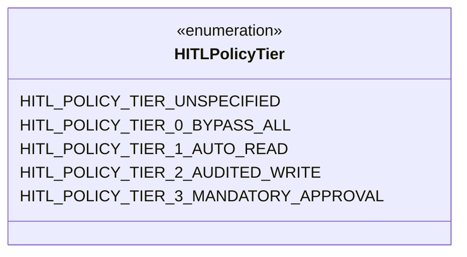
### ScriptLanguage Diagram

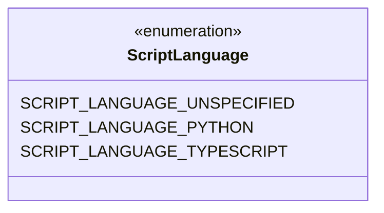
### ResourceCategory Diagram

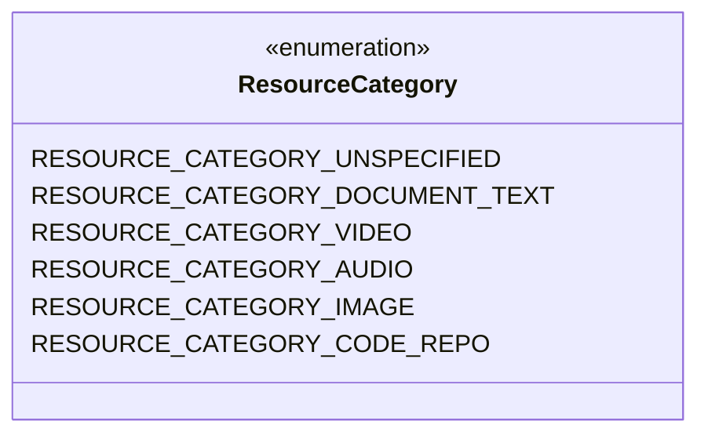
### AuthorDetails Diagram

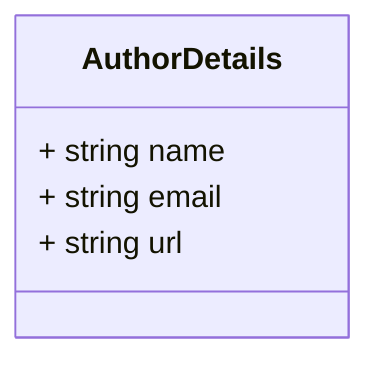
### ToolRequirement Diagram

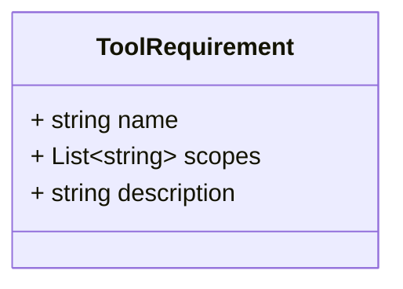
### CompiledSkillReference Diagram

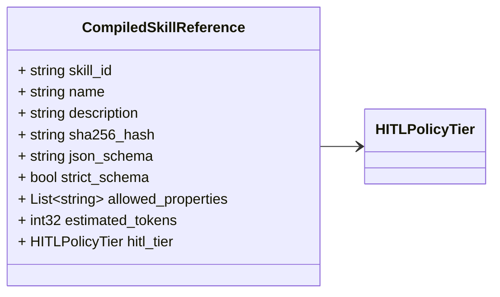
### ExecutionHints Diagram

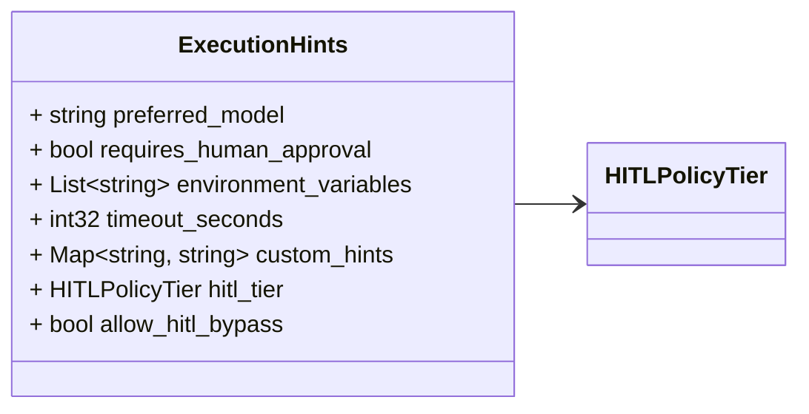
### ScriptDefinition Diagram

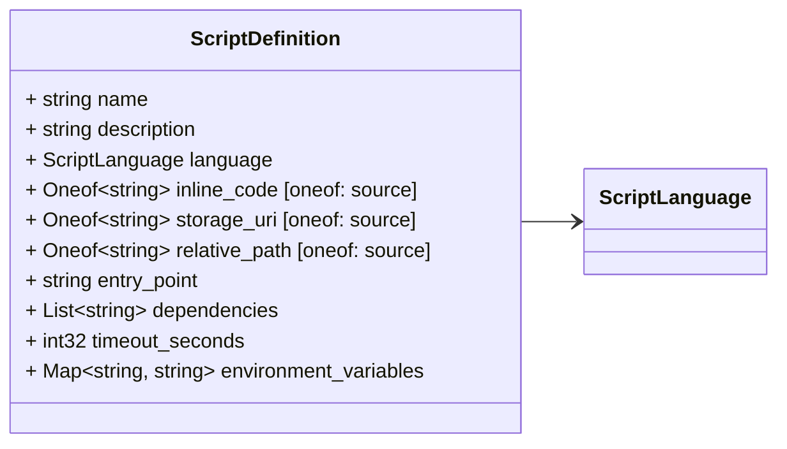
### ResourceStorageLocation Diagram

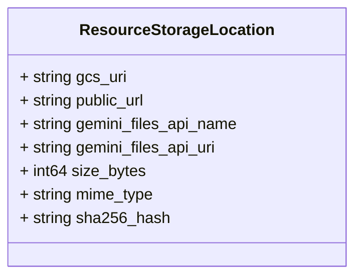
### ResourceInterpretation Diagram

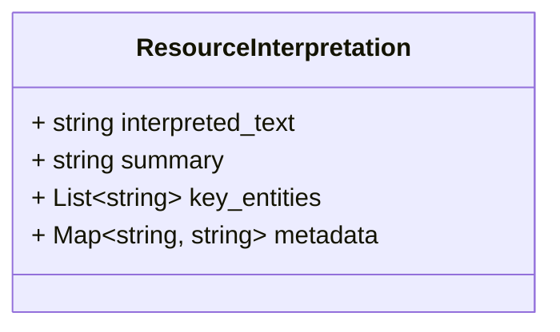
### ResourceRequirement Diagram

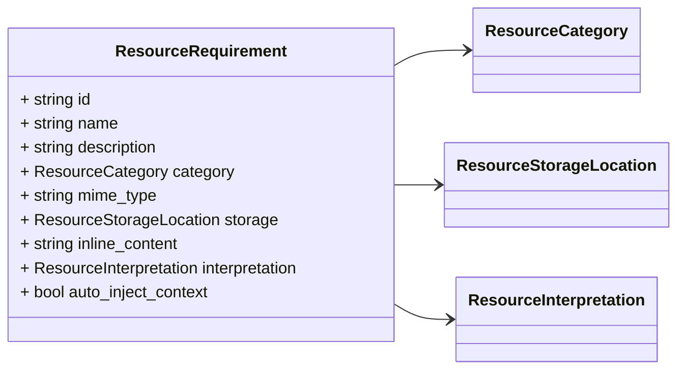
### SkillDefinition Diagram

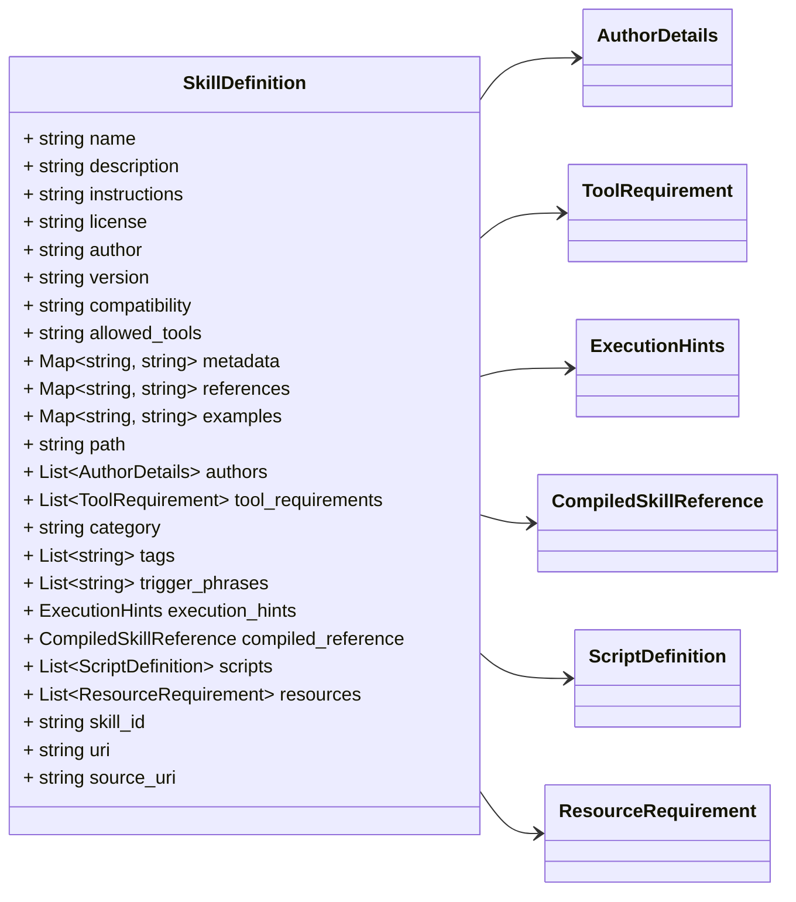
### SkillSummary Diagram

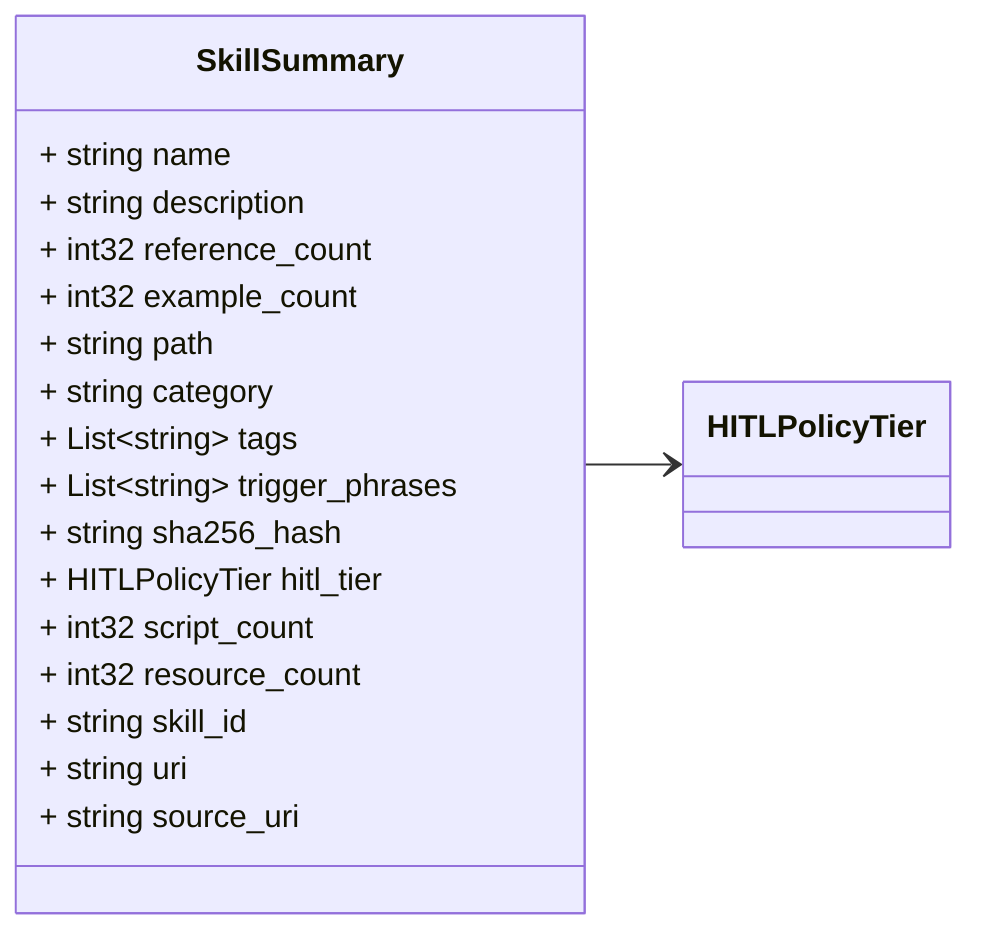

## Message: AuthorDetails

**FQN**: castor.skills.v1.AuthorDetails

AuthorDetails represents structured attribution for a skill contributor.

| Field   | Ordinal | Type     | Label | Description |
|---------|---------|----------|-------|-------------|
| `name`  | 1       | `string` |       |             |
| `email` | 2       | `string` |       |             |
| `url`   | 3       | `string` |       |             |

## Message: ToolRequirement

**FQN**: castor.skills.v1.ToolRequirement

ToolRequirement represents a structured permission contract for agent tool execution.

| Field         | Ordinal | Type     | Label    | Description                              |
|---------------|---------|----------|----------|------------------------------------------|
| `name`        | 1       | `string` |          | e.g. "Bash", "Read", "WebSearch"         |
| `scopes`      | 2       | `string` | Repeated | e.g. ["git:*", "uv:*"]                   |
| `description` | 3       | `string` |          | Rationale for requesting tool execution  |

## Message: CompiledSkillReference

**FQN**: castor.skills.v1.CompiledSkillReference

CompiledSkillReference provides a minimized, cryptographically locked representation of a skill.

| Field                | Ordinal | Type             | Label    | Description                                              |
|----------------------|---------|------------------|----------|----------------------------------------------------------|
| `skill_id`           | 1       | `string`         |          |                                                          |
| `name`               | 2       | `string`         |          |                                                          |
| `description`        | 3       | `string`         |          |                                                          |
| `sha256_hash`        | 4       | `string`         |          |                                                          |
| `json_schema`        | 5       | `string`         |          |                                                          |
| `strict_schema`      | 6       | `bool`           |          | Enforces additionalProperties: false                     |
| `allowed_properties` | 7       | `string`         | Repeated | Allowed property extensions when strict_schema is false  |
| `estimated_tokens`   | 8       | `int32`          |          |                                                          |
| `hitl_tier`          | 9       | `HITLPolicyTier` |          |                                                          |

## Message: ExecutionHints

**FQN**: castor.skills.v1.ExecutionHints

ExecutionHints provides operational parameters for LLM agents, routers, and orchestrators.

| Field                     | Ordinal | Type             | Label    | Description                                                  |
|---------------------------|---------|------------------|----------|--------------------------------------------------------------|
| `preferred_model`         | 1       | `string`         |          | e.g. "gemini-3.1-pro", "gemini-2.0-flash"                    |
| `requires_human_approval` | 2       | `bool`           |          | True if the skill performs high-risk or destructive actions  |
| `environment_variables`   | 3       | `string`         | Repeated | Required env vars (e.g. ["GITHUB_TOKEN", "GOPATH"])          |
| `timeout_seconds`         | 4       | `int32`          |          | Max recommended execution duration in seconds                |
| `custom_hints`            | 5       | `string, string` | Map      | Arbitrary key-value execution directives                     |
| `hitl_tier`               | 6       | `HITLPolicyTier` |          | Explicit HITL risk tier                                      |
| `allow_hitl_bypass`       | 7       | `bool`           |          | Whether this skill permits programmatic HITL bypass          |

## Message: ScriptDefinition

**FQN**: castor.skills.v1.ScriptDefinition

ScriptDefinition specifies an executable helper script attached to a skill.

| Field                   | Ordinal | Type             | Label          | Description                                               |
|-------------------------|---------|------------------|----------------|-----------------------------------------------------------|
| `name`                  | 1       | `string`         |                | Unique identifier or script name                          |
| `description`           | 2       | `string`         |                | Docstring/rationale for script usage                      |
| `language`              | 3       | `ScriptLanguage` |                | Script runtime language (Python or TypeScript)            |
| `inline_code`           | 4       | `string`         | Oneof (source) | Embedded raw source code snippet                          |
| `storage_uri`           | 5       | `string`         | Oneof (source) | Storage location (e.g. gs://bucket/path/script.py)        |
| `relative_path`         | 6       | `string`         | Oneof (source) | Relative path in skill bundle (e.g. scripts/handler.ts)   |
| `entry_point`           | 7       | `string`         |                | Function or entry handler (e.g. "main", "handler")        |
| `dependencies`          | 8       | `string`         | Repeated       | Runtime package dependencies (e.g. ["requests>=2.31.0"])  |
| `timeout_seconds`       | 9       | `int32`          |                | Maximum allowed script execution duration                 |
| `environment_variables` | 10      | `string, string` | Map            | Execution environment variables                           |

## Message: ResourceStorageLocation

**FQN**: castor.skills.v1.ResourceStorageLocation

ResourceStorageLocation details storage pointers and Gemini Files API references.

| Field                   | Ordinal | Type     | Label | Description                                                       |
|-------------------------|---------|----------|-------|-------------------------------------------------------------------|
| `gcs_uri`               | 1       | `string` |       | Remote Cloud Storage URI (e.g. gs://bucket/skill-assets/doc.pdf)  |
| `public_url`            | 2       | `string` |       | Direct HTTP/HTTPS fallback URL                                    |
| `gemini_files_api_name` | 3       | `string` |       | Gemini Files API resource name (e.g. files/abc123xyz)             |
| `gemini_files_api_uri`  | 4       | `string` |       | Gemini Files API URI for direct developer API ingestion           |
| `size_bytes`            | 5       | `int64`  |       | File size in bytes                                                |
| `mime_type`             | 6       | `string` |       | Content MIME type (e.g. "application/pdf", "image/png")           |
| `sha256_hash`           | 7       | `string` |       | Cryptographic hash for verification                               |

## Message: ResourceInterpretation

**FQN**: castor.skills.v1.ResourceInterpretation

ResourceInterpretation captures extracted textual representations generated by resource interpreters.

| Field              | Ordinal | Type             | Label    | Description                                                                |
|--------------------|---------|------------------|----------|----------------------------------------------------------------------------|
| `interpreted_text` | 1       | `string`         |          | Detailed text/markdown extraction (e.g. OCR text, transcripts, summaries)  |
| `summary`          | 2       | `string`         |          | Concise summary of the resource content                                    |
| `key_entities`     | 3       | `string`         | Repeated | Extracted entities, keywords, or domain tags                               |
| `metadata`         | 4       | `string, string` | Map      | Extracted metadata (e.g. duration_seconds, resolution, page_count)         |

## Message: ResourceRequirement

**FQN**: castor.skills.v1.ResourceRequirement

ResourceRequirement represents a structured context asset required by a skill.

| Field                 | Ordinal | Type                      | Label | Description                                                          |
|-----------------------|---------|---------------------------|-------|----------------------------------------------------------------------|
| `id`                  | 1       | `string`                  |       | Unique identifier for the resource within the skill                  |
| `name`                | 2       | `string`                  |       | Display name or title                                                |
| `description`         | 3       | `string`                  |       | Purpose of the resource in skill execution                           |
| `category`            | 4       | `ResourceCategory`        |       | Asset classification category                                        |
| `mime_type`           | 5       | `string`                  |       | Resource MIME type                                                   |
| `storage`             | 6       | `ResourceStorageLocation` |       | Remote storage pointers (GCS / Files API)                            |
| `inline_content`      | 7       | `string`                  |       | Lightweight inline text/markdown content (< 100KB)                   |
| `interpretation`      | 8       | `ResourceInterpretation`  |       | Pre-computed text interpretation for LLM context                     |
| `auto_inject_context` | 9       | `bool`                    |       | Whether to automatically inject interpreted context into LLM prompt  |

## Message: SkillDefinition

**FQN**: castor.skills.v1.SkillDefinition

SkillDefinition defines the core structural model for an enterprise AI agent skill.

| Field                | Ordinal | Type                     | Label    | Description                                                                                                        |
|----------------------|---------|--------------------------|----------|--------------------------------------------------------------------------------------------------------------------|
| `name`               | 1       | `string`                 |          |                                                                                                                    |
| `description`        | 2       | `string`                 |          |                                                                                                                    |
| `instructions`       | 3       | `string`                 |          |                                                                                                                    |
| `license`            | 4       | `string`                 |          |                                                                                                                    |
| `author`             | 5       | `string`                 |          | Attribution Legacy single-string author for backward compatibility                                                 |
| `version`            | 6       | `string`                 |          |                                                                                                                    |
| `compatibility`      | 7       | `string`                 |          |                                                                                                                    |
| `allowed_tools`      | 8       | `string`                 |          | Tool Permissions & Security Contracts Legacy flat string for backward compatibility                                |
| `metadata`           | 9       | `string, string`         | Map      |                                                                                                                    |
| `references`         | 10      | `string, string`         | Map      |                                                                                                                    |
| `examples`           | 11      | `string, string`         | Map      |                                                                                                                    |
| `path`               | 12      | `string`                 |          |                                                                                                                    |
| `authors`            | 13      | `AuthorDetails`          | Repeated | Strongly-typed list of contributors                                                                                |
| `tool_requirements`  | 14      | `ToolRequirement`        | Repeated | Strongly-typed tool permissions                                                                                    |
| `category`           | 15      | `string`                 |          | Categorization & Intent Triggers Domain category (e.g. "devops", "database", "python")                             |
| `tags`               | 16      | `string`                 | Repeated | Search tags for fast registry discovery                                                                            |
| `trigger_phrases`    | 17      | `string`                 | Repeated | Explicit phrases or intent triggers (e.g. "scaffold Go microservice")                                              |
| `execution_hints`    | 18      | `ExecutionHints`         |          | Agent Execution Guidelines Operational hints for LLM orchestrators                                                 |
| `compiled_reference` | 19      | `CompiledSkillReference` |          | Optional pre-compiled reference pointer                                                                            |
| `scripts`            | 20      | `ScriptDefinition`       | Repeated | Executable Scripts & Multimodal Resources Helper scripts (Python or TypeScript only)                               |
| `resources`          | 21      | `ResourceRequirement`    | Repeated | Multimodal context resources & assets                                                                              |
| `skill_id`           | 22      | `string`                 |          | Registration & Server Provenance Generated unique skill identifier (e.g. sk-9b1deb4d-3b7d-4bad-9bdd-2b0d7b3d0123)  |
| `uri`                | 23      | `string`                 |          | Canonical registered URI (e.g. skm://skills/sk-9b1deb4d)                                                           |
| `source_uri`         | 24      | `string`                 |          | Original registration source (e.g. github://google/skills@main/tree/main/skills/cloud/gemini-api)                  |

## Message: SkillSummary

**FQN**: castor.skills.v1.SkillSummary

SkillSummary provides a lightweight summary of a skill definition for listing and discovery.

| Field             | Ordinal | Type             | Label    | Description |
|-------------------|---------|------------------|----------|-------------|
| `name`            | 1       | `string`         |          |             |
| `description`     | 2       | `string`         |          |             |
| `reference_count` | 3       | `int32`          |          |             |
| `example_count`   | 4       | `int32`          |          |             |
| `path`            | 5       | `string`         |          |             |
| `category`        | 6       | `string`         |          |             |
| `tags`            | 7       | `string`         | Repeated |             |
| `trigger_phrases` | 8       | `string`         | Repeated |             |
| `sha256_hash`     | 9       | `string`         |          |             |
| `hitl_tier`       | 10      | `HITLPolicyTier` |          |             |
| `script_count`    | 11      | `int32`          |          |             |
| `resource_count`  | 12      | `int32`          |          |             |
| `skill_id`        | 13      | `string`         |          |             |
| `uri`             | 14      | `string`         |          |             |
| `source_uri`      | 15      | `string`         |          |             |

<!-- Created by: Proto Diagram Tool -->
<!-- https://github.com/GoogleCloudPlatform/proto-gen-md-diagrams -->
