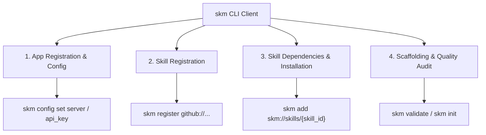

# SKM (Skill Manager) CLI

`skm` is the enterprise CLI package manager and client for AI Agent Skills. It manages the complete lifecycle of skills—from local scaffolding and SDLC validation to enterprise server registration and multi-language dependency resolution (`skm://`, `github://`, `mod://`, `maven://`, `pkg://`, `file://`).

---

## Architecture Overview



---

## Installation

### Pre-Compiled Standalone Binary

Download the latest pre-compiled binary:

```bash
# Download binary for your platform (macOS / Linux / Windows)
curl -sL "https://github.com/retail-cortex/skills/releases/latest/download/skm_$(uname -s)_$(uname -m)" -o skm

# Make executable and place on PATH
chmod +x skm
sudo mv skm /usr/local/bin/skm

skm version
```

### Shell Autocompletions

Enable autocompletion for your shell:

```bash
eval "$(skm completion bash)" # Bash
eval "$(skm completion zsh)"  # Zsh
skm completion fish | source  # Fish
```

### Oh My Zsh Plugin Integration

An official plugin with autocompletion and aliases is available in `apps/cli/plugins/oh-my-zsh/skm`:

```bash
cp -r apps/cli/plugins/oh-my-zsh/skm ~/.oh-my-zsh/custom/plugins/
# Add 'skm' to plugins=(...) array in ~/.zshrc and run: source ~/.zshrc
```

**Zsh Productivity Aliases**:
- `skma` -> `skm add`
- `skmreg` -> `skm register`
- `skmcfg` -> `skm config`
- `skmver` -> `skm verify`
- `skmv` -> `skm validate`
- `skml` -> `skm list`
- `skms` -> `skm search`
- `skmc` -> `skm compile`
- `skmi` -> `skm init`

### Cross-Compilation with Bazel

Bazel cross-compiles static `skm` binaries for Linux, macOS, and Windows without external dependencies:

```bash
# Build native binary
bazel build //:skm

# Cross-compile platform targets
bazel build //cmd/skm:skm_linux_amd64
bazel build //cmd/skm:skm_darwin_arm64
bazel build //cmd/skm:skm_windows_amd64
```
