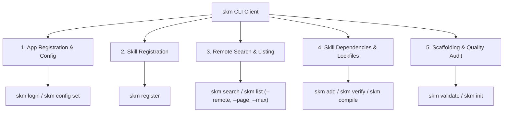

# SKM (Skill Manager) CLI

`skm` is the enterprise CLI client and package manager for AI Agent Skills. It manages the complete lifecycle of skills—from local scaffolding and SDLC validation to enterprise server registration, multi-modal vector search, and multi-language dependency resolution (`skm://`, `github://`, `mod://`, `maven://`, `pkg://`, `file://`).

---

## Architecture Overview



---

## Command Reference

| Command | Usage | Description |
| :--- | :--- | :--- |
| **`search`** | `skm search <query> [-r] [-p <page>] [-n <max>] [--json]` | Searches skills locally or queries remote `skills-service` vector index. |
| **`list`** | `skm list [-r] [-p <page>] [-n <max>] [--json]` | Lists skills from local filesystem or remote server with bounded pagination. |
| **`add`** | `skm add <uri> [-d <dir>] [--force] [--manifest-only]` | Resolves and installs skills from polyglot URIs, generating `.manifest.lock`. |
| **`register`**| `skm register <source_uri>` | Registers source skill to central server, computing multi-modal embeddings. |
| **`login`** | `skm login <email> [app_name]` | Initiates developer app registration and email verification challenge. |
| **`config`** | `skm config set <key> <value>` | Sets connection configuration in `~/.skm/.env.toml`. |
| **`config`** | `skm config show` | Displays active CLI configuration and masked credentials. |
| **`validate`**| `skm validate <path> [-r] [--json]` | Runs 5-point SDLC quality audit (Frontmatter, Structure, CWE, 429, Links). |
| **`verify`** | `skm verify [-d <dir>] [--json]` | Verifies cryptographic SHA-256 integrity against `.manifest.lock`. |
| **`compile`** | `skm compile [-d <dir>] [-o <file>]` | Compiles skills into a zero-I/O `skills_manifest.json` bundle. |
| **`init`** | `skm init <name> [-d <dir>]` | Scaffolds a new skill directory conforming to SDLC specifications. |

---

## Global & Common Flags

* **`-r, --remote`**: Directs `list` or `search` operations to query the central `skills-service` server (`SKM_SERVER_URL`).
* **`-p, --page <num>`**: 1-based page index for remote paginated results (default: `1`).
* **`-n, --max, --page-size <num>`**: Number of items per page. Clamped between `1` and `25` (default: `5`).
* **`-d, --dir <path>`**: Target directory for skill operations (default: `./.skills` or workspace root).
* **`-s, --server <url>`**: Override target server URL for remote requests (default: `http://localhost:8000`).
* **`--json`**: Formats command output as structured JSON.
* **`--force`**: Overwrites existing destination skills during `skm add`.
* **`--manifest-only`**: Updates `.manifest.lock` without copying files to disk.

---

## Installation & Cross-Compilation

### Pre-Compiled Standalone Binary

```bash
# Download binary for your platform (macOS / Linux / Windows)
curl -sL "https://github.com/retail-cortex/skills/releases/latest/download/skm_$(uname -s)_$(uname -m)" -o skm
chmod +x skm
sudo mv skm /usr/local/bin/skm

skm version
```

### Hermetic Bazel Cross-Compilation

```bash
# Build native host binary
bazel build //cmd/skm

# Cross-compile for all enterprise target architectures
bazel build //cmd/skm:skm_linux_amd64
bazel build //cmd/skm:skm_darwin_arm64
bazel build //cmd/skm:skm_windows_amd64
```

