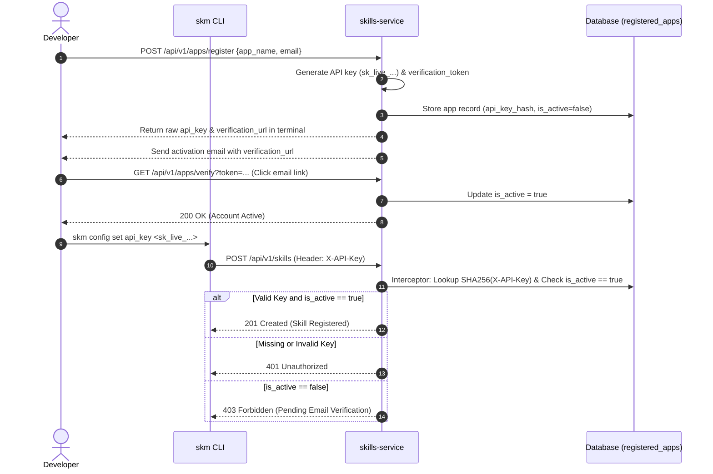

# Application Registration & Authentication Lifecycle

Application Registration connects client tools (such as the `skm` CLI or agent applications) to the central enterprise skill server (`skills-service`). 

---

## 1. Application Registration Protocol (`POST /api/v1/apps/register`)

Developers can register an application without providing a secret key or pre-existing credentials. Only an application name and valid email address are required.

### Request Payload (`POST /api/v1/apps/register`)

```json
{
  "app_name": "enterprise-agent-host",
  "email": "developer@company.com"
}
```

### Server Processing & Secret Key Issuance
1. **App Identity**: Generates a unique `app_id` (UUIDv4) and an email `verification_token`.
2. **API Key Generation**: Generates a cryptographically secure API key string (`sk_live_...`).
3. **Key Hashing**: Computes a SHA-256 hash of the API key (`api_key_hash`) for database storage. The raw key is never stored in plain text.
4. **Inactive State**: Creates the application record in `registered_apps` with `is_active = false` (pending email verification).
5. **Terminal Response**: Returns the raw `api_key` directly in the HTTP `201 Created` response payload so the developer can view and configure it in their local CLI.
6. **Activation Dispatch**: Constructs a `verification_url` (`/api/v1/apps/verify?token=<verification_token>`) and sends an activation email to the registered address.

### Response Payload (`201 Created`)

```json
{
  "app_id": "8f3a91b2-1234-4567-89ab-cdef01234567",
  "app_name": "enterprise-agent-host",
  "email": "developer@company.com",
  "api_key": "sk_live_YOUR_API_KEY_HERE",
  "verification_token": "e4d3c2b1-5678-90ab-cdef-1234567890ab",
  "verification_url": "http://localhost:8000/api/v1/apps/verify?token=e4d3c2b1-5678-90ab-cdef-1234567890ab"
}
```

---

## 2. Account Activation (`GET /api/v1/apps/verify`)

Before an application can invoke protected service endpoints, the developer must activate their account by following the verification URL sent to their email.

### HTTP Endpoint (`GET /api/v1/apps/verify?token=<token>`)

```http
GET /api/v1/apps/verify?token=e4d3c2b1-5678-90ab-cdef-1234567890ab HTTP/1.1
Host: localhost:8000
```

### Response (`200 OK`)

```json
{
  "app_id": "8f3a91b2-1234-4567-89ab-cdef01234567",
  "app_name": "enterprise-agent-host",
  "email": "developer@company.com",
  "is_active": true,
  "message": "Application email verified successfully. Account is now active."
}
```

---

## 3. CLI Configuration (`skm config`)

Once the API key is returned in the terminal response, configure `skm` to persist credentials in `~/.skm/.env.toml`:

```bash
# Configure target skills-service server URL
skm config set server http://localhost:8000

# Store issued API key
skm config set api_key sk_live_YOUR_API_KEY_HERE

# Verify active CLI configuration
skm config show
```

### Configuration File (`~/.skm/.env.toml`)

```toml
SKM_SERVER_URL = "http://localhost:8000"
SKM_API_KEY = "sk_live_YOUR_API_KEY_HERE"
```

---

## 4. Filter & Interceptor Authentication (`AuthenticateAPIKey`)

When requests are made to protected endpoints (e.g. `POST /api/v1/skills` during `skm register`), the `X-API-Key` HTTP header is inspected by the server filter/interceptor middleware (`AuthenticateAPIKey`).



### Validation Invariants
The interceptor validates **two mandatory requirements** on every request:
1. **API Key Hash Verification**: Computes SHA-256 of the `X-API-Key` header and queries `registered_apps`. Returns HTTP `401 Unauthorized` if the key is missing or invalid.
2. **Activation Status Invariant**: Checks `registered_app.is_active`. Returns HTTP `403 Forbidden` (`ErrAppNotVerified`) if `is_active == false`, preventing unverified applications from writing or accessing enterprise skill resources.
