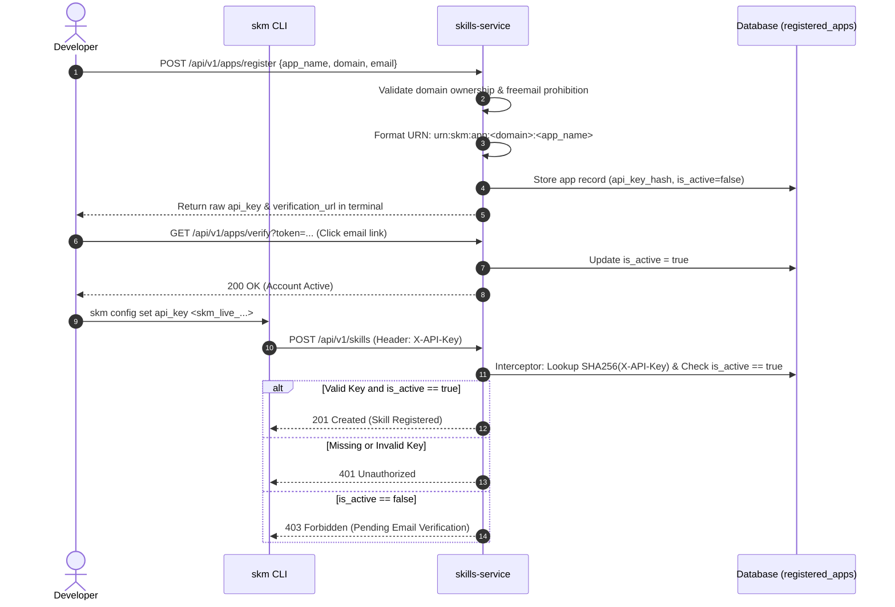
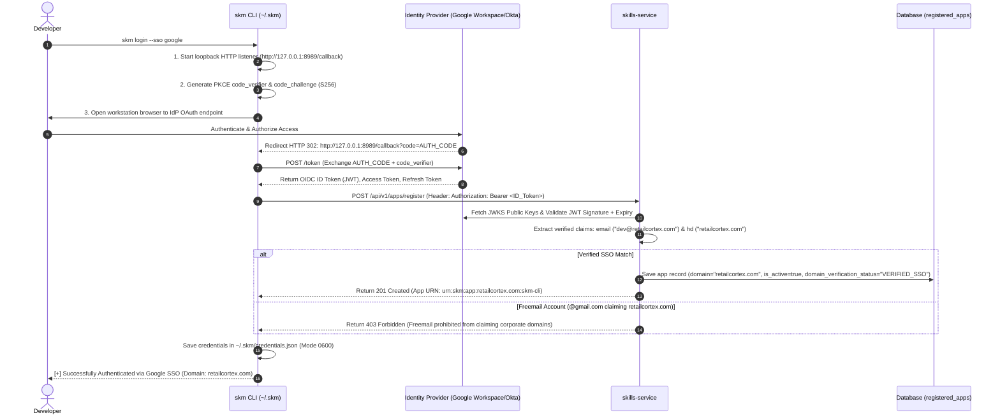

# Application Registration & Authentication Lifecycle

Application Registration connects client tools (such as the `skm` CLI or agent applications) to the central enterprise skill server (`skills-service`). 

---

## 1. Application Registration Protocol (`POST /api/v1/apps/register`)

Developers register an application by providing an application name, domain authority, developer email, and optional organization ID. No secret key or pre-existing credential is required in the request payload.

### Request Payload (`POST /api/v1/apps/register`)

```json
{
  "app_name": "checkout-agent",
  "domain": "retailcortex.com",
  "email": "developer@retailcortex.com",
  "organization_id": "team-checkout"
}
```

### Server Processing & Domain Ownership Rules
1. **Domain Authorization & URN Generation**:
   - Extracts email domain (e.g. `retailcortex.com`).
   - If `domain` is omitted, defaults to the email domain.
   - **Freemail Protection**: If a public freemail address (e.g. `@gmail.com`, `@yahoo.com`) attempts to claim a corporate domain, the server rejects the request with HTTP `403 Forbidden` (`ErrFreemailDomainProhibited`).
   - Assigns a deterministic canonical URN: `urn:skm:app:<domain>:<app_name>` (e.g. `urn:skm:app:retailcortex.com:checkout-agent`).
2. **Domain Verification Status**:
   - **`VERIFIED_SSO`**: Set automatically when the developer's email domain matches the requested domain.
   - **`PENDING_DNS`**: Set when claiming a custom third-party domain, issuing a DNS challenge string (`skm-domain-verify-<uuid>`).
3. **API Key Generation & Hashing**: Generates a secure random API key (`skm_live_...`) and computes its SHA-256 hash (`api_key_hash`) for DB storage.
4. **Terminal Response**: Returns the raw `api_key` in the `201 Created` payload so the developer can configure it locally.

### Response Payload (`201 Created`)

```json
{
  "app_id": "8f3a91b2-1234-4567-89ab-cdef01234567",
  "app_name": "checkout-agent",
  "domain": "retailcortex.com",
  "app_urn": "urn:skm:app:retailcortex.com:checkout-agent",
  "organization_id": "team-checkout",
  "email": "developer@retailcortex.com",
  "domain_verification_status": "VERIFIED_SSO",
  "api_key": "skm_live_YOUR_API_KEY_HERE",
  "verification_token": "e4d3c2b1-5678-90ab-cdef-1234567890ab",
  "verification_url": "http://localhost:8000/api/v1/apps/verify?token=e4d3c2b1-5678-90ab-cdef-1234567890ab"
}
```

---

## 2. Account Activation (`GET /api/v1/apps/verify`)

Before an application can invoke protected service endpoints, the developer must activate their account by following the verification URL sent to their email.

### HTTP Endpoint (`GET /api/v1/apps/verify?token=<token>`)

```http
GET /api/v1/apps/verify?token=e4d3c2b1-5678-90ab-cdef-1234567890ab HTTP/1.1
Host: localhost:8000
```

### Response (`200 OK`)

```json
{
  "app_id": "8f3a91b2-1234-4567-89ab-cdef01234567",
  "app_name": "checkout-agent",
  "domain": "retailcortex.com",
  "app_urn": "urn:skm:app:retailcortex.com:checkout-agent",
  "email": "developer@retailcortex.com",
  "domain_verification_status": "VERIFIED_SSO",
  "is_active": true,
  "message": "Application email verified successfully. Account is now active."
}
```

---

## 3. CLI Configuration (`skm config`)

Configure `skm` settings persisted in `~/.skm/.env.toml`:

```bash
# Configure target skills-service server URL
skm config set server http://localhost:8000

# Store issued API key
skm config set api_key skm_live_YOUR_API_KEY_HERE

# Store domain & organization defaults
skm config set domain retailcortex.com
skm config set org team-checkout

# Verify active CLI configuration
skm config show
```

### Configuration File (`~/.skm/.env.toml`)

```toml
# SKM Enterprise CLI Configuration
SKM_SERVER_URL="http://localhost:8000"
SKM_API_KEY="skm_live_YOUR_API_KEY_HERE"
SKM_DOMAIN="retailcortex.com"
SKM_ORGANIZATION_ID="team-checkout"
```

---

## 4. Filter & Interceptor Authentication (`AuthenticateAPIKey`)

When requests are made to protected endpoints (e.g. `POST /api/v1/skills` during `skm register`), the `X-API-Key` HTTP header is inspected by the server filter/interceptor middleware (`AuthenticateAPIKey`).



### Validation Invariants
The interceptor validates **two mandatory requirements** on every request:
1. **API Key Hash Verification**: Computes SHA-256 of the `X-API-Key` header and queries `registered_apps`. Returns HTTP `401 Unauthorized` if the key is missing or invalid.
2. **Activation Status Invariant**: Checks `registered_app.is_active`. Returns HTTP `403 Forbidden` (`ErrAppNotVerified`) if `is_active == false`, preventing unverified applications from writing or accessing enterprise skill resources.

---

## 5. OAuth 2.0 / OIDC SSO Authentication (`skm login --sso`)

For enterprise environments integrated with identity providers (Google Workspace, Okta, Azure AD), `skm` supports native OAuth 2.0 / OIDC single sign-on authentication.



### 5.1 CLI Authentication Workflows
- **Interactive PKCE Workflow (`skm login --sso`)**: Uses OAuth 2.0 Authorization Code Grant with PKCE (RFC 7636) via an ephemeral local loopback server (`http://127.0.0.1:8989/callback`).
- **Headless / Device Authorization Workflow (`skm login --sso --device`)**: Uses Device Authorization Grant (RFC 8628) for SSH and non-browser terminal environments. Displays a user code (`ABCD-EFGH`) and verification URL (`https://google.com/device`).

### 5.2 OIDC Token Persistence (`~/.skm/credentials.json`)
OIDC ID Tokens and Refresh Tokens are stored in a restricted JSON file (`POSIX mode 0600`):

```json
{
  "active_account": "developer@retailcortex.com",
  "accounts": {
    "developer@retailcortex.com": {
      "sso_provider": "google",
      "id_token": "eyJhbGciOiJSUzI1NiIs...",
      "refresh_token": "1//0eXYZ...",
      "access_token": "ya29.a0...",
      "expires_at": "2026-08-04T18:00:00Z",
      "hd": "retailcortex.com",
      "app_urn": "urn:skm:app:retailcortex.com:skm-cli"
    }
  }
}
```

### 5.3 Server-Side JWT Claims Verification
When `skills-service` receives requests bearing `Authorization: Bearer <ID_TOKEN>`, it verifies the signature against the IdP's public JWKS endpoint:
- **`email`**: Extracted identity (guaranteed verified by IdP signature).
- **`hd` (Hosted Domain)**: Extracted corporate domain claim. Domain verification status is set directly to `VERIFIED_SSO` and email activation links are bypassed (`is_active = true`).
