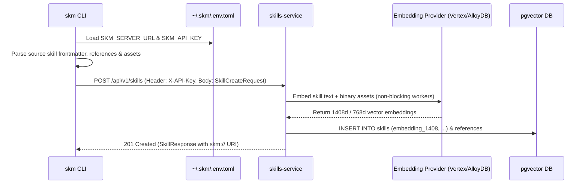

# Skill Registration

Skill Registration publishes a source skill definition (from GitHub, local directories, or package repositories) into the central enterprise `skills-service` registry, generating multi-modal vector embeddings and updating HNSW vector indexes for real-time semantic discovery.

---

## 1. Registering Source Skills (`skm register`)

Use `skm register <source_uri>` to parse a source skill and register it with the central server:

```bash
# Register a skill from a remote GitHub repository
skm register github://google/skills@main/tree/main/skills/cloud/gemini-api

# Register a skill from a local development directory
skm register file:///path/to/enterprise-skill
```

---

## 2. Multi-Modal Ingestion & Embedding Pipeline

When `skm register` submits a skill to `skills-service`:

1. **Frontmatter & Asset Parsing**:
   - Parses YAML frontmatter (`name`, `description`, `version`, `category`, `tags`, `trigger_phrases`, `execution_hints`).
   - Recursively reads text references (`references/*.md`) and executable examples (`examples/*`).
   - Reads binary multi-modal assets (`references/*.png`, `*.jpg`, `*.webp`, `*.pdf`, `*.wasm`, `*.proto`).
2. **Dual-Tier Vector Embedding Generation**:
   - Generates skill-level embeddings from concatenated metadata and system instructions.
   - Concurrently generates itemized embeddings for each attached reference and example via non-blocking worker goroutines.
   - Embeds binary media using the configured multimodal embedding model.
3. **Poly-Column `pgvector` Persistence**:
   - Populates vector columns matching the active model dimension (`embedding_768`, `embedding_1408`, or `embedding_3072`).
   - Updates PostgreSQL/AlloyDB HNSW index partitions (`skills_embedding_768_hnsw_idx`, `skills_embedding_1408_hnsw_idx`).
4. **Canonical URI Assignment**:
   - Generates deterministic UUID `skill_id` (e.g. `sk-9b1deb4d`).
   - Allocates canonical URI: **`skm://skills/{skill_id}`**.



---

## 3. Server HTTP Endpoint (`POST /api/v1/skills`)

```http
POST /api/v1/skills HTTP/1.1
Host: localhost:8000
X-API-Key: skm_live_YOUR_API_KEY_HERE
Content-Type: application/json

{
  "name": "gemini-api",
  "description": "Integration skill for Google Gemini API on Vertex AI",
  "instructions": "# Gemini API Skill...",
  "source_uri": "github://google/skills@main/tree/main/skills/cloud/gemini-api",
  "category": "cloud",
  "tags": ["gemini", "vertex", "ai", "llm"],
  "trigger_phrases": ["call gemini", "invoke multimodal model"]
}
```

**Response (`201 Created`)**:
```json
{
  "id": "sk-9b1deb4d",
  "name": "gemini-api",
  "uri": "skm://skills/sk-9b1deb4d",
  "source_uri": "github://google/skills@main/tree/main/skills/cloud/gemini-api",
  "version": "1.0.0",
  "created_at": "2026-08-09T17:30:00Z"
}
```

