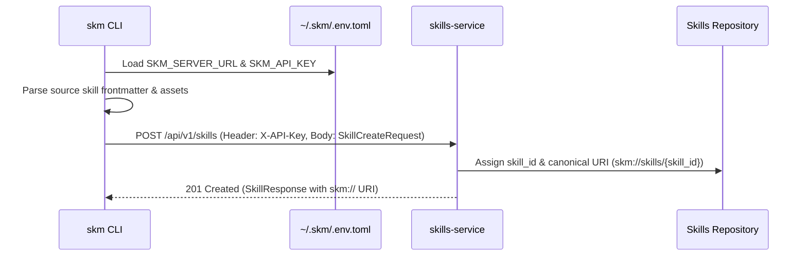

# Skill Registration

Skill Registration publishes a source skill definition (from GitHub, local directories, or package repositories) into the central enterprise `skills-service` registry.

---

## Registering Source Skills (`skm register`)

Use `skm register <source_uri>` to parse a source skill and register it with the central server:

```bash
# Register a skill from a remote GitHub repository
skm register github://google/skills@main/tree/main/skills/cloud/gemini-api

# Register a skill from a local development directory
skm register file:///path/to/enterprise-skill
```

---

## Registration Sequence & Flow



---

## Canonical URI Generation (`skm://`)

Upon successful registration:
1. `skills-service` generates a unique `skill_id` (e.g., `sk-9b1deb4d`).
2. A canonical URI is created: **`skm://skills/{skill_id}`**.
3. Downstream consumer agents and CLI clients can now depend on `skm://skills/{skill_id}` for centralized versioning, governance, and access control.

---

## Server HTTP Endpoint (`POST /api/v1/skills`)

```http
POST /api/v1/skills HTTP/1.1
Host: localhost:8080
X-API-Key: secret-api-key-12345
Content-Type: application/json

{
  "name": "gemini-api",
  "description": "Integration skill for Google Gemini API on Vertex AI",
  "instructions": "# Gemini API Skill...",
  "source_uri": "github://google/skills@main/tree/main/skills/cloud/gemini-api"
}
```

**Response (`201 Created`)**:
```json
{
  "id": "sk-9b1deb4d",
  "name": "gemini-api",
  "uri": "skm://skills/sk-9b1deb4d",
  "source_uri": "github://google/skills@main/tree/main/skills/cloud/gemini-api"
}
```
