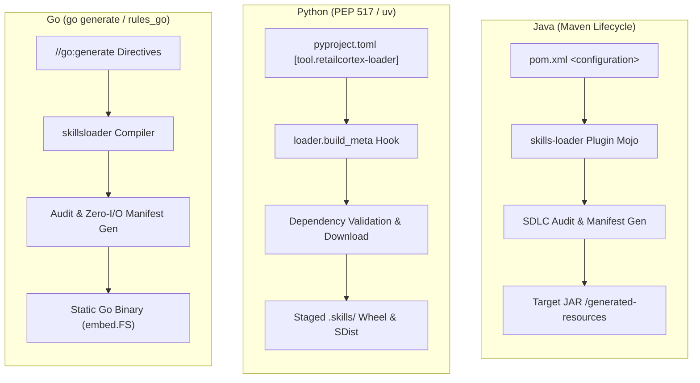

# Enterprise Client Libraries & Native Build Integration

Skill Builder client libraries act as **native, validating participants in the build cycle and agent runtime** of each language ecosystem (**Maven** for Java, **PEP 517 / `uv`** for Python, and **`go generate` / `rules_go`** for Go).

In addition to build-time dependency staging, each SDK provides **JIT Pre-Call Retrieval** to dynamically query central `skills-service` vector indexes, constraining agent prompts to the top &le; 3 ranked skills for token efficiency and zero tool bleed.

---

## Native Build System Architecture

---

## Language Support & Runtime Capabilities Matrix

| Feature | Java Client (`skills-java`) | Python Client (`retailcortex-loader`) | Go Client (`skillsloader`) |
| :--- | :---: | :---: | :---: |
| **JIT Pre-Call Suggestions** | `registry.suggestSkills(prompt, 3, server)` | `registry.suggest_skills(prompt, 3, server)` | `registry.SuggestSkills(prompt, 3, server)` |
| **Remote Vector Query** | `GET /api/v1/skills?s={query}&page_size=3` | `GET /api/v1/skills?s={query}&page_size=3` | `GET /api/v1/skills?s={query}&page_size=3` |
| **Local Offline Fallback** | Substring & Domain Keyword Index | TF-IDF Discovery Engine & Substring | Substring & Domain Matcher |
| **Native Build Hook** | `skills-loader-maven-plugin` Mojo | `loader.build_meta` PEP 517 | `go generate` / `rules_go` |
| **Build Phase** | `generate-resources` / `compile` | `build_wheel` / `build_sdist` | `go generate` / `go test` |
| **Configuration** | `pom.xml` (`<configuration>`) | `pyproject.toml` (`[tool.retailcortex-loader]`) | `//go:generate` directives |
| **Artifact Injection** | Injected into target JAR `/generated-resources` | Staged into `.skills/` wheel tree | Embedded via `embed.FS` or manifest |
| **Build Validation Gate** | Fails build if skills violate SDLC rules | Fails build if dependency resolution fails | Fails build / test suite if checksum mismatch |
| **Polyglot URIs** | `skm://`, `github://`, `maven://`, etc. | `skm://`, `github://`, `pkg://`, etc. | `skm://`, `github://`, `mod://`, etc. |

---

## Core Operational Principles

1. **JIT Dynamic Pre-Call Retrieval**: Agents query central multi-modal vector search to retrieve at most 3 top-ranked skills, avoiding context window bloat and conflicting tool instructions.
2. **Automated Build Validation**: The client build hooks enforce 5-point SDLC checks during native build cycles. Invalid skill definitions, missing frontmatter, or checksum tampering fail the build immediately.
3. **Hermetic Packaging**: Resolved skills and pre-compiled `skills_manifest.json` files are bundled directly into output artifacts (JARs, Wheels, Go binaries), ensuring zero runtime network overhead or filesystem I/O for cold starts.
4. **Enterprise Governance**: Remote skill dependencies are fetched via secure APIs (`X-API-Key`) and locked with cryptographic SHA-256 digests in `.manifest.lock`.
