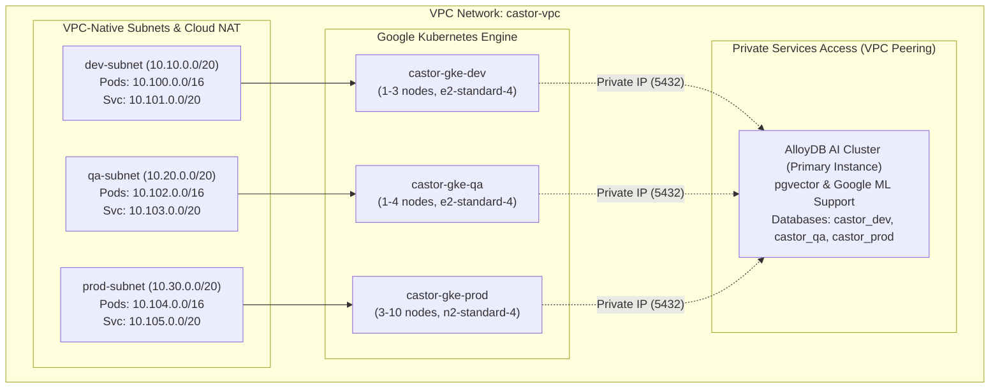
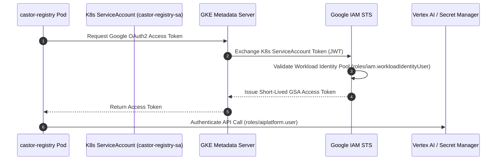

# Enterprise Cloud Deployment & Infrastructure

This document outlines the operational procedures for provisioning Google Cloud infrastructure via **Terraform** and deploying the `Castor Registry` (`castor-server`) to **Google Kubernetes Engine (GKE)** with **AlloyDB AI** across `dev`, `qa`, and `prod` environments.

---

## 1. How-To Guide: Infrastructure & Service Deployment

### 1.1 Prerequisites & Local Environment Setup

1. Install required CLI tooling:
   - **Google Cloud SDK (`gcloud`)**: Authenticated with Application Default Credentials.
   - **Terraform (v1.5+)**: For infrastructure provisioning.
   - **kubectl & kustomize**: For GKE cluster deployments.
2. Initialize environment configuration via `.envrc` or shell export:
   ```bash
   export GCP_PROJECT_ID="wmt-lab-prj"
   export GCP_REGION="us-east4"
   export EMBEDDING_PROVIDER="alloydb-ai"
   export GCS_TF_STATE_BUCKET="wmt-lab-prj-terraform-state" # Optional for GCS state
   
   # Set up gcloud authentication and quota project
   gcloud config set project "${GCP_PROJECT_ID}"
   gcloud auth application-default login
   gcloud auth application-default set-quota-project "${GCP_PROJECT_ID}"
   ```

---

### 1.2 Step 1: Provision Cloud Infrastructure (Terraform)

The Terraform configuration provisions the VPC network, subnets, Private Services Access (PSA) peering for AlloyDB, Cloud NAT, 3 GKE clusters, and the AlloyDB AI instance.

```bash
# Navigate to deployment automation scripts
cd deployments/scripts

# Execute automated infrastructure provisioning
./deploy-infra.sh
```

#### Manual Terraform Execution Flow

```bash
cd deployments/terraform

# 1. Format & Validate
terraform fmt -recursive
terraform init -backend-config="bucket=${GCS_TF_STATE_BUCKET}" -backend-config="prefix=castor"

# 2. Plan Execution
terraform plan \
  -var="project_id=${GCP_PROJECT_ID}" \
  -var="region=${GCP_REGION}" \
  -out=tfplan

# 3. Apply Plan
terraform apply tfplan
```

---

### 1.3 Step 2: Build & Push Container Image

Package the `castor-server` binary into a distroless container and push to Google Artifact Registry:

```bash
# Create Artifact Registry repository (if not already created)
gcloud artifacts repositories create castor-repo \
  --repository-format=docker \
  --location="${GCP_REGION}" \
  --project="${GCP_PROJECT_ID}" || true

# Authenticate Docker to Artifact Registry
gcloud auth configure-docker "${GCP_REGION}-docker.pkg.dev"

# Build & Push container image
IMAGE_TAG="${GCP_REGION}-docker.pkg.dev/${GCP_PROJECT_ID}/castor-repo/castor-server:v1.0.0"

docker build -t "${IMAGE_TAG}" -f - . <<EOF
FROM golang:1.24-alpine AS builder
WORKDIR /app
COPY go.mod go.sum ./
RUN go mod download
COPY . .
RUN CGO_ENABLED=0 GOOS=linux go build -o /castor-server ./cmd/castor_server

FROM gcr.io/distroless/static-debian12:nonroot
WORKDIR /
COPY --from=builder /castor-server /castor-server
EXPOSE 8000 9090
USER 10001:10001
ENTRYPOINT ["/castor-server"]
EOF

docker push "${IMAGE_TAG}"
```

---

### 1.4 Step 3: Deploy `Castor Registry` to GKE Environments

Deploy to target clusters (`dev`, `qa`, or `prod`) using the deployment script, which configures cluster credentials, synchronizes Secret Manager credentials, and applies Kustomize overlays:

```bash
cd deployments/scripts

# Deploy to Development Cluster
./deploy-k8s.sh dev

# Deploy to QA Cluster
./deploy-k8s.sh qa

# Deploy to Production Cluster
./deploy-k8s.sh prod
```

#### Manual K8s Rollout & Verification

```bash
ENV="dev"
CLUSTER_NAME="castor-gke-${ENV}"
NAMESPACE="castor"

# 1. Fetch Cluster Credentials
gcloud container clusters get-credentials "${CLUSTER_NAME}" \
  --region "${GCP_REGION}" \
  --project "${GCP_PROJECT_ID}"

# 2. Synchronize AlloyDB Connection Secret from Secret Manager
SECRET_ID="castor-alloydb-${ENV}-dsn"
DB_DSN=$(gcloud secrets versions access latest --secret="${SECRET_ID}" --project="${GCP_PROJECT_ID}")

kubectl create namespace "${NAMESPACE}" --dry-run=client -o yaml | kubectl apply -f -
kubectl create secret generic castor-registry-db-secret \
  --namespace="${NAMESPACE}" \
  --from-literal=database_url="${DB_DSN}" \
  --dry-run=client -o yaml | kubectl apply -f -

# 3. Apply Kustomize Overlay
kubectl apply -k "deployments/kubernetes/overlays/${ENV}"

# 4. Monitor Rollout Status
kubectl rollout status deployment/castor-registry -n "${NAMESPACE}"
```

---

### 1.5 Step 4: Verify Deployment Health & Ingress

```bash
# Check running pods and service endpoints
kubectl get pods,svc -n castor

# Port-forward to test REST and MCP endpoints locally
kubectl port-forward svc/castor-registry 8000:8000 -n castor &

# Query service health
curl -s http://localhost:8000/health | jq .

# Test semantic search query against live AlloyDB instance
curl -s "http://localhost:8000/api/v1/skills?s=database+postgres&page=1&page_size=5" | jq .
```

---

## 2. Directory Structure & Build Mechanics

```text
deployments/
├── terraform/                      # Modular Infrastructure as Code (Terraform)
│   ├── versions.tf                 # Google Provider (5.30+) & GCS Remote State configuration
│   ├── main.tf                     # Root coordinator wiring network, alloydb, and gke
│   ├── variables.tf                # Configurable variables (project_id, region, node pools)
│   ├── outputs.tf                  # Endpoints, AlloyDB IP, and Secret Manager secret names
│   ├── terraform.tfvars.example    # Variable definitions template
│   └── modules/
│       ├── network/                # Custom VPC, VPC-native subnets (dev, qa, prod), PSA, Cloud NAT
│       ├── alloydb/                # HA AlloyDB Cluster, Primary Instance, pgvector, users, secrets
│       └── gke/                    # 3 Private GKE Clusters (dev, qa, prod) + Workload Identity
├── kubernetes/                     # Kubernetes Kustomize deployment manifests
│   ├── base/                       # Reusable base manifests
│   │   ├── deployment.yaml         # Container securityContext, health probes (/health), limits
│   │   ├── service.yaml            # ClusterIP service (8000 REST/MCP, 9090 gRPC)
│   │   ├── serviceaccount.yaml     # Workload Identity annotated ServiceAccount
│   │   ├── configmap.yaml          # Base configuration defaults
│   │   └── kustomization.yaml
│   └── overlays/                   # Environment-specific configuration overlays
│       ├── dev/                    # 2 replicas, vertex-gemini, dev database
│       ├── qa/                     # 3 replicas, alloydb-ai, qa database
│       └── prod/                   # 5-30 replicas (HPA), topology spread, production database
├── scripts/                        # Automated operations runners
│   ├── deploy-infra.sh             # Terraform validation, plan, and apply runner
│   ├── deploy-k8s.sh               # GKE credentials sync, Secret Manager injection & rollout
│   └── setup-workload-identity.sh  # Google Cloud IAM Workload Identity binding
└── README.md                       # High-level architecture summary
```

### Build & Packaging Mechanics

1. **Multi-Stage Distroless Docker Build**:
   - Compiles Go binary statically (`CGO_ENABLED=0 GOOS=linux`) on alpine builder image.
   - Packages binary into `gcr.io/distroless/static-debian12:nonroot` to minimize container attack surfaces (CWE-250).
2. **Kustomize Base + Overlay Architecture**:
   - `base/`: Declares immutable container configurations, ports (8000 HTTP, 9090 gRPC), health probes, and standard non-root security contexts (`runAsUser: 10001`).
   - `overlays/`: Injects environment-specific settings (database secrets, replica counts, HPA autoscale limits, and resource quotas).
3. **Secret Injection Flow**:
   - Terraform provisions unique database users (`dev_user`, `qa_user`, `prod_user`) and random passwords, storing complete DSN strings in Google Cloud Secret Manager.
   - `deploy-k8s.sh` retrieves the latest version from Secret Manager and mounts it as a Kubernetes Secret (`castor-registry-db-secret`), ensuring plain-text credentials never enter git repositories (CWE-798).

---

## 3. Architecture & Infrastructure Theory

### 3.1 Network Topology & Isolation



- **Private Cluster Architecture**: GKE nodes operate with private RFC 1918 IP addresses only. Master endpoints are shielded with authorized networks.
- **Private Services Access (PSA)**: Allocates a dedicated `/16` range peered directly with Google Service Networking (`servicenetworking.googleapis.com`), enabling low-latency, private IP connectivity to AlloyDB AI without traversing the public internet.
- **Cloud NAT**: Provides managed outbound internet egress for private GKE nodes to fetch container dependencies and communicate with Google Vertex AI APIs.

---

### 3.2 GKE Workload Identity Federation

Workload Identity links Kubernetes ServiceAccounts directly to Google Service Accounts (GSAs), eliminating static credential keys:



- **IAM Least Privilege**:
  - `roles/aiplatform.user`: Grants access to generate embeddings via Vertex AI models.
  - `roles/cloudtrace.agent`: Exports distributed OpenTelemetry traces to Google Cloud Trace.
  - `roles/secretmanager.secretAccessor`: Allows retrieving runtime database credentials.

---

### 3.3 AlloyDB AI & Poly-Column Vector Indexing

The provisioned AlloyDB cluster provides native PostgreSQL compatibility with built-in ML extensions:
- **`google_ml.enable_model_support=on`**: Enables calling Vertex AI and local embedding functions directly via SQL (`SELECT embedding(...)`).
- **`alloydb.enable_pgvector=on`**: Activates PostgreSQL vector extensions supporting poly-column embeddings (`embedding_768`, `embedding_1408`, `embedding_3072`) with HNSW cosine distance indexing (`vector_cosine_ops`).
- **Automated Backup & Continuous Recovery**: Configured with 7-day continuous PITR (Point-in-Time Recovery) and 14-count quantity-based weekly snapshot retention.
