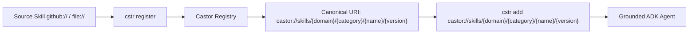

# Enterprise Skills Registry

This registry provides 23 enterprise-ready AI Agent Skills. While built upon the foundational [agentskills.io](https://agentskills.io/specification) specification, this framework **heavily extends** the standard to meet strict enterprise security, canonical server registration (`castor://skills/{domain}/{category}/{name}/{version}`), and performance requirements for the Google Agent Development Kit (ADK).

---

## Enterprise Skill Lifecycle

---

## Scaffolding & Setup Meta-Skills

| Meta-Skill | License | Technology & Build Stack | Description |
| :--- | :--- | :--- | :--- |
| **`mono-repo-setup`** | `Apache-2.0` | Bazel Bzlmod Polyglot | Scaffolding for polyglot monorepos (Go 1.26+, Python 3.13 uv, Java 17+ Maven, TypeScript React 19 pnpm), root Bazel configs, and `configs/terraform/`. |
| **`python-project-setup`** | `Apache-2.0` | Python 3.13, uv & Bazel | Scaffolding for enterprise Python services using `uv`, wrapped in Bazel `rules_python`, with Google OAuth2, None safety, and cascading TOML. |
| **`go-project-setup`** | `Apache-2.0` | Go 1.26+ & Bazel | Scaffolding for Go microservices using standard `/cmd`, `/internal`, `/pkg`, `/api` layout, Bazel `rules_go`/`gazelle`, nil safety, and `configs/terraform/`. |
| **`java-project-setup`** | `Apache-2.0` | Java 17+ / 21 LTS, Maven & Bazel | Scaffolding for Java microservices using Maven POM with latest GCP BOM, wrapped in Bazel `rules_java`, with Optional/NonNull safety and `configs/terraform/`. |

---

## Domain & Technology Skills

| Skill Directory | License | Technology / Domain | SDLC, Google OAuth2, Error Handling & 429 Highlights |
| :--- | :--- | :--- | :--- |
| **`bazel-modules`** | `Apache-2.0` | Bazel & Bzlmod | Bzlmod dependency graphs, hermetic TDD, `rules_hugo` GitHub Pages publishing, coverage collection, and SemVer. |
| **`react-vite`** | `Apache-2.0` | React 19 & Vite 6 | Google OAuth2 PKCE/GIS, HTTP 429 countdown banners, `strictNullChecks`, optional chaining, paired Vitest TDD, 85% coverage. |
| **`python-core`** | `Apache-2.0` | Python 3.13 & UV | None safety, paired positive/negative pytest TDD, 90% coverage enforcement, Hugo site publishing, and SemVer. |
| **`python-fastapi`** | `Apache-2.0` | FastAPI Enterprise | Google OAuth2 Bearer token verification, slowapi 429 rate limiting, async REST TDD with httpx, 90% coverage, and SemVer. |
| **`python-fastmcp`** | `Apache-2.0` | FastMCP Protocol | FastMCP tool TDD, GitHub Actions schema validation, prompt injection defense, Pydantic bounds, and SemVer. |
| **`python-adk-fastapi`** | `Apache-2.0` | FastAPI & Google ADK | Superior pattern wrapping ADK in FastAPI on Uvicorn, Google OAuth2 user token delegation to CAPI, tenacity 429 backoff with jitter. |
| **`go-lang`** | `Apache-2.0` | Go 1.26+ Services | Google OAuth2 ID token verification middleware, retryablehttp 429 backoff, nil pointer safety, paired table-driven TDD. |
| **`alloydb`** | `Apache-2.0` | AlloyDB & pgvector | Testcontainers TDD, migration CI/CD validation, private IP VPC security, SSL enforcement, and SemVer schema versioning. |
| **`bigquery`** | `Apache-2.0` | BigQuery & CAPI | Dry-run query TDD, SQLFluff linting, GE OAuth security delegation, Protobuf normalization, and SemVer. |
| **`opentelemetry-google`** | `Apache-2.0` | OpenTelemetry & GCP Trace | InMemorySpanExporter TDD, CI/CD pipeline verification, PII scrubbing security, batch flush lifecycles, and SemVer. |
| **`terraform-gcp`** | `Apache-2.0` | Terraform for GCP | `terraform test` TDD, GitHub Actions CI/CD with tflint, GCS remote state security, least-privilege IAM, and SemVer. |
| **`configuration-modenv`** | `Apache-2.0` | Configuration & modenv | Cascading TOML precedence TDD, GitHub Actions CI schema validation, XOR cipher memory decryption, and SemVer. |
| **`java-enterprise`** | `Apache-2.0` | Java 17+ & Javalin | Google OAuth2 ID token verifier, Resilience4j 429 retries, Optional/NonNull null safety, JUnit 5 TDD, JaCoCo 85% coverage. |
| **`a2a`** | `Apache-2.0` | A2A Protocol & Orchestration | Component TDD, GitHub Actions CI validation, token bucket rate limiting, HMAC message auth (CWE-306), and SemVer. |
| **`a2ui`** | `Apache-2.0` | A2UI v0.8 & Gemini Enterprise | Sandboxed iframe CSP policies (CWE-1021), postMessage origin checks (CWE-346), right-aligned actions with `justify-end`, and component TDD. |
| **`docker-containers`** | `Apache-2.0` | Multi-Stage Docker | Container health check TDD, GitHub Actions Trivy vulnerability scanning, non-root user security, and immutable SemVer tags. |
| **`nx-monorepo`** | `Apache-2.0` | NX Polyglot Monorepo | Affected TDD testing, GitHub Actions CI with remote caching, module boundary security rules, and SemVer release orchestration. |
| **`protobuf-grpc`** | `Apache-2.0` | Protobuf & gRPC | In-process gRPC TDD, Buf breaking change detection, mTLS/auth security, Bazel rules_proto_grpc, and SemVer. |
| **`google-adk-skill-builder`** | `Apache-2.0` | ADK Meta-Skill Factory | ADK evaluator TDD, GitHub Actions schema validation, human-in-the-loop security reviews, progressive disclosure, and SemVer. |

---

## Skill Anatomical Blueprint

Each skill directory contains:

- `SKILL.md`: Root specification document with YAML frontmatter metadata, trigger conditions, core rules, and implementation patterns.
- `scripts/`: Helper utilities and setup scripts.
- `examples/`: Reference implementations and code snippets.
- `resources/` & `references/`: Supporting documentation, schema definitions, and templates.
