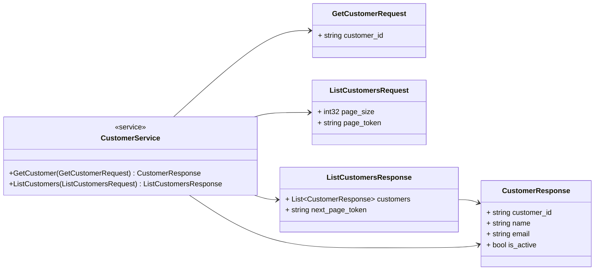
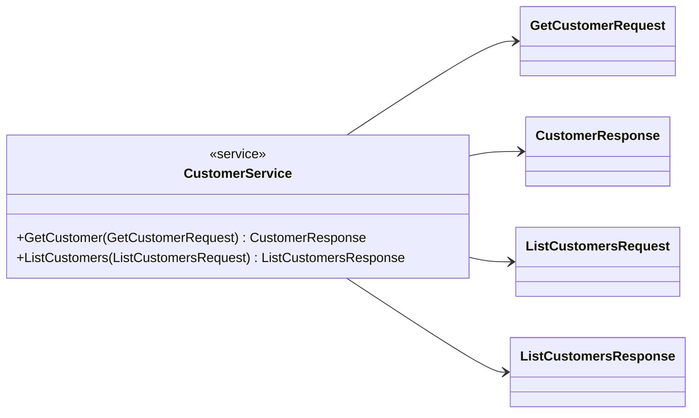
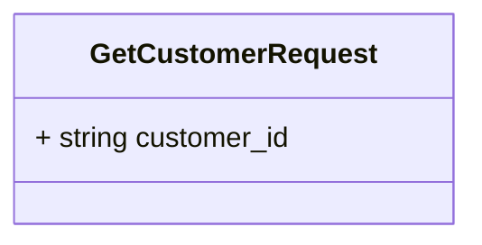
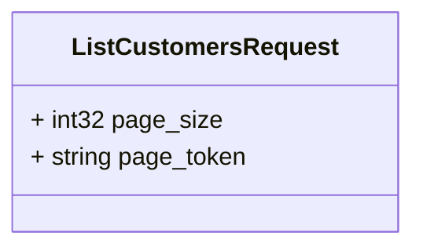
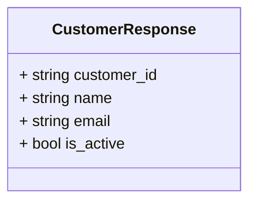
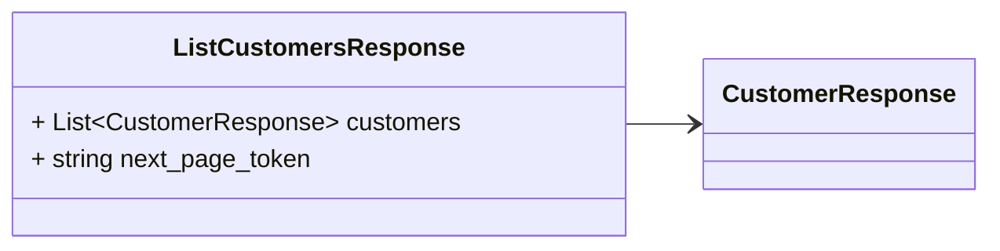

# Package: enterprise.customer.v1

 

## Imports

| Import | Description |
|--------|-------------|

## Options

| Name                | Value                                         | Description |
|---------------------|-----------------------------------------------|-------------|
| go_package          | github.com/enterprise/service/api/customer/v1 |             |
| java_multiple_files | true                                          |             |
| java_package        | com.enterprise.customer.v1                    |             |

### enterprise.customer.v1 Diagram

## Service: CustomerService

FQN: enterprise.customer.v1

 

### CustomerService Diagram

| Method         | Parameter (In)       | Parameter (Out)       | Description |
|----------------|----------------------|-----------------------|-------------|
| GetCustomer    | GetCustomerRequest   | CustomerResponse      |             |
| ListCustomers  | ListCustomersRequest | ListCustomersResponse |             |

### GetCustomerRequest Diagram

### ListCustomersRequest Diagram

### CustomerResponse Diagram

### ListCustomersResponse Diagram

## Message: GetCustomerRequest

FQN: enterprise.customer.v1.GetCustomerRequest

 

| Field       | Ordinal | Type   | Label | Description |
|-------------|---------|--------|-------|-------------|
| customer_id | 1       | string |       |             |

## Message: ListCustomersRequest

FQN: enterprise.customer.v1.ListCustomersRequest

 

| Field      | Ordinal | Type   | Label | Description |
|------------|---------|--------|-------|-------------|
| page_size  | 1       | int32  |       |             |
| page_token | 2       | string |       |             |

## Message: CustomerResponse

FQN: enterprise.customer.v1.CustomerResponse

 

| Field       | Ordinal | Type   | Label | Description |
|-------------|---------|--------|-------|-------------|
| customer_id | 1       | string |       |             |
| name        | 2       | string |       |             |
| email       | 3       | string |       |             |
| is_active   | 4       | bool   |       |             |

## Message: ListCustomersResponse

FQN: enterprise.customer.v1.ListCustomersResponse

 

| Field           | Ordinal | Type             | Label    | Description |
|-----------------|---------|------------------|----------|-------------|
| customers       | 1       | CustomerResponse | Repeated |             |
| next_page_token | 2       | string           |          |             |

<!-- Created by: Proto Diagram Tool -->
<!-- https://github.com/GoogleCloudPlatform/proto-gen-md-diagrams -->
